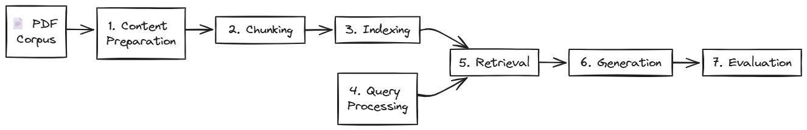
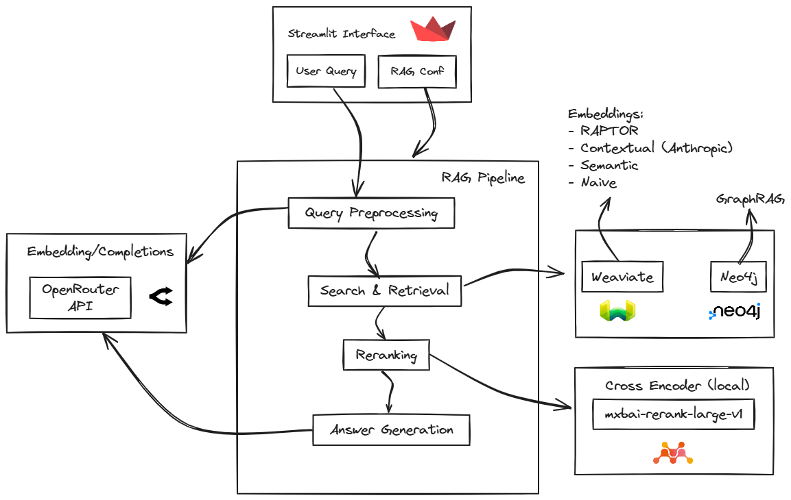
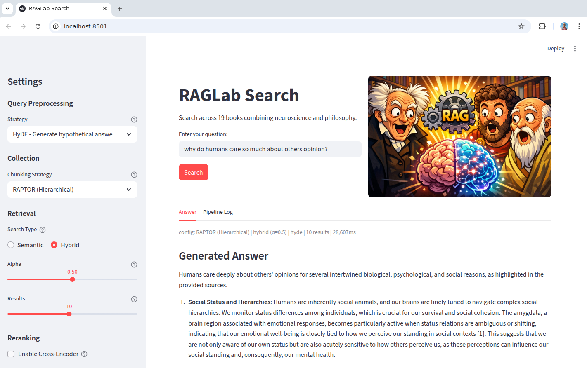

# RAGLab

This is an investigation project started to test concepts learned in [DeepLearning.AI course about RAG](https://www.deeplearning.ai/courses/retrieval-augmented-generation-rag/) applying them to an idea I had in mind after reading the fantastic book [Brain and Behaviour, by David Eagleman and Jonathan Downar](https://eagleman.com/books/brain-and-behavior/), which I discovered thanks to  an [Andrej Karpathy talk on YouTube](https://youtu.be/fqVLjtvWgq8).

I also love practical philosophy books about wisdom of life from Stoic authors, Schopenhauer, and Confucianism and had the idea to get the best of both worlds relating human traits, tendencies and usual struggles that concerned certain philosophical schools with the brain internal functioning, to understand the underlying why to some of the most intriguing human behaviour to me.

I started with a simple RAG system with naive chunking and semantic search over my dataset of 19 books (some about neuroscience and some about philosophy), just to soon be aware how difficult it is to get good answers to broad open questions using a simple RAG system, even more difficult mixing two distinct fields of knowledge, one more abstract and another more technical.

So trying to improve the RAG system performance I ended up building a customized evaluation framework to test some of the recent improvements in RAG techniques. I created an user interface to easily tune (embedding collection, preprocessing technique, type of search) and inspect each step result (chunks retrieved, LLM call and responses and final answer) and compare results with different configurations to get an intuition of the effect of each one.

To get more consistent results it runs a comprehensive evaluation using each possible hyperparameter combination (46 configurations) over a handcrafted set of test questions that cover both single concept and cross domain concepts. All details are accessible through the links at the end of this README file.

This is custom and simple evaluation framework tailored to this specific project and does not aim to be used as a general framework. There are professional frameworks out there for that purpose, but nowadays it is quite easy to construct something like this with coding agents. I built this using Claude Code and Opus 4.6.

I cannot publish the dataset nor database (Weaviate for embeddings, Neo4j from Knowledge Graph) data as the books have intellectual property protection, but I publish the project code and the technical insights and intuitions extracted from my non expert point of view.

## Project scope

The code in this project covers the complete data workflow. Starts with processing books in PDF and follows the standard RAG pipeline. It allows to test different RAG improvement techniques both alone and combined to see the effect of each possible combination chunking strategy/query preprocessing and search type.

    

## Architecture 

These are the main components of the application. 

    

## RAG improvement techniques tested
Apart form standard RAG techniques, searching for improvements that could lead to better answers to cross domain open questions, these techniques are implemented in the different components:

| Technique | Paper | What It Does |
|-----------|-------|--------------|
| **HyDE** | [arXiv:2212.10496](https://arxiv.org/abs/2212.10496) | Generates hypothetical answers for semantic matching |
| **Query Decomposition** | [arXiv:2507.00355](https://arxiv.org/abs/2507.00355) | Breaks complex questions into sub-queries with union merging |
| **Contextual Chunking** | [Anthropic Blog](https://www.anthropic.com/news/contextual-retrieval) | LLM-generated context prepended to chunks (-35% retrieval failures) |
| **RAPTOR** | [arXiv:2401.18059](https://arxiv.org/abs/2401.18059) | Hierarchical summarization tree with UMAP + GMM clustering |
| **GraphRAG** | [arXiv:2404.16130](https://arxiv.org/abs/2404.16130) | Knowledge graph + Leiden communities for cross-document reasoning |
| **GraphRAG Auto-Tuning** | [MS Research](https://www.microsoft.com/en-us/research/blog/graphrag-auto-tuning-provides-rapid-adaptation-to-new-domains/) | Discovers entity types from corpus content |

## Documentation

For implementation details, design decisions, and code walkthroughs:

- **[Getting Started](docs/getting-started.md)** — Installation, prerequisites, commands
- **[Content Preparation](docs/content-preparation/README.md)** — PDF extraction, cleaning, segmentation
- **[Chunking Strategies](docs/chunking/README.md)** — Section, Semantic, Contextual, RAPTOR
- **[Preprocessing Strategies](docs/preprocessing/README.md)** — HyDE, Decomposition, GraphRAG
- **[Evaluation Framework](docs/evaluation/README.md)** — RAGAS metrics and results

## Usage for evaluation

The evaluation of the RAG system can be done in two ways:

- **Streamlit UI**. It allows to change the configuration and see the intermediate and final results. From the UI you can choose:

    - embedding collection from the ones in Weaviate,
    - search type (keyword, hybrid with specific alpha or pure semantic) and top k,
    - reranking used or not, and
    - preprocessing technique applied (HyDE, Query Decomposition, GraphRAG).

    You can write a question and see all the pipeline intermediate results, the chunks retrieved, the score of each chunk, the intermediate LLM interactions (for Query Decomposition or HyDE) and the final answer, so in one place you can easily compare intermediate steps and final results of each configuration for same question.
    

      
    

- **Running python code**. In addition to direct evaluation through the UI, an evaluation stage is included using RAGAS metrics over a set of handcrafted questions combining single concept and cross domain questions. 

<strong>Sample question & answer</strong> (click to expand)

**Question:** Why do humans care so much about others' opinions?

**Answer:**

Humans care deeply about others' opinions for several intertwined biological, psychological, and social reasons, as highlighted in the provided sources.

*Social Status and Hierarchies*: Humans are inherently social animals, and our brains are finely tuned to navigate complex social hierarchies. We monitor status differences among individuals, which is crucial for our survival and social cohesion. The amygdala, a brain region associated with emotional responses, becomes particularly active when status relations are ambiguous or shifting, indicating that our emotional well-being is closely tied to how we perceive our standing in social contexts [1]. This suggests that we are not only aware of our own status but are also acutely sensitive to how others perceive us, as these perceptions can influence our social standing and, consequently, our mental health.

*Theory of Mind and Reputation*: The ability to understand others' thoughts and feelings—known as Theory of Mind—is essential for social interactions. This cognitive skill allows us to gauge how we are viewed by others, which is critical for maintaining our social reputation [6]. Studies have shown that reflecting on one's reputation activates specific brain regions, such as the medial prefrontal cortex, which is involved in self-referential processing and social cognition [6]. Thus, our concern for others' opinions is not merely a social nicety; it is a fundamental aspect of how we navigate our social world.

*Emotional and Motivational Drivers*: Our emotional responses to social feedback are powerful motivators. For instance, social criticism can activate the amygdala, particularly in individuals with social anxiety, highlighting the distress that negative evaluations can cause [6]. Conversely, positive social feedback can enhance feelings of reward and motivation, reinforcing our desire to be viewed favorably by others [6]. This interplay between social feedback and emotional response underscores why we are so invested in how others perceive us.

*Cultural and Evolutionary Factors*: From an evolutionary perspective, being attuned to others' opinions has conferred survival advantages. Humans have historically relied on social bonds for cooperation, resource sharing, and protection against threats. Our ability to form complex social structures and maintain relationships is a hallmark of our species, and caring about others' opinions facilitates these connections [10]. This social nature has likely shaped our cognitive processes, making us more sensitive to social cues and evaluations.

*Philosophical Insights*: Philosophically, thinkers like Epictetus emphasize the importance of understanding our roles and duties within the social fabric. He suggests that our moral intuitions and connections to others guide our actions, indicating that our concern for others' opinions is not merely about social standing but also about fulfilling our responsibilities to those around us [4][9]. This perspective encourages a balance between caring for others' views and maintaining our moral integrity.

In summary, humans care about others' opinions due to a complex interplay of biological imperatives, cognitive processes, emotional responses, and philosophical understandings of our social roles. This multifaceted concern is deeply embedded in our nature as social beings, shaping our interactions and influencing our mental health and well-being.

**References:**
- [1] *Behave, The Biology of Humans at Our Best Worst* — Robert M. Sapolsky, Section: SUMMARY AND CONCLUSIONS
- [4] *The Art of Living, The Classical Manual on Virtue Happiness and Effectiveness* — Epictetus, Section: Our Duties Are Revealed by Our Relations with One Another
- [6] *Brain and Behavior, A Cognitive Neuroscience Perspective* — David Eagleman, Jonathan Downar, Section: Social Reward and Social Aversion
- [9] *The Art of Living, The Classical Manual on Virtue Happiness and Effectiveness* — Epictetus, Section: Trust Your Moral Intuitions
- [10] *Fundamentals of Cognitive Neuroscience, A Beginner's Guide* — Nicole M. Gage, Bernard Baars, Section: Our Social Nature

*Config: RAPTOR (Hierarchical) | hybrid (α=0.5) | hyde | 10 results | 28,607ms | Model: openai/gpt-5-mini*

## Corpus

It is composed by just a set of books of mine selected more or less arbitrarily containing some of the content I want to ask about and relate to each other (Neuroscience & Philosophy). 

<strong>List of books</strong> (click to expand)

The tokens are calculated with *tiktoken* with *cl100k_base encoding* (GPT-4 / *text-embedding-3-large* tokenizer).

| Book | Author | Category | Tokens |
|------|--------|----------|--------|
| Cognitive Neuroscience: The Biology of the Mind | Michael Gazzaniga | Neuroscience | 455,433 |
| Brain and Behavior | David Eagleman, Jonathan Downar | Neuroscience | 370,663 |
| Biopsychology | John Pinel, Steven Barnes | Neuroscience | 326,159 |
| Behave | Robert M. Sapolsky | Neuroscience | 276,948 |
| Psychobiology of Behaviour | K. Fountoulakis, I. Nimatoudis | Neuroscience | 197,404 |
| Determined | Robert M. Sapolsky | Neuroscience | 194,134 |
| Fundamentals of Cognitive Neuroscience | Nicole M. Gage, Bernard Baars | Neuroscience | 152,365 |
| Cognitive Biology | Luca Tommasi et al. | Neuroscience | 146,231 |
| Letters from a Stoic | Seneca | Philosophy/Wisdom | 281,487 |
| Thinking Fast and Slow | Daniel Kahneman | Philosophy/Wisdom | 204,286 |
| Essays and Aphorisms | Arthur Schopenhauer | Philosophy/Wisdom | 102,616 |
| The Meditations | Marcus Aurelius | Philosophy/Wisdom | 88,693 |
| The Enchiridion | Epictetus | Philosophy/Wisdom | 88,466 |
| The Analects | Confucius | Philosophy/Wisdom | 77,862 |
| The Pocket Oracle | Baltasar Gracián | Philosophy/Wisdom | 54,819 |
| Counsels and Maxims | Arthur Schopenhauer | Philosophy/Wisdom | 54,649 |
| The Wisdom of Life | Arthur Schopenhauer | Philosophy/Wisdom | 51,641 |
| The Art of Living | Epictetus | Philosophy/Wisdom | 23,660 |
| Tao Te Ching | Lao Tzu | Philosophy/Wisdom | 20,415 |
| **Total** | **19 books** | | **3.17M** |

## Key Insights

After building this pipeline and testing dozens of configurations, these are my main takeaways:

**Data preparation is harder than expected.** Scientific PDF books with complex layouts, figures, and footnotes break naive extraction pipelines. Getting clean, well-structured data demands significant effort with traditional techniques. Today, I believe Vision Language Models (VLMs) offer the most promising path forward — tools like [LandingAI Agentic Document Extraction](https://landing.ai/ade) or any capable VLM are well suited to handle the visual complexity inherent in scientific documents.

**Current advanced RAG techniques don't pay off.** The best evaluation metrics came from standard section-based chunking with no advanced preprocessing — the simplest configuration tested. Only HyDE showed marginal improvement over baseline, which makes intuitive sense: it bridges the gap between how users phrase questions and how answers are stored by generating a hypothetical answer first, then searching for semantically similar content. No other technique — neither alternative chunking strategies nor query preprocessing methods — produced clear gains. The biggest disappointment was GraphRAG, which despite its recent popularity, requires substantial infrastructure (graph database, entity extraction, knowledge graph construction) with many steps that all need to work well (admittedly, I may not have been able to get the most out of them). The resulting complexity is difficult to maintain and adds latency at query time, without delivering better answers for broad open questions.

**Intuition about the future.** My sense is that the field will move toward something closer to how human memory works, with specialized mechanisms for different types of information:
- *Short-term working memory*: currently approximated by context files like AGENTS.md or MEMORY.md.
- *Long-term memory*:
    - Declarative: episodic (learning about its context and history) and semantic (factual knowledge — this is what RAG tries to solve now). I imagine this evolving into something encoded in the model's weights. Perhaps different modules inside the model, in the same way that the brain has different areas with different structures and connections (hippocampus, brainstem, different lobes), with the potential for emergent capabilities (like consciousness, continuous learning) from the interaction of specialized modules. It should be naturally multimodal, drawing from both external knowledge and the model's own reasoning. The exact mechanism is unclear, but representing knowledge as weights would integrate more naturally into how models operate. 
    - Non-declarative: procedural, priming, and conditioning. This currently maps well to patterns like SKILL.md or agent definition files.

I know this is easier said than done, but current mainstream RAG improvement techniques feel too brittle, too complex to maintain, and fundamentally limited for open questions: they fail when queries aren't semantically similar to how the information was originally stored.

