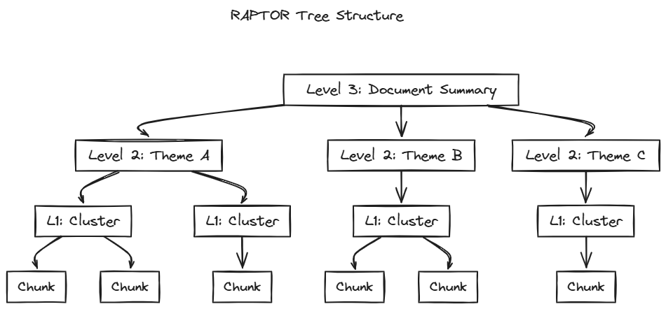

# RAPTOR: Hierarchical Summarization Tree

[← Contextual Chunking](contextual-chunking.md) | [Home](../../README.md)

[RAPTOR: Recursive Abstractive Processing for Tree-Organized Retrieval](https://arxiv.org/abs/2401.18059) builds a hierarchical tree of summaries from document chunks, enabling retrieval at multiple levels of abstraction. It addresses a fundamental gap in flat-chunk RAG: questions requiring synthesis across multiple sections have no single chunk that contains the answer.

Traditional chunking fails for:
- **Theme questions**: "What is the author's central argument?"
- **Multi-section synthesis**: "How do chapters 3 and 7 connect?"
- **Comparative questions**: "What's the difference between X and Y approaches?"

RAPTOR solves this by recursively clustering chunks and generating LLM summaries, creating a tree where higher levels capture broader themes.

<div align="center">
    
</div>


Here RAPTOR is implemented as a **post-processing step on semantic chunks (std=2)**.


## Paper Approach

The paper demonstrated significant improvements on multi-step reasoning tasks, achieving +20% absolute on QuALITY and new state-of-the-art on QASPER. Critically, 18.5-57% of retrieved nodes came from summary layers rather than original chunks, proving that hierarchical abstraction provides information simply not available in leaves alone.

<div align="center">

| Benchmark | RAPTOR | Best Baseline | Improvement |
|-----------|--------|---------------|-------------|
| QuALITY (multi-step reasoning) | 82.6% | 62.7% | **+20% absolute** |
| QASPER (scientific QA) | 55.7% F1 | 53.0% (DPR) | **New SOTA** |

</div>

### The Algorithm

The core insight is combining dimensionality reduction with probabilistic clustering to find semantically coherent groups, then summarizing them recursively:

1. **UMAP** (Uniform Manifold Approximation and Projection) reduces 3072-dim embeddings (text-embedding-3-large) to 10 dims, preserving local and global structure while making clustering tractable
2. **GMM** (Gaussian Mixture Model) clusters the reduced embeddings, using **BIC** (Bayesian Information Criterion) to automatically select K—balancing fit vs complexity to avoid both under- and over-clustering
3. **LLM summarization** generates a summary for each cluster, creating parent nodes
4. **Recursion** repeats on the summaries until the tree stops growing
5. **Collapsed tree retrieval** queries all nodes (leaves + summaries) together; similarity naturally selects the appropriate abstraction level (the paper tested this against layer-by-layer tree traversal and found collapsed tree with top-k=20 performed best)

The choice of GMM over K-means is deliberate: GMM provides soft clustering where a chunk about "stress and cortisol" can belong to both "neuroscience" AND "health effects" clusters, while K-means forces hard assignment.


## Differences from Paper

The main deviation in this implementation is using larger leaf chunks. The paper used 100-token chunks, optimized for their evaluation datasets (fiction, magazine articles, short papers). This corpus contains dense academic content—neuroscience textbooks and philosophy treatises—where [research](https://arxiv.org/html/2505.21700v2) shows larger chunks dramatically improve retrieval (4.8% → 71.5% accuracy from 64 to 1024 tokens on technical content). The tree structure provides hierarchical value regardless of leaf size.

<div align="center">

| Aspect | Paper | This Implementation |
|--------|-------|---------------------|
| **Leaf chunks** | 100 tokens | Semantic std=2 (~500 tokens avg) |
| **Document scope** | Per-document | Per-book |
| **Summary model** | gpt-3.5-turbo | deepseek-v3.2 |
| **Cluster assignment** | Soft (P > 0.3) | Soft (P >= 0.3), same as paper |
| **Retrieval** | Collapsed tree | Collapsed tree (same) |

</div>


## Algorithm

The input is semantic chunks (std=2). The algorithm recursively clusters and summarizes until the tree stops growing, then returns all nodes for collapsed-tree retrieval.

```
For each book:
  Load semantic chunks (std=2) as level-0 nodes

  While nodes.count >= MIN_CLUSTER_SIZE and level < MAX_LEVELS:
    1. Embed current level nodes
    2. UMAP reduce dimensions
    3. Find optimal K via BIC
    4. GMM cluster nodes (soft assignment, P >= 0.3)
    5. LLM summarize each cluster → new nodes at level+1

  Return all nodes (leaves + summaries)
```

**Summary prompt:**
```
Write a concise summary (~100-150 words) of the following content.
Include key details but ensure all sentences are complete. Do not end mid-sentence.

Content:
{context}

Summary:
```

**Output:** Average summary = 131 tokens (~72% compression). Average children per parent = 6.7 chunks.


## Tree Depths in This Corpus

<div align="center">

| Category | Books | Leaves | Levels | Level Breakdown Example |
|----------|-------|--------|--------|-------------------------|
| **Large** | 6 | 400-960 | 3 | Biopsychology: 959→41→6→2 |
| **Medium** | 7 | 130-340 | 2 | Thinking Fast: 333→20→4 |
| **Small** | 4 | 40-100 | 2 | Enchiridion: 74→10→3 |
| **Tiny** | 2 | 23-28 | 1 | Wisdom of Life: 28→4 |

</div>


## Example: Chunk Hierarchy

This example from *Brain and Behavior* (the same chunk used in [Semantic Chunking](semantic-chunking.md)) traces a single leaf chunk through its parent summaries up to the tree root.

**Tree Path:** `chunk_676` → `L1_cluster_4` → `L2_cluster_4` → `L3_cluster_1` (root)

<details>
<summary><strong>chunk_676 (Level 0 — Leaf): 521 tokens</strong></summary>
<small>

**Section:** *Why Motivation Matters* | **Parent:** `L1_cluster_4`

> Staying alive is a balancing act. From the moment an animal opens its eyes in the morning, it is faced with a series of dilemmas. Should I spend my time foraging for food and building my energy supplies? Or is it more important to find a source of water? Is it too cold to go outside today, even if I am hungry? Am I safe from predators here, or do I need to find a better shelter? Are there too many rivals in this territory? Should I drive them away and defend my food supply, even if it means going hungry and risking injury? And what about the all-important goal of reproduction? How important is it to find a mate if going outside to find one involves a risk of getting eaten? With so many needs to meet, the brain needs to have some way of setting its priorities. Get the balance right, and the prize is survival and many offspring, who will probably have brains as crafty as your own. Get the balance wrong, and your kind of brain will in time go extinct. As one might imagine, the brain's current architecture for priority setting developed early on (at least half a billion years ago, as you may recall from Chapter 2) and has remained remarkably stable ever since. Many of the basic needs of a living creature have changed little, even as animals have moved from water to the land and diversified into thousands of species, one of which now has the intelligence to study its own brain's motivational mechanisms. It is worth mentioning here that the circuitry of what we usually mean by 'intelligence' is a relatively new addition to an ancient basic brain plan. So-called 'general intelligence' is also a different function from priority-setting. Intelligence is about being able to predict the outside-world consequences of your actions: for example, what sequence of button presses on your computer will result in your email being sent to the intended recipient. High intelligence typically refers to the ability to make accurate predictions about outside-world events based on one's actions: for example, reliably predicting which answers on a multiple-choice test will result in a response of 'correct.' Motivation is more akin to judgment: the ability to make accurate predictions about what is most important in any given scenario. Of course, intelligence and judgment do not always go together. A person may have a high ability to memorize textbook content and predict the most appropriate answers on a test. However, this same person may have difficulty assigning the most appropriate priority level to reading the textbook over sending emails in the nights leading up to the examination and perform poorly on the examination as a result.

</small>
</details>

<details>
<summary><strong>L1_cluster_4 (Level 1 Summary): 172 tokens</strong></summary>
<small>

**Children:** 13 chunks | **Parent:** `L2_cluster_4`

> All living organisms have essential survival needs, which are maintained through the process of homeostasis. The hypothalamus plays a crucial role in regulating internal parameters, such as hunger, thirst, temperature, and sleep, through its various nuclei. It receives input from the body's internal state and bloodstream composition, allowing it to coordinate autonomic, endocrine, and behavioral responses to maintain balance. For example, when dehydrated, the hypothalamus can increase heart rate and stimulate the release of antidiuretic hormone to conserve water. Additionally, it generates motivational signals that prompt the cerebral cortex to plan actions, such as foraging for water. The interplay between internal drives and external incentives shapes complex behaviors necessary for survival. Dopaminergic neurons in the midbrain help prioritize these competing drives, influencing decision-making and behavioral responses essential for survival and reproduction.

</small>
</details>

<details>
<summary><strong>L2_cluster_4 (Level 2 Summary): 180 tokens</strong></summary>
<small>

**Children:** 5 L1 clusters | **Parent:** `L3_cluster_1`

> All living organisms require essential survival needs, maintained through homeostasis, with the hypothalamus playing a key role in regulating hunger, thirst, temperature, and sleep. It coordinates responses to internal states and external stimuli, such as increasing heart rate and releasing antidiuretic hormone during dehydration. The interplay between internal drives and external incentives influences complex behaviors necessary for survival, with dopaminergic neurons in the midbrain prioritizing these competing drives. Additionally, cognitive biases, such as anchoring and confirmation bias, can lead to irrational decision-making, influenced by emotional factors rather than rationality. The theory of mind, crucial for social interactions, is supported by neural mechanisms like mirror neurons and the fusiform face area. Emotions are processed by the limbic system, with theories evolving to recognize the integration of various systems. Understanding these mechanisms is vital for addressing emotional disorders and improving decision-making strategies.

</small>
</details>

<details>
<summary><strong>L3_cluster_1 (Level 3 — Root): 173 tokens</strong></summary>
<small>

**Children:** 4 L2 clusters | **Parent:** none (root)

> Nearly 70% of jail inmates have a history of substance abuse, underscoring the shortcomings of the War on Drugs, which emphasizes supply over the neurological aspects of addiction. Addiction distorts motivation, leading individuals to prioritize substances over essential needs. Current treatments, including counseling and medications, often result in limited long-term success and high relapse rates. New strategies, such as studying brain circuitry and potential treatments like immunization and ibogaine, are being explored. The text also discusses the emotional impacts of neurological interventions, as seen in cases like Susanna, a Parkinson's patient who experienced sadness during deep brain stimulation. Furthermore, the hypothalamus regulates essential survival needs, while cognitive biases can lead to irrational decisions influenced by emotions. Understanding the intricate relationship between brain function, emotions, and language acquisition is crucial for improving treatment strategies for neurological and psychiatric disorders.

</small>
</details>

**Observation:** L1 stays topically coherent with the leaf (survival needs → homeostasis → hypothalamus → dopaminergic neurons). At L2/L3, clusters merge diverse neuroscience content—motivation joins with cognitive biases, emotion processing, and addiction. This is expected: higher levels capture book-wide themes rather than chapter-specific content.

The hierarchy enables queries at different granularities:
- *"What survival dilemmas do animals face?"* → retrieves the leaf chunk
- *"How does the brain regulate basic drives?"* → retrieves L1 summary
- *"What brain systems are covered in this textbook?"* → retrieves L2/L3 summaries


## Navigation

**Next:** [Query-Time Strategies](../preprocessing/README.md) — How queries are transformed

**Related:**
- [Contextual Chunking](contextual-chunking.md) — Alternative approach (can be combined)
- [Semantic Chunking](semantic-chunking.md) — Prerequisite (RAPTOR uses semantic std=2 as leaves)
- [Chunking Overview](README.md) — Strategy comparison
