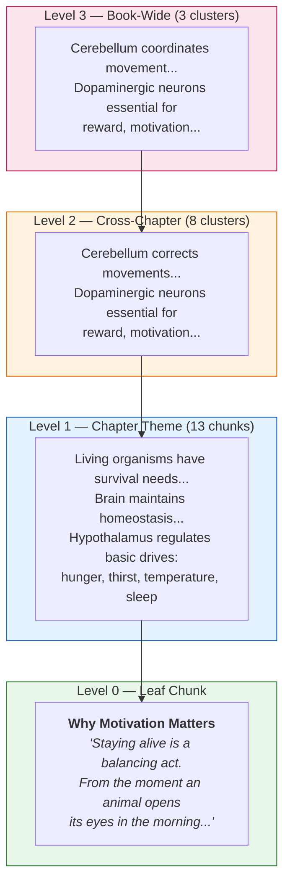

# RAPTOR: Hierarchical Summarization Tree

[← Contextual Chunking](contextual-chunking.md) | [Home](../../README.md)

[RAPTOR: Recursive Abstractive Processing for Tree-Organized Retrieval](https://arxiv.org/abs/2401.18059) builds a hierarchical tree of summaries from document chunks, enabling retrieval at multiple levels of abstraction. It addresses a fundamental gap in flat-chunk RAG: questions requiring synthesis across multiple sections have no single chunk that contains the answer.

Traditional chunking fails for:
- **Theme questions**: "What is the author's central argument?"
- **Multi-section synthesis**: "How do chapters 3 and 7 connect?"
- **Comparative questions**: "What's the difference between X and Y approaches?"

RAPTOR solves this by recursively clustering chunks and generating LLM summaries, creating a tree where higher levels capture broader themes.

<div align="center">
    
</div>


Here RAPTOR is implemented as a **post-processing step on semantic chunks (std=2)**.


## Paper Approach

The paper demonstrated significant improvements on multi-step reasoning tasks, achieving +20% absolute on QuALITY and new state-of-the-art on QASPER. Critically, 18.5-57% of retrieved nodes came from summary layers rather than original chunks, proving that hierarchical abstraction provides information simply not available in leaves alone.

<div align="center">

| Benchmark | RAPTOR | Best Baseline | Improvement |
|-----------|--------|---------------|-------------|
| QuALITY (multi-step reasoning) | 82.6% | 62.7% | **+20% absolute** |
| QASPER (scientific QA) | 55.7% F1 | 53.0% (DPR) | **New SOTA** |

</div>

### The Algorithm

The core insight is combining dimensionality reduction with probabilistic clustering to find semantically coherent groups, then summarizing them recursively:

1. **UMAP** (Uniform Manifold Approximation and Projection) reduces 1536-dim embeddings to 10 dims, preserving local and global structure while making clustering tractable
2. **GMM** (Gaussian Mixture Model) clusters the reduced embeddings, using **BIC** (Bayesian Information Criterion) to automatically select K—balancing fit vs complexity to avoid both under- and over-clustering
3. **LLM summarization** generates a summary for each cluster, creating parent nodes
4. **Recursion** repeats on the summaries until the tree stops growing
5. **Collapsed tree retrieval** queries all nodes (leaves + summaries) together; similarity naturally selects the appropriate abstraction level

The choice of GMM over K-means is deliberate: GMM provides soft clustering where a chunk about "stress and cortisol" can belong to both "neuroscience" AND "health effects" clusters, while K-means forces hard assignment.


## Differences from Paper

The main deviation in this implementation is using larger leaf chunks. The paper used 100-token chunks, optimized for their evaluation datasets (fiction, magazine articles, short papers). This corpus contains dense academic content—neuroscience textbooks and philosophy treatises—where [research](https://arxiv.org/html/2505.21700v2) shows larger chunks dramatically improve retrieval (4.8% → 71.5% accuracy from 64 to 1024 tokens on technical content). The tree structure provides hierarchical value regardless of leaf size.

<div align="center">

| Aspect | Paper | This Implementation |
|--------|-------|---------------------|
| **Leaf chunks** | 100 tokens | Semantic std=2 (~500 tokens avg) |
| **Document scope** | Per-document | Per-book |
| **Summary model** | gpt-3.5-turbo | gpt-4o-mini |
| **Cluster assignment** | Soft (P > 0.3) | Hard (highest probability) |
| **Retrieval** | Collapsed tree | Collapsed tree (same) |

</div>


## Algorithm

The input is semantic chunks (std=2). The algorithm recursively clusters and summarizes until the tree stops growing, then returns all nodes for collapsed-tree retrieval.

```
For each book:
  Load semantic chunks (std=2) as level-0 nodes

  While nodes.count > MIN_CLUSTER_SIZE:
    1. Embed current level nodes
    2. UMAP reduce dimensions
    3. Find optimal K via BIC
    4. GMM cluster nodes
    5. LLM summarize each cluster → new nodes at level+1

  Return all nodes (leaves + summaries)
```

**Output:** Average summary = 131 tokens (~72% compression). Average children per parent = 6.7 chunks.


## Tree Depths in This Corpus

<div align="center">

| Category | Books | Leaves | Levels | Level Breakdown Example |
|----------|-------|--------|--------|-------------------------|
| **Large** | 6 | 400-960 | 3 | Biopsychology: 959→41→6→2 |
| **Medium** | 7 | 130-340 | 2 | Thinking Fast: 333→20→4 |
| **Small** | 4 | 40-100 | 2 | Enchiridion: 74→10→3 |
| **Tiny** | 2 | 23-28 | 1 | Wisdom of Life: 28→4 |

</div>


## Example: Chunk Hierarchy

This example from *Brain and Behavior* (the same chunk used in [semantic-chunking.md](semantic-chunking.md)) shows how a leaf chunk connects to progressively broader summaries:


```mermaid
flowchart TB
    subgraph L3["Level 3 — Book-Wide (3 clusters)"]
        S3["Cerebellum coordinates movement...<br/>Dopaminergic neurons essential for<br/>reward, motivation..."]
    end

    subgraph L2["Level 2 — Cross-Chapter (8 clusters)"]
        S2["Cerebellum corrects movements...<br/>Dopaminergic neurons essential for<br/>reward, motivation..."]
    end

    subgraph L1["Level 1 — Chapter Theme (13 chunks)"]
        S1["Living organisms have survival needs...<br/>Brain maintains homeostasis...<br/>Hypothalamus regulates basic drives:<br/>hunger, thirst, temperature, sleep"]
    end

    subgraph L0["Level 0 — Leaf Chunk"]
        C["<b>Why Motivation Matters</b><br/><i>'Staying alive is a balancing act.<br/>From the moment an animal opens<br/>its eyes in the morning...'</i>"]
    end

    S3 --> S2
    S2 --> S1
    S1 --> C

    style L3 fill:#fce4ec,stroke:#c2185b
    style L2 fill:#fff3e0,stroke:#ef6c00
    style L1 fill:#e3f2fd,stroke:#1565c0
    style L0 fill:#e8f5e9,stroke:#2e7d32
```

**Leaf (Level 0)** — Section: *Why Motivation Matters* (521 tokens)
> "Staying alive is a balancing act. From the moment an animal opens its eyes in the morning, it is faced with a series of dilemmas. Should I spend my time foraging for food and building my energy supplies? Or is it more important to find a source of water?..."

**Level 1 Summary** — Cluster of 13 chunks (150 tokens)
> "All living organisms have essential survival needs, and their bodies must maintain a narrow range of physical parameters to sustain life. The brain plays a crucial role in maintaining homeostasis. The hypothalamus contains neurons that regulate basic drives such as hunger, thirst, temperature control, sexual arousal, and sleep..."

**Level 2-3 Summaries** — At higher levels, clusters merge diverse content from across the book. The L2/L3 summaries for this chunk combine motivation/reward content with motor control (cerebellum), reflecting how RAPTOR groups semantically related neuroscience topics.

The hierarchy enables queries at different granularities:
- *"What survival dilemmas do animals face?"* → retrieves the leaf chunk
- *"How does the brain regulate basic drives?"* → retrieves L1 summary
- *"What brain systems are covered in this textbook?"* → retrieves L2/L3 summaries


## Navigation

**Next:** [Query-Time Strategies](../preprocessing/README.md) — How queries are transformed

**Related:**
- [Contextual Chunking](contextual-chunking.md) — Alternative approach (can be combined)
- [Semantic Chunking](semantic-chunking.md) — Prerequisite (RAPTOR uses semantic std=2 as leaves)
- [Chunking Overview](README.md) — Strategy comparison
