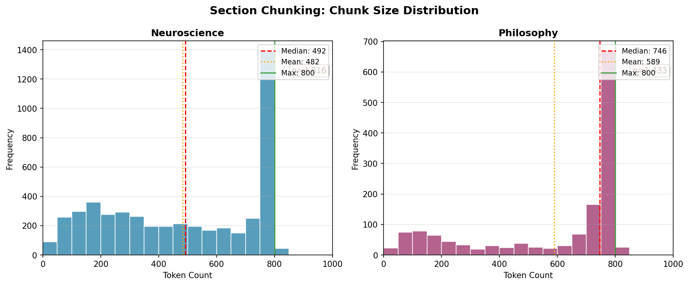

# Section Chunking (Baseline)

[← Chunking Overview](README.md) | [Home](../../README.md)

This is the baseline chunking strategy, splitting by token number but leveraging the structure authors have already created. It operates on a key assumption: **each section contains a single coherent subject**. By respecting this natural boundary, the chunker splits documents into chunks with a maximum 800-token size while maintaining sentence overlap for context continuity.

The algorithm uses these parameters:

- **Chunk size**:  800 tokens (max).  Upper limit balancing paragraph unity and retrieval performance
- **Overlap**:  2 sentences. Handles "As mentioned above..." references with minimal redundancy (~50-100 tokens)

### Chunk Size: Why 800-Token Limit?

Research indicates 512-1024 tokens is optimal for technical/analytical content. [NVIDIA's benchmark](https://developer.nvidia.com/blog/finding-the-best-chunking-strategy-for-accurate-ai-responses/) found this range best for complex queries, while [academic studies](https://arxiv.org/html/2505.21700v2) show smaller chunks (64-128) suit factoid queries but larger chunks dramatically improve technical retrieval (TechQA: 4.8% → 71.5% accuracy from 64 to 1024 tokens).

Analysis of this corpus:



<div align="center">

| Corpus | Avg Section Tokens | Single-Chunk Sections |
|--------|-------------------|----------------------|
| **Neuroscience** | 722 | 2,270 / 3,219 (71%) |
| **Philosophy** | 1,549 | 351 / 545 (64%) |

</div>

Neuroscience sections average 722 tokens—below the limit, preserving most conceptual units intact. Philosophy varies widely: aphoristic works (Tao Te Ching: 159, Art of Living: 238) fit single chunks, while essay collections (Seneca: 2,127, Schopenhauer: 2,300+) require splitting.

The 800-token limit balances these needs: within the research-backed 512-1024 optimal range, preserves paragraph unity (one idea per chunk), and keeps most neuroscience sections whole. For longer philosophy essays, 2-sentence overlap maintains continuity, though [Contextual Chunking](contextual-chunking.md) or [RAPTOR](raptor.md) may better handle extended arguments.

**Future work:** per-content-type tuning (shorter for factoid references, longer for essays).

### Algorithm

The input is a JSON file per book with NLP generated chunks, each one containing one paragraph and with the context included (book > section)
```
For each document:
  1. Load NLP-segmented paragraphs 
  2. Initialize: current_chunk = [], current_context = None

  For each paragraph:
    If context changed (new section):
      Save current_chunk
      Start new chunk (no overlap across sections)

    For each sentence:
      If (current_chunk + sentence) <= MAX_TOKENS:
        Append sentence to chunk
      Else:
        Save current_chunk
        Start new chunk with last 2 sentences (overlap)
```


<details>
<summary><strong>Example Chunk</strong></summary>
<small>

```json
{
  "chunk_id": "Brain and behavior, a cognitive neuroscience perspective (David Eagleman, Jonathan Downar)::chunk_549",
  "book_id": "Brain and behavior, a cognitive neuroscience perspective (David Eagleman, Jonathan Downar)",
  "context": "Brain and behavior, a cognitive neuroscience perspective (David Eagleman, Jonathan Downar) > CHAPTER 13 Emotions > Ventral Striatum: Pleasure and Reward",
  "section": "Ventral Striatum: Pleasure and Reward",
  "text": "In 1954, at McGill University in Montreal, Canada, the psychologists James Olds and Peter Milner implanted a pair of electrodes in the brain of a rat, hoping to study the effects of stimulation on its movements. However, the results were unexpected: the rat began returning again and again to the place in the cage where it received stimulation, as if strongly rewarded for doing so (Olds & Milner, 1954). Surprised to see this effect, Olds and Milner then tried providing the rat with a lever that would trigger stimulation. The rat soon began pressing this lever repeatedly, hundreds of times an hour, often to the exclusion of all other activities. The effects of the stimulation bore all the behavioral hallmarks of intense reward. X-rays and postmortem examinations eventually revealed that the electrode had missed its intended target and instead had reached a region known as the septal area, near the ventral striatum. In a series of experiments and later in televised demonstrations, Olds and Milner showed rats braving severe electric shocks to obtain stimulation and engaging in self-stimulation so fervently as to reach the point of starvation. As a result, this region, and its nearby connections through the medial forebrain bundle , soon became popularized as the so-called 'pleasure center of the brain' (Olds & Milner, 1954). Over the next two decades, studies provided evidence that these same regions have a similar function in human beings who underwent neurosurgical implantation of DBS electrodes for the treatment of psychiatric and neurological illnesses. A wide variety of recent studies have confirmed that the ventral striatum plays a crucial role in pleasure and reward. It is one of a handful of 'hedonic hot spots' in which electrical or chemical stimulation increases the magnitude of pleasure for enjoyable stimuli such as tasty, sugary water (Pecina, Smith, & Berridge, 2006). In human neuroimaging studies, the ventral striatum shows activation for a wide variety of rewarding stimuli including juice, pleasant images, monetary rewards, social praise, or positive outcomes in games (Kringelbach & Berridge, 2009). Likewise, in those rare and unfortunate cases where a patient suffers bilateral lesions of the ventral globus pallidus (which lies adjacent to the ventral striatum), the result is severe depression with anhedonia : a complete loss of the capacity for pleasure or enjoyment (Miller et al., 2006). Neurosurgeons are also beginning once again to exploit the role of the ventral striatum in pleasure and reward, with the goal of treating patients with severe depression (Bewernick et al., 2010). By implanting DBS electrodes in this region , the surgeons are sometimes able to alleviate the depression and, more specifically, to restore the capacity for pleasure and enjoyment that is so often lost in depressed patients. One interesting effect of this stimulation is that it appears to decrease , rather than increase, activity in some of the cortical regions that connect to the ventral striatum: for example, the ventromedial frontopolar cortex (Benazzouz et al., 2000). Keep this point in mind when you read the case study A Cure Born of Desperation , later in this chapter.",
  "token_count": 672,
  "chunking_strategy": "sequential_overlap_2"
}
```

</small>
</details>

## Navigation

**Next:** [Semantic Chunking](semantic-chunking.md) — Embedding-based topic boundaries

**Related:**
- [Contextual Chunking](contextual-chunking.md) — LLM-generated context prepended
- [RAPTOR](raptor.md) — Hierarchical summarization alternative
- [Chunking Overview](README.md) — Strategy comparison
