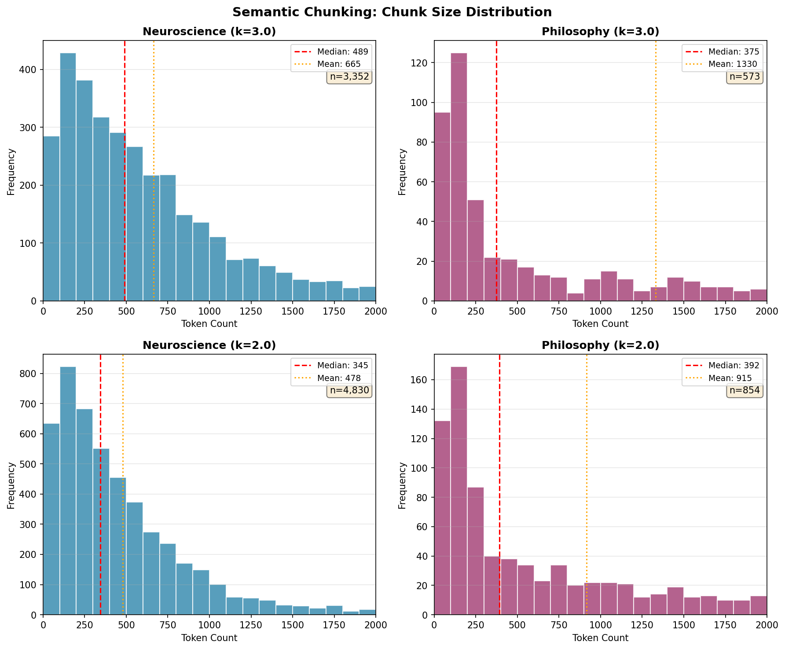

# Semantic Chunking

[← Chunking Overview](README.md) | [Home](../../README.md)

Semantic chunking splits text at topic boundaries detected by embedding similarity, creating chunks that preserve conceptual coherence rather than splitting mid-argument. Unlike fixed-size chunking, it adapts to content structure.

Here **Breakpoint-based semantic chunking**, with **standard deviation** as a reference is implemented, using these parameters:
- **Max token limit**: 8191, embedding model max. To leave room for semantic chunk to group as needed.
- **Sentence overlap**: 2, same as in section chunking.
- **Std coefficient**: 2std and 3std chunks were generated to compare results.


## Semantic Chunking Approaches

[Qu et al. 2024](https://arxiv.org/abs/2410.13070) identifies two main approaches:

- **Breakpoint-based** — "Scans over the sequence of sentences and decides where to insert a breakpoint" when "semantic distance between two consecutive sentences exceeds a threshold, meaning a significant topic change." Preserves document order but is "locally greedy" since it examines only two adjacent sentences at each decision point.
- **Clustering-based** — "Leverages clustering algorithms to group sentences together semantically, capturing global relationships and allowing for non-sequential sentence groupings." However, "risks losing contextual information hidden in the proximity of sentences."

[LangChain](https://python.langchain.com/api_reference/experimental/text_splitter/langchain_experimental.text_splitter.SemanticChunker.html) and [LlamaIndex](https://developers.llamaindex.ai/python/examples/node_parsers/semantic_chunking/) both implement **breakpoint-based** chunking as their primary semantic chunking approach.

### Embedding Scope: Section vs Document

LangChain/LlamaIndex embed the **entire document** at once—suited for short documents (articles, pages). For books with chapters/sections, this implementation uses **section-scope**:

Why section-scope for books?

1. Authors create sections to group coherent topics—a strong structural prior
2. Cross-section comparison introduces noise (unrelated topics may have similar embeddings about the same entities)
3. The std deviation threshold needs a homogeneous distribution; mixing topics creates multimodal distributions
4. [Qu et al. 2024](https://arxiv.org/abs/2410.13070) found semantic chunking helps most on content with "high topic diversity"—which exists *within* sections (sub-topics), not across them


## Breakpoint Detection: Why Standard Deviation?

After evaluating threshold methods for breakpoint detection, standard deviation-based detection was chosen:

| Approach | Description |
|----------|-------------|
| **Fixed threshold** | Sets a constant similarity cutoff (e.g., 0.4). Splits whenever consecutive sentence similarity falls below this value. Simple to understand but lacks adaptability—optimal thresholds vary significantly across corpora and document types, requiring manual tuning for each dataset ([Qu et al. 2024](https://arxiv.org/abs/2410.13070)). |
| **Percentile-based** | Computes all pairwise distances between consecutive sentences, then splits at distances exceeding the Xth percentile (default: 95th in LangChain/LlamaIndex). Adapts to each document's distance distribution, but percentile thresholds can behave inconsistently—documents with uniform similarity may split at arbitrary points ([LangChain SemanticChunker](https://python.langchain.com/api_reference/experimental/text_splitter/langchain_experimental.text_splitter.SemanticChunker.html)). |
| **Standard deviation** | Splits when similarity drops below `mean - (k × std)` (default: k=3). Self-calibrating: interprets low similarities as statistical outliers, so only significant topic shifts trigger splits. Maps directly to statistical confidence intervals (k=3 ≈ 99.7% CI). Performs well on positively-skewed similarity distributions typical of most documents ([LangChain PR #16807](https://github.com/langchain-ai/langchain/pull/16807)). |

The formula `similarity < mean - (k × std)` treats low similarities as statistical outliers, making breakpoint detection self-calibrating.


## Algorithm

The input is NLP-segmented paragraphs with context (book > section). The algorithm groups sentences by section, then embeds and detects breakpoints at section scope.

```
For each document:
  Phase 1: Group by section
    For each paragraph:
      Aggregate sentences into sections[context]

  Phase 2: Process each section
    For each section:
      1. Embed ALL sentences in section (batch API call)
      2. Compute cosine similarity between adjacent sentences
      3. Calculate mean and std of similarities
      4. Mark breakpoints where similarity < mean - (k × std)

      For each sentence:
        If breakpoint detected:
          1. Save current_chunk
          2. Start new chunk with last 2 sentences (overlap)

        If (current_chunk + sentence) > MAX_TOKENS:
          1. Save current_chunk
          2. Start new chunk with last 2 sentences (overlap)

        Append sentence to current_chunk
```


## Corpus Analysis

Comparison of semantic chunking with two coefficient values:



The distributions show **right-skewed patterns** with no ceiling effect—unlike section chunking's spike at 800 tokens, semantic chunking produces smooth tails extending to 2000+ tokens. This reflects the algorithm preserving complete conceptual units regardless of length. The k=3.0 (conservative) distributions have higher means than medians (Neuroscience: 665 vs 490; Philosophy: 1331 vs 375), indicating many small sections kept intact plus some very large ones—the long tail represents multi-paragraph arguments preserved as single chunks. The k=2.0 (sensitive) distributions shift left with lower means (479 and 916), showing how the more aggressive threshold detects subtler topic shifts. Philosophy's extreme mean-median gap at k=3.0 (1331 vs 375) reveals its bimodal nature: short aphorisms (Tao Te Ching, Epictetus) alongside lengthy essays (Schopenhauer, Seneca) that semantic chunking keeps intact when no topic boundary is detected.

<div align="center">

| Corpus | Coefficient | Chunks | Avg Tokens | Median | Single-Chunk Sections |
|--------|-------------|--------|------------|--------|----------------------|
| **Neuroscience** | k=3.0 | 3,352 | 665 | 490 | 3,167 / 3,219 (98%) |
| **Neuroscience** | k=2.0 | 4,830 | 479 | 346 | 2,143 / 3,219 (67%) |
| **Philosophy** | k=3.0 | 573 | 1,331 | 375 | 534 / 545 (98%) |
| **Philosophy** | k=2.0 | 854 | 916 | 392 | 411 / 545 (75%) |

</div>

### Comparative Analysis

**k=3.0 (conservative):** Only statistically extreme similarity drops trigger splits. Result: 98% of sections in both corpora remain as single chunks. Fewer total chunks, larger average size.

**k=2.0 (sensitive):** Triggers on smaller similarity drops (95% CI vs 99.7% CI). Result: 44% more chunks for neuroscience, 49% more for philosophy. Single-chunk rate drops to 67% and 75% respectively. Average tokens decrease ~28-31%.

**vs Section Chunking:** [Section chunking](section-chunking.md) produces 71% (neuroscience) and 64% (philosophy) single-chunk sections—splitting purely on token limits. Semantic k=3.0 preserves significantly more content within chunks by only splitting at topic boundaries, while k=2.0 creates more granular chunks comparable to section chunking but at semantically meaningful boundaries.

### Example: Section vs Semantic Chunking

The same content handled differently by each strategy:

<details>
<summary><strong>Section Chunking: 2 chunks (782 + 91 tokens)</strong></summary>
<small>

**Chunk 1 (782 tokens)** — Split at token limit, mid-paragraph:
```json
{
  "chunk_id": "Brain and behavior...::chunk_578",
  "context": "Brain and behavior... > CHAPTER 14 Motivation and Reward > Why Motivation Matters",
  "text": "Staying alive is a balancing act. From the moment an animal opens its eyes in the morning, it is faced with a series of dilemmas... [content about survival needs, intelligence vs motivation, internal drives] ...These drives are closely associated with the circuitry of the hypothalamus, as we'll see further below. External drives arise from sources outside the body itself. These include drives in response to threats, sexual or reproductive opportunities, parental attachment drives, social dominance, and affiliation.",
  "token_count": 782
}
```

**Chunk 2 (91 tokens)** — Orphaned continuation:
```json
{
  "chunk_id": "Brain and behavior...::chunk_579",
  "context": "Brain and behavior... > CHAPTER 14 Motivation and Reward > Why Motivation Matters",
  "text": "External drives arise from sources outside the body itself. These include drives in response to threats, sexual or reproductive opportunities, parental attachment drives, social dominance, and affiliation. These types of drives are more closely associated with the circuitry of the amygdala, as we'll see in a moment. At this point in the progress of neuroscience, our list of drives is almost certainly incomplete. However, the ones listed above are the most well studied so far.",
  "token_count": 91
}
```

</small>
</details>

<details>
<summary><strong>Semantic Chunking (std=3.0): 1 chunk (840 tokens)</strong></summary>
<small>

**Single coherent chunk** — No topic boundary detected, content preserved:
```json
{
  "chunk_id": "Brain and behavior, a cognitive neuroscience perspective (David Eagleman, Jonathan Downar)::chunk_458",
  "book_id": "Brain and behavior, a cognitive neuroscience perspective (David Eagleman, Jonathan Downar)",
  "context": "Brain and behavior... > CHAPTER 14 Motivation and Reward > Why Motivation Matters",
  "section": "Why Motivation Matters",
  "text": "Staying alive is a balancing act. From the moment an animal opens its eyes in the morning, it is faced with a series of dilemmas. Should I spend my time foraging for food and building my energy supplies? Or is it more important to find a source of water? [...] What are these basic needs or drives? We can divide them into the drives arising from internal states or bodily functions and the drives arising from external sources or incentives. The internal drives include homeostatic drives such as energy balance, water balance, thermoregulation, circadian rhythms including sleep and wakefulness, and stress responses, as well as internal drives toward reproductive and defensive behavior. These drives are closely associated with the circuitry of the hypothalamus, as we'll see further below. External drives arise from sources outside the body itself. These include drives in response to threats, sexual or reproductive opportunities, parental attachment drives, social dominance, and affiliation. These types of drives are more closely associated with the circuitry of the amygdala, as we'll see in a moment. At this point in the progress of neuroscience, our list of drives is almost certainly incomplete. However, the ones listed above are the most well studied so far.",
  "token_count": 840,
  "chunking_strategy": "semantic_std3"
}
```

</small>
</details>

<details>
<summary><strong>Semantic Chunking (std=2.0): 2 chunks (521 + 380 tokens)</strong></summary>
<small>

**Chunk 1 (521 tokens)** — Splits at detected topic boundary (intelligence vs survival needs):
```json
{
  "chunk_id": "Brain and behavior, a cognitive neuroscience perspective (David Eagleman, Jonathan Downar)::chunk_676",
  "context": "Brain and behavior... > CHAPTER 14 Motivation and Reward > Why Motivation Matters",
  "section": "Why Motivation Matters",
  "text": "Staying alive is a balancing act. From the moment an animal opens its eyes in the morning, it is faced with a series of dilemmas. [...] It is worth mentioning here that the circuitry of what we usually mean by 'intelligence' is a relatively new addition to an ancient basic brain plan. [...] Motivation is more akin to judgment: the ability to make accurate predictions about what is most important in any given scenario. Of course, intelligence and judgment do not always go together. A person may have a high ability to memorize textbook content and predict the most appropriate answers on a test. However, this same person may have difficulty assigning the most appropriate priority level to reading the textbook over sending emails in the nights leading up to the examination and perform poorly on the examination as a result.",
  "token_count": 521,
  "chunking_strategy": "semantic_std2"
}
```

**Chunk 2 (380 tokens)** — Continues with drives and neural circuitry:
```json
{
  "chunk_id": "Brain and behavior, a cognitive neuroscience perspective (David Eagleman, Jonathan Downar)::chunk_677",
  "context": "Brain and behavior... > CHAPTER 14 Motivation and Reward > Why Motivation Matters",
  "section": "Why Motivation Matters",
  "text": "A person may have a high ability to memorize textbook content and predict the most appropriate answers on a test. [...] Human beings meet their survival needs with behaviors that are more complex than those of any other species on the planet. [...] What are these basic needs or drives? We can divide them into the drives arising from internal states or bodily functions and the drives arising from external sources or incentives. [...] These drives are closely associated with the circuitry of the hypothalamus, as we'll see further below. External drives arise from sources outside the body itself. [...] These types of drives are more closely associated with the circuitry of the amygdala, as we'll see in a moment. At this point in the progress of neuroscience, our list of drives is almost certainly incomplete. However, the ones listed above are the most well studied so far.",
  "token_count": 380,
  "chunking_strategy": "semantic_std2"
}
```

</small>
</details>

**Key differences:**
- **Section chunking** splits at 800 tokens regardless of content, creating a 91-token orphan chunk
- **Semantic std=3.0** (conservative) keeps the entire section intact (840 tokens) since no statistically extreme similarity drop occurs
- **Semantic std=2.0** (sensitive) detects a topic shift between "intelligence vs judgment" discussion and "basic survival drives" discussion, creating two balanced chunks with 2-sentence overlap


## Navigation

**Next:** [Contextual Chunking](contextual-chunking.md) — LLM-generated context prepended

**Related:**
- [Section Chunking](section-chunking.md) — Token-based baseline strategy
- [RAPTOR](raptor.md) — Hierarchical summarization alternative
- [Chunking Overview](README.md) — Strategy comparison
