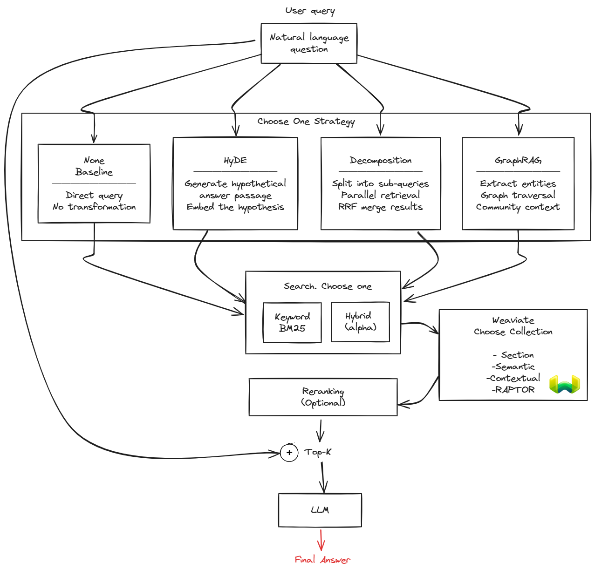

# Query-Time Strategies

[← RAPTOR](../chunking/raptor.md) | [Home](../../README.md)

Query-time strategies transform or enhance retrieval at query time. This is a **query-time decision**—you can switch strategies without re-indexing. These strategies can be combined with any chunking type, enabling systematic testing of which combinations perform best.

## Why Query-Time Strategies

Even with well-chunked documents, retrieval can fail for reasons unrelated to indexing:

- **Semantic gap**: Questions and documents live in different embedding spaces. "What causes memory loss?" embeds far from "Cortisol damages hippocampal neurons" despite being directly relevant.
- **Multi-aspect queries**: Complex questions like "How does Stoic philosophy compare to neuroscience on emotions?" require retrieving from multiple domains simultaneously.
- **Cross-document synthesis**: Thematic questions like "What are the main themes across these books?" have no single chunk containing the answer.
- **Recall vs precision tradeoff**: Initial retrieval (BM25/hybrid) casts a wide net to avoid missing relevant documents, but includes tangentially related results that dilute answer quality.

Each preprocessing strategy addresses a specific failure mode.

## Pipeline Overview

**Three stages:**
1. **Preprocessing** — Transform query before search (HyDE, Decomposition, GraphRAG)
2. **Search** — Retrieve candidates from Weaviate (keyword or hybrid)
3. **Reranking** — Re-score candidates with cross-encoder (optional)

## Strategy Comparison

Each strategy targets a specific retrieval failure mode with a distinct mechanism. The table below provides a quick reference; detailed explanations follow for each technique. See individual pages for implementation details.

### Preprocessing (Before Search)

| Strategy | Failure Mode Addressed | LLM Calls | Latency |
|----------|------------------------|-----------|---------|
| **None** | — (baseline) | 0 | ~0ms |
| [**HyDE**](hyde.md) | Semantic gap | 4 | ~500ms |
| [**Decomposition**](query-decomposition.md) | Multi-aspect queries | 1 | ~500ms |
| [**GraphRAG**](graphrag.md) | Cross-document synthesis | 1+ | ~1-2s |

How each technique improves retrieval:

- **HyDE (Hypothetical Document Embeddings)**: Bridges the semantic gap between how users ask questions and how documents express answers. Instead of embedding the question directly, an LLM generates a hypothetical answer, which is then embedded. This "answer-shaped" embedding lands closer to actual answer chunks in vector space, improving recall for queries where question-document vocabulary differs significantly.

- **Decomposition**: Handles multi-aspect queries by breaking a complex question into independent sub-questions, each retrieving its own set of chunks. Results are merged using simple union (concatenate + deduplicate). The cross-encoder reranker then scores all pooled documents against the original query, making sophisticated merging redundant.

- **GraphRAG**: Synthesizes information across documents by leveraging a pre-built knowledge graph. Entity extraction identifies key concepts in the query, which are matched to graph communities (clusters of related entities). Community summaries provide corpus-wide context that no individual chunk contains, enabling answers to thematic or comparative questions.

## Evaluation Results

Two evaluation runs compared all query-time strategies across 46 pipeline configurations, using [RAGAS](https://docs.ragas.io/) metrics (answer_correctness, context_recall). Run 1 used 16 curated questions; Run 2 used 46 diverse questions including cross-domain questions that require connecting concepts across different books.

### Query Strategy Ranking

| Strategy | Run 1 (answer_correctness) | Run 2 (answer_correctness) |
|----------|---------------------------|---------------------------|
| **HyDE** | 1st (0.514) | 1st — tied (0.487) |
| **None** | 2nd (0.484) | 1st — tied (0.487) |
| **Decomposition** | 3rd (0.465) | 3rd (0.483) |
| **GraphRAG** | 4th (0.376) | 4th (0.378) |

HyDE showed a 3-point advantage in Run 1, but this advantage disappeared entirely in Run 2, where HyDE and no-strategy performed identically. For context_recall, HyDE maintained a small but consistent advantage in both runs, particularly for cross-domain questions. Decomposition consistently underperformed the baseline — sub-question breaking fragments the retrieval signal. GraphRAG ranked last (46/46) in both runs; entity-based retrieval added noise compared to direct vector+BM25 search.

The most impactful query-time decision was the search blend (alpha), not the preprocessing strategy. Hybrid search (alpha=0.5) won overall in both runs and is a free parameter that requires no additional compute.

**Limitations**: These results are specific to a small neuroscience/philosophy corpus (5 books). Individual configuration rankings were unstable between runs (Spearman rho = 0.27 for answer_correctness), though factor-level trends (which strategy is best/worst) were more consistent. HyDE was only tested with pure semantic search (alpha=1.0), so its interaction with hybrid search remains untested. See [cross-run comparison](../../data/evaluation/analysis/cross_run_comparison.md) for full details.

## Navigation

**Next:** [HyDE](hyde.md) — Hypothetical document embeddings

**Related:**
- [Chunking Strategies](../chunking/README.md) — Index-time document splitting
- [Evaluation Framework](../evaluation/README.md) — How strategies are compared
