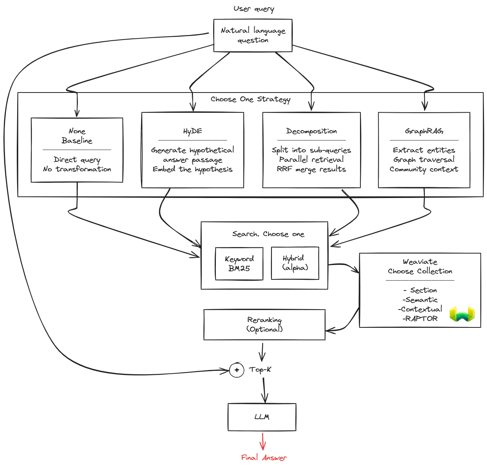

# Query-Time Strategies

[← RAPTOR](../chunking/raptor.md) | [Home](../../README.md)

Query-time strategies transform or enhance retrieval at query time. This is a **query-time decision**—you can switch strategies without re-indexing. These strategies can be combined with any chunking type, enabling systematic testing of which combinations perform best.

## Why Query-Time Strategies

Even with well-chunked documents, retrieval can fail for reasons unrelated to indexing:

- **Semantic gap**: Questions and documents live in different embedding spaces. "What causes memory loss?" embeds far from "Cortisol damages hippocampal neurons" despite being directly relevant.
- **Multi-aspect queries**: Complex questions like "How does Stoic philosophy compare to neuroscience on emotions?" require retrieving from multiple domains simultaneously.
- **Cross-document synthesis**: Thematic questions like "What are the main themes across these books?" have no single chunk containing the answer.
- **Recall vs precision tradeoff**: Initial retrieval (BM25/hybrid) casts a wide net to avoid missing relevant documents, but includes tangentially related results that dilute answer quality.

Each preprocessing strategy addresses a specific failure mode.

## Pipeline Overview

**Three stages:**
1. **Preprocessing** — Transform query before search (HyDE, Decomposition, GraphRAG)
2. **Search** — Retrieve candidates from Weaviate (keyword or hybrid)
3. **Reranking** — Re-score candidates with cross-encoder (optional)

## Strategy Comparison

Each strategy targets a specific retrieval failure mode with a distinct mechanism. The table below provides a quick reference; detailed explanations follow for each technique. See individual pages for implementation details.

### Preprocessing (Before Search)

| Strategy | Failure Mode Addressed | LLM Calls | Latency |
|----------|------------------------|-----------|---------|
| **None** | — (baseline) | 0 | ~0ms |
| [**HyDE**](hyde.md) | Semantic gap | 1-2 | ~500ms |
| [**Decomposition**](query-decomposition.md) | Multi-aspect queries | 1 | ~500ms |
| [**GraphRAG**](graphrag.md) | Cross-document synthesis | 1+ | ~1-2s |

How each technique improves retrieval:

- **HyDE (Hypothetical Document Embeddings)**: Bridges the semantic gap between how users ask questions and how documents express answers. Instead of embedding the question directly, an LLM generates a hypothetical answer, which is then embedded. This "answer-shaped" embedding lands closer to actual answer chunks in vector space, improving recall for queries where question-document vocabulary differs significantly.

- **Decomposition**: Handles multi-aspect queries by breaking a complex question into independent sub-questions, each retrieving its own set of chunks. Results are merged using Reciprocal Rank Fusion (RRF). This prevents any single aspect from dominating retrieval and ensures coverage across all facets of a compound question.

- **GraphRAG**: Synthesizes information across documents by leveraging a pre-built knowledge graph. Entity extraction identifies key concepts in the query, which are matched to graph communities (clusters of related entities). Community summaries provide corpus-wide context that no individual chunk contains, enabling answers to thematic or comparative questions.

## Navigation

**Next:** [HyDE](hyde.md) — Hypothetical document embeddings

**Related:**
- [Chunking Strategies](../chunking/README.md) — Index-time document splitting
- [Evaluation Framework](../evaluation/README.md) — How strategies are compared
