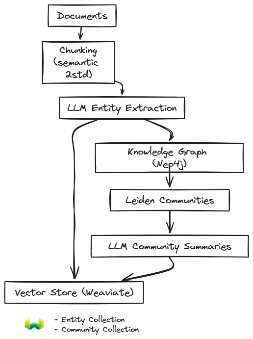
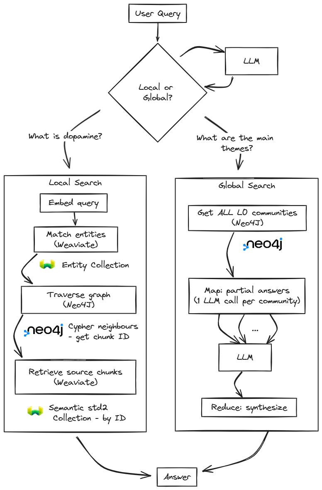

# GraphRAG: Knowledge Graph Communities

[<- Query Decomposition](query-decomposition.md) | [Home](../../README.md)

When you ask "What are the main themes across all 19 books?", no single chunk contains this answer. Vector search finds chunks similar to your query, but similarity doesn't help when the answer requires synthesizing information scattered across thousands of pages. This is the **global query problem**: questions about patterns, themes, and relationships that span an entire corpus.

[GraphRAG](https://arxiv.org/abs/2404.16130) solves this by building a knowledge graph from your documents. Entities (people, concepts, brain regions) become nodes; relationships become edges. The Leiden algorithm then detects communities of densely connected entities. Each community gets an LLM-generated summary. For global queries, GraphRAG uses DRIFT search — embedding the query, retrieving the top-K most relevant communities via HNSW, processing them in parallel primer folds, then reducing into a final synthesized answer.

**When GraphRAG helps:** Cross-document synthesis, thematic questions, relationship discovery, "compare authors' perspectives on X" queries.

**When it struggles:** Simple factual lookups (overkill), frequently updated corpora (requires reindexing), small datasets (setup cost exceeds benefit).

Since April 2024, GraphRAG has evolved significantly: Microsoft added DRIFT search (hybrid local/global) and dynamic community selection; LightRAG achieved 6× cost reduction with incremental updates; LazyGraphRAG cut indexing to 0.1% of original cost; HippoRAG and HopRAG improved multi-hop reasoning by up to 76%; agentic variants now dynamically select tools per query. **This project implements the original paper's indexing pipeline with a simplified DRIFT search for global queries.** The original map-reduce approach processed ALL communities with O(n) LLM calls; DRIFT replaces this with HNSW top-K retrieval (O(log n)), reducing ~1000 LLM calls to ~5. Local search uses entity-based graph traversal. The goal remains a controlled baseline for comparing against other foundational RAG techniques (HyDE, RAPTOR, query decomposition) on the same corpus and evaluation set.


## The GraphRAG Paper and Algorithm

**Paper:** "From Local to Global: A Graph RAG Approach to Query-Focused Summarization"
**Authors:** Edge et al. (Microsoft Research)
**Published:** April 2024 ([arXiv:2404.16130](https://arxiv.org/abs/2404.16130))
([Microsoft GraphRAG Official Implementation](https://github.com/microsoft/graphrag))

Standard RAG retrieves chunks similar to a query, but similarity isn't synthesis. The authors wanted systems that could answer corpus-wide questions—"What are the main themes across all documents?"—which require understanding patterns, not just finding relevant passages. Their solution: transform documents into a hierarchical knowledge structure that can be queried at different abstraction levels.

### Indexing Phase (Offline)

Indexing runs once per corpus, building the graph and community structures needed for query-time retrieval.

<div align="center">
    
</div>

1. **Chunking** — Split documents into text units for extraction. It uses semantic chunking with 2 standard deviation coefficient.

2. **Entity extraction** — An LLM processes each chunk, extracting entities with predefined types (PERSON, BRAIN_STRUCTURE, CONCEPT) and relationships between them. Each relationship includes a description and a weight (0.0-1.0). The paper recommends "gleaning"—multiple extraction passes where the LLM is prompted to find missed entities.

3. **Graph construction** — Entities become nodes; relationships become weighted edges. When the same entity appears in multiple chunks, descriptions are merged and relationship weights accumulated. The result is a connected knowledge graph where each node tracks which source chunks mentioned it.

4. **Community detection** — The Leiden algorithm partitions the graph into communities of densely connected entities. Unlike Louvain, Leiden guarantees well-connected communities through a refinement phase. It runs hierarchically: L0 produces the coarsest communities (corpus-wide themes), L2 the finest (specific topics).

5. **Summarization** — For each community, an LLM generates a summary describing its key entities, relationships, and themes. Entities are sorted by PageRank so hub entities appear first. These summaries become the index for global queries—enabling corpus-wide answers without processing all source text.

6. **Embedding** — Entity descriptions, community summaries, and source chunks are embedded and stored in a vector database. At query time, embedding similarity finds relevant entities (for local search) and communities (for global search) without requiring LLM calls.

### Query Phase (Online)

Queries are classified as **local** or **global** and routed to different retrieval paths.

<div align="center">
    
</div>

**Local queries** ask about specific entities or concepts (e.g., "What is dopamine?"):

1. **Embed query** — The user query is converted to an embedding vector using the same model used during indexing.

2. **Match entities** — Vector similarity search against the entity collection in Weaviate. The query embedding is compared to pre-computed entity description embeddings, returning the top-k most similar entities as graph entry points.

3. **Traverse graph** — Starting from matched entities, traverse the knowledge graph in Neo4j (1-2 hops) to discover related entities and their relationships. This captures structural context that embedding similarity alone would miss.

4. **Retrieve source chunks** — Collect the source chunks associated with matched and traversed entities. These chunks contain the original text that mentioned each entity.

5. **Generate answer** — Combine retrieved chunks with entity/relationship context and send to the LLM for answer generation.

**Global queries** ask about themes, patterns, or corpus-wide understanding (e.g., "What are the main themes?"). RAGLab uses **DRIFT search** (simplified from Microsoft's Dynamic Reasoning with Inference-time Fine-Tuning):

1. **Embed query + HNSW top-K** — The query is embedded and compared against pre-computed community summary embeddings via Weaviate's HNSW index. The top-K most relevant communities are retrieved across all hierarchy levels (default K=20). This replaces the original paper's exhaustive approach of processing ALL communities.

2. **Primer folds** — The top-K communities are split into folds (default 4 folds of 5 communities each). Each fold runs a parallel LLM call that generates an intermediate answer from its community subset. Communities not relevant to the query are filtered out.

3. **Reduce** — A final LLM call synthesizes all intermediate fold answers into a coherent response, merging insights and removing redundancy. Total: ~5 LLM calls instead of ~1000.

### Results Summary

The paper demonstrated that community-based retrieval substantially outperforms vector-only approaches for thematic questions, achieving 72-83% win rates on comprehensiveness metrics. The hierarchical structure enables answering questions that would otherwise require processing the entire corpus. Notably, the reference implementation found that smaller context windows (8k tokens) outperformed larger ones (16k-64k) due to models struggling to utilize information in long prompts—a finding that informed the original map-reduce design. RAGLab replaces map-reduce with DRIFT search, which similarly processes small community subsets (primer folds) independently before synthesis.


## RAGLab Implementation

RAGLab implements the original GraphRAG algorithm with adaptations for a dual-domain corpus (neuroscience + philosophy) and a different storage architecture.

### Storage: Neo4j + Weaviate

Microsoft's reference implementation uses Parquet files for everything. RAGLab uses **Neo4j** for the knowledge graph (enabling Cypher traversal) and **Weaviate** for vector search (entities, communities, chunks). This dual-storage approach enables graph traversal patterns not possible with flat files, at the cost of additional infrastructure.

> **Note:** Neo4j 5.x+ supports native vector indexes, which could consolidate entity and community embeddings into Neo4j—enabling unified graph+vector queries in single Cypher statements. Chunk embeddings would remain in Weaviate due to its superior hybrid search. See [Neo4j Vector Indexes](https://neo4j.com/docs/cypher-manual/current/indexes/semantic-indexes/vector-indexes/).

### Entity Types

Entity types are defined in `src/graph/graphrag_types.yaml` with 9 curated types. Microsoft defaults to 4 generic types (PERSON, ORGANIZATION, LOCATION, EVENT). RAGLab extends this for the dual-domain corpus while following the industry consensus that fewer, non-overlapping types work better than many specific ones.

<details>
<summary><strong>Why these 9 types?</strong></summary>

Initial extraction with open types showed PERSON fragmented across 6 variants (RESEARCHER, PHILOSOPHER, HISTORICAL_FIGURE) totaling ~9,000 entities that should be one type. Similarly, CONCEPT dominated with 19,916 entities—too generic for useful retrieval.

The 9 types mirror the evaluation query pattern (brain mechanisms → brain functions → psychological states → behaviors → theories & precepts):

| Type | Examples | Query Role |
|------|----------|------------|
| PERSON | Sapolsky, Epictetus, Kahneman | Attribution |
| BRAIN_STRUCTURE | amygdala, prefrontal cortex, thalamus | Causal mechanism |
| BRAIN_FUNCTION | neuroplasticity, fear conditioning, fight-or-flight | Process mechanism |
| CHEMICAL | dopamine, serotonin, oxytocin, cortisol | Causal mechanism |
| DISORDER | PTSD, depression, addiction | Clinical condition |
| MENTAL_STATE | emotion, consciousness, suffering, happiness | Internal experience |
| BEHAVIOR | procrastination, aggression, conformity | Observable pattern |
| THEORY | dual process theory, prospect theory, classical conditioning | Empirical model |
| PRECEPT | dichotomy of control, wu wei, memento mori | Wisdom teaching |

Strict mode (`GRAPHRAG_STRICT_MODE = True`) discards entities with types not in this list, preventing graph fragmentation.

</details>

### Key Differences from Microsoft

**Graph traversal vs text_unit_id lookup.** Microsoft stores `text_unit_ids` on each entity and simply collects them at query time—no graph traversal. RAGLab uses Cypher traversal (`max_hops=2`) to discover multi-hop relationships, enabling cross-domain connections like `self-control → impulse_control → prefrontal_cortex`.

**Semantic chunking.** The paper uses fixed 300-token chunks. RAGLab uses [semantic chunking](../chunking/semantic-chunking.md) with `std=2.0` for entity extraction—smaller, more cohesive chunks improve relationship capture since entities must appear together in a chunk to form edges.

**Deterministic Leiden.** RAGLab runs Leiden with `seed=42` and `concurrency=1`, guaranteeing identical community assignments across runs. This enables crash recovery: if summarization fails midway, re-running picks up where it stopped.

**Combined degree ranking.** Local search ranks chunks by `combined_degree = start_degree + neighbor_degree` (Microsoft's approach). Chunks reached via hub entities score higher—well-connected nodes carry more information value.


## Knowledge Graph Visualization

The knowledge graph can be explored interactively. Nodes are colored by entity
type and sized by degree centrality. Hover for entity details.

**[Interactive graph (top 15 entities)](https://crlsrmrlsz.github.io/raglab/visualizations/graph_filtered.html)** — Core entities by degree centrality

To regenerate after re-indexing:
```bash
python -m src.visualization.graph_export --top-n 15 --metric degree
```


## Navigation

**Next:** [Evaluation Framework](../evaluation/README.md) — How strategies are compared

**Related:**
- [RAPTOR](../chunking/raptor.md) — Alternative hierarchy via clustering (no Neo4j)
- [HyDE](hyde.md) — Simpler query transformation (no graph)
- [Query Decomposition](query-decomposition.md) — Sub-query strategy
- [Preprocessing Overview](README.md) — Strategy comparison

