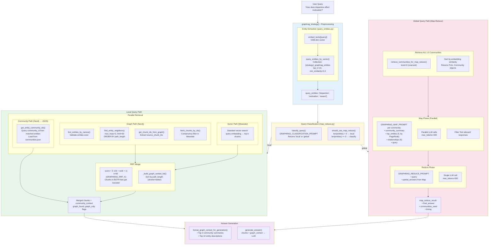

# GraphRAG: Knowledge Graph Communities

[<- Query Decomposition](query-decomposition.md) | [Home](../../README.md)

When you ask "What are the main themes across all 19 books?", no single chunk contains this answer. Vector search finds chunks similar to your query, but similarity doesn't help when the answer requires synthesizing information scattered across thousands of pages. This is the **global query problem**: questions about patterns, themes, and relationships that span an entire corpus.

[GraphRAG](https://arxiv.org/abs/2404.16130) solves this by building a knowledge graph from your documents. Entities (people, concepts, brain regions) become nodes; relationships become edges. The Leiden algorithm then detects communities of densely connected entities. Each community gets an LLM-generated summary. For global queries, GraphRAG uses map-reduce over these summaries to synthesize corpus-wide answers.

**When GraphRAG helps:** Cross-document synthesis, thematic questions, relationship discovery, "compare authors' perspectives on X" queries.

**When it struggles:** Simple factual lookups (overkill), frequently updated corpora (requires reindexing), small datasets (setup cost exceeds benefit).


## The GraphRAG Paper and Algorithm

**Paper:** "From Local to Global: A Graph RAG Approach to Query-Focused Summarization"
**Authors:** Edge et al. (Microsoft Research)
**Published:** April 2024 ([arXiv:2404.16130](https://arxiv.org/abs/2404.16130))

The authors wanted RAG systems that could answer questions requiring corpus-wide understanding—what they call "query-focused summarization" at scale. Standard RAG retrieves relevant chunks, but relevance isn't synthesis. Their solution: transform documents into a hierarchical knowledge structure that can be queried at different abstraction levels.

The algorithm has two phases:

### Indexing (Offline)

1. **Entity extraction.** An LLM processes each chunk, extracting entities (named items with types like PERSON, CONCEPT, BRAIN_REGION) and relationships (connections between entities with descriptions and strength scores). The paper uses multiple extraction rounds with "gleaning"—prompting the LLM to find missed entities.

   The [reference implementation](https://github.com/microsoft/graphrag) uses three prompts with **predefined entity types**:

   | Prompt | Purpose |
   |--------|---------|
   | `GRAPH_EXTRACTION_PROMPT` | Main extraction: "entity_type: One of the following types: [{entity_types}]" |
   | `CONTINUE_PROMPT` | Gleaning: "MANY entities were missed... Add them below" |
   | `LOOP_PROMPT` | Termination check: "Answer Y if entities remain, N if done" |

   Entity types are configured in `settings.yaml` before indexing—the LLM must choose from this predefined list (e.g., `PERSON, ORGANIZATION, LOCATION, EVENT`). This ensures consistent taxonomy but requires knowing your corpus beforehand.

2. **Knowledge graph construction.** Entities become nodes; relationships become weighted edges. Duplicate entity names are merged via string normalization. The result is a connected graph where each node tracks which source chunks mentioned it.

3. **Community detection.** The Leiden algorithm partitions the graph into communities of densely connected entities. Unlike Louvain (its predecessor), Leiden guarantees well-connected communities through a refinement phase. The algorithm runs recursively, producing a hierarchy: C0 (finest granularity, specific topics), C1 (medium, domain themes), C2 (coarsest, corpus-wide patterns).

4. **Community summarization.** For each community, the LLM generates a summary describing its entities, relationships, and themes. Entities are sorted by PageRank (hub entities first). These summaries become the index for global queries.

### Query (Online)

**Local queries** (entity-focused): Extract entities from the query, traverse the graph to find related entities and their source chunks, merge with vector search results using RRF.

**Global queries** (thematic): Map-reduce over community summaries. The map phase generates partial answers from each relevant community in parallel. The reduce phase synthesizes these into a coherent final answer.

### Key Findings

**Community summaries work.** 72-83% win rate on comprehensiveness versus baseline RAG. The hierarchical structure captures corpus-level patterns that chunk retrieval misses entirely.

**8k context beats larger.** Surprisingly, 8k token context windows outperformed 16k, 32k, and 64k on comprehensiveness (58.1% average win rate). Larger contexts trigger "lost in the middle" effects where models fail to utilize information in long prompts.

**Leiden over Louvain.** Louvain can produce disconnected communities (pathological cases). Leiden's refinement phase guarantees connectivity, making it robust for downstream summarization.

**Token efficiency.** Root-level community summaries (C0) require 9-43x fewer tokens than processing source text directly, amortizing indexing cost across queries.


## RAGLab Implementation

RAGLab implements GraphRAG across two stages with several adaptations for the dual-domain corpus (neuroscience + philosophy):


**Curated entity types.** Entity types are defined in `src/graph/graphrag_types.yaml` (8 types). Following industry best practices, types are minimal and non-overlapping: 2 generic (PERSON, WORK), 3 neuroscience (BRAIN_STRUCTURE, CHEMICAL, DISORDER), 2 psychology bridge (MENTAL_STATE, BEHAVIOR), and 1 philosophy (PRINCIPLE). Relationship types remain open-ended per the GraphRAG paper.

**Strict mode filtering.** Following LangChain's approach, RAGLab discards extracted entities whose types don't match the curated list (`GRAPHRAG_STRICT_MODE = True` in config). This prevents graph fragmentation when the LLM ignores type constraints—entities with wrong types are removed rather than stored with inconsistent labels. Relationships involving discarded entities are also pruned during Neo4j upload (source/target won't exist in the entity set).

<details>
<summary><strong>Entity type design rationale</strong></summary>

**Why fewer types is better.** Microsoft defaults to just 4 types (PERSON, ORGANIZATION, LOCATION, EVENT). Overlapping types cause: (1) **inconsistent extraction**—the LLM might tag "Aristotle" as PHILOSOPHER, HISTORICAL_FIGURE, or RESEARCHER, fragmenting nodes; (2) **weakened communities**—Leiden clustering relies on co-occurrence, so split entities dilute signal.

**Industry consensus.** [Microsoft GraphRAG](https://microsoft.github.io/graphrag/config/yaml/) (4 types), [LangChain](https://python.langchain.com/api_reference/experimental/graph_transformers/langchain_experimental.graph_transformers.llm.LLMGraphTransformer.html) ("basic/elementary types"), [LlamaIndex](https://docs.llamaindex.ai/en/stable/module_guides/indexing/lpg_index_guide/) (3-5 in examples), [Neo4j](https://neo4j.com/blog/developer/graphrag-llm-knowledge-graph-builder/) ("minimal schema")—all recommend 4-6 generic types.

**Corpus analysis.** Initial extraction with open types showed PERSON fragmented across 6 variants (RESEARCHER, PHILOSOPHER, HISTORICAL_FIGURE, etc.) totaling ~9,000 entities. Similarly, PSYCHOLOGICAL_PHENOMENON vs PSYCHOLOGICAL_CONCEPT and VIRTUE vs ETHICAL_CONCEPT created semantic overlap.

**Query-driven design.** Evaluation questions connect brain mechanisms → psychological states → behaviors → philosophical principles. The 8 types mirror this retrieval pattern:

| Type | Examples | Query Role |
|------|----------|------------|
| PERSON | Sapolsky, Epictetus, Kahneman | Attribution |
| WORK | Behave, Meditations | Source |
| BRAIN_STRUCTURE | amygdala, prefrontal cortex, thalamus | Causal mechanism |
| CHEMICAL | dopamine, serotonin, oxytocin | Causal mechanism |
| DISORDER | PTSD, depression, addiction | Clinical condition |
| MENTAL_STATE | emotion, consciousness, suffering | Internal experience |
| BEHAVIOR | procrastination, aggression, empathy | Observable pattern |
| PRINCIPLE | dichotomy of control, wu wei, hedonic treadmill | Philosophical interpretation |

</details>

<details>
<summary><strong>Removed: Auto-tuning process</strong></summary>

RAGLab originally implemented Microsoft's [auto-tuning](https://www.microsoft.com/en-us/research/blog/graphrag-auto-tuning-provides-rapid-adaptation-to-new-domains/) approach for entity type discovery. The process was:

1. **Open-ended extraction** — LLM extracts entities with freely-assigned types (no predefined schema)
2. **Type aggregation** — Collect all unique types across corpus with frequency counts
3. **Stratified consolidation** — LLM proposes clean taxonomy, balancing types across neuroscience vs philosophy corpora
4. **Save for query time** — Store `discovered_types.json` for entity matching

**Top extracted types (by count):**

| Type | Count | Issue |
|------|-------|-------|
| CONCEPT | 19,916 | Catch-all, too broad for retrieval |
| BRAIN_REGION | 6,133 | Useful, kept as BRAIN_STRUCTURE |
| NEURAL_STRUCTURE | 5,248 | Merged with BRAIN_REGION |
| COGNITIVE_PROCESS | 4,482 | Merged into MENTAL_STATE |
| RESEARCHER | 4,451 | Merged into PERSON |
| HISTORICAL_FIGURE | 2,147 | Merged into PERSON |
| BEHAVIOR | 2,134 | Kept |
| PHILOSOPHER | 1,172 | Merged into PERSON |
| EMOTION | 902 | Merged into MENTAL_STATE |

**Why auto-tuning was removed:**

- **CONCEPT dominated** (19,916 entities) — too generic for useful retrieval
- **Person fragmentation** — 6 variants (RESEARCHER, PHILOSOPHER, HISTORICAL_FIGURE, PERSON, PEOPLE, RESEARCHERS) totaling ~9,000 entities that should be one type
- **Consolidation overhead** — extra LLM calls during indexing without quality improvement
- **Inconsistent runs** — open extraction produced different types on re-runs

The curated 8-type schema provides consistent taxonomy without consolidation cost.

</details>

**Semantic chunking for entity extraction.** The paper uses fixed 300-token chunks, but RAGLab recommends [semantic chunking](../chunking/semantic-chunking.md) with **std coefficient=2.0** for GraphRAG (`GRAPHRAG_SEMANTIC_STD_COEFFICIENT = 2.0` in config). Lower std = more breakpoints = smaller, more cohesive chunks. While entity deduplication happens at merge time regardless of chunk boundaries, *relationships* are extracted per-chunk—entities must appear together to form edges. Semantic chunking keeps related concepts together, improving relationship capture. The std=2.0 setting creates more granular chunks than std=3.0, which is better for entity extraction since each chunk covers fewer topics.

**Deterministic Leiden.** Stage 6b runs Leiden with `seed=42` and `concurrency=1`, guaranteeing identical community assignments on every run. This enables crash recovery: if summarization fails midway, re-running picks up where it stopped because community IDs remain stable.

**Dual extraction at query time.** Entity extraction uses embedding similarity search (~50ms) with LLM fallback (~1-2s) for complex conceptual queries. The embedding approach searches pre-indexed entity descriptions in Weaviate; the LLM approach uses the same curated entity types from `graphrag_types.yaml` to guide extraction.

**RRF merge with graph boost.** Hybrid retrieval combines vector search results with graph traversal results using Reciprocal Rank Fusion (k=60). Chunks appearing in both lists get boosted scores—they're semantically similar AND structurally related through the knowledge graph.

**Community context by entity membership (Microsoft approach).** For local queries, RAGLab retrieves community summaries based on which communities the matched entities belong to—not embedding similarity. This aligns with Microsoft's implementation where community context comes from the entity's community_id property in Neo4j, ensuring we get thematically relevant community summaries.

**Neo4j graph traversal ([VectorCypherRetriever pattern](https://neo4j.com/docs/neo4j-graphrag-python/current/user_guide_rag.html)).** RAGLab uses Cypher traversal (`MATCH path = (start)-[*1..2]-(neighbor)`) instead of Microsoft's simpler text_unit_id lookup. **Why:** Microsoft stores `text_unit_ids` on each entity during indexing and simply collects them at query time—no graph traversal needed. This is efficient but only retrieves chunks that directly mention the matched entity. RAGLab's Cypher traversal discovers **multi-hop relationships**, finding structurally related entities beyond initial matches:
```
stress → [ACTIVATES] → amygdala → [INHIBITS] → prefrontal_cortex → [CONTROLS] → decision-making
```
For a dual-domain corpus (neuroscience + philosophy), this enables cross-domain connections. A query about "Stoic self-control" can traverse to `prefrontal_cortex` chunks via `self-control → [REQUIRES] → impulse_control → [LOCALIZED_IN] → prefrontal_cortex`, bridging philosophy and neuroscience.

Configuration in `src/config.py`:

```python
GRAPHRAG_TRAVERSE_DEPTH = 2        # Hops from query entities
GRAPHRAG_TOP_COMMUNITIES = 3       # Community summaries in context
GRAPHRAG_RRF_K = 60                # RRF constant
GRAPHRAG_LEIDEN_RESOLUTION = 1.0   # Higher = more communities
GRAPHRAG_LEIDEN_SEED = 42          # Deterministic (crash recovery)
```

**Output collections:**
- `Entity_semantic_std2_v1` — Entity descriptions (for query extraction)
- `Community_semantic_std2_v1` — Community summaries (for thematic context)


---

## Detailed Implementation: Indexing Pipeline

The indexing pipeline transforms documents into a queryable knowledge graph with community summaries.


```mermaid
flowchart TB
    subgraph Stage4_5["Stage 4.5: Entity Extraction"]
        direction TB
        Chunks["Final Chunks<br/>(JSON files)"]

        subgraph Extraction["extract_chunk() per chunk"]
            direction TB
            Prompt1["GRAPHRAG_CHUNK_EXTRACTION_PROMPT<br/>entity_types from graphrag_types.yaml<br/>max_entities=10, max_relationships=7"]
            LLM1["LLM Call<br/>claude-3-haiku<br/>structured output"]

            subgraph Gleaning["Gleaning Loop (max_gleanings=1)"]
                direction TB
                LoopCheck["GRAPHRAG_LOOP_PROMPT<br/>Did you miss any? Y/N"]
                ContinuePrompt["GRAPHRAG_CONTINUE_PROMPT<br/>MANY entities were missed..."]
                Dedupe["_deduplicate_entities()<br/>_deduplicate_relationships()"]
            end

            Prompt1 --> LLM1
            LLM1 --> LoopCheck
            LoopCheck -->|Y| ContinuePrompt
            ContinuePrompt --> LoopCheck
            LoopCheck -->|N| Dedupe
        end

        StrictMode["Strict Mode Filter<br/>GRAPHRAG_STRICT_MODE=True<br/>Discard non-matching types"]

        subgraph Consolidation["Consolidation (Microsoft approach)"]
            direction TB
            EntityMerge["consolidate_entities()<br/>Key: (normalized_name, entity_type)<br/>LLM summarize if >1 description"]
            RelMerge["consolidate_relationships()<br/>Key: (source, target, type)<br/>Average weights"]
        end

        Output1["extraction_results.json<br/>entities + relationships + stats"]

        Chunks --> Extraction
        Extraction --> StrictMode
        StrictMode --> Consolidation
        Consolidation --> Output1
    end

    subgraph Stage6b_1["Stage 6b Phase 1: Neo4j Upload"]
        direction TB
        Upload["upload_entities()<br/>MERGE on (normalized_name, entity_type)"]
        UploadRels["upload_relationships()<br/>MATCH source/target<br/>MERGE RELATED_TO edge"]
        Indexes["Create indexes:<br/>entity_name, entity_name_type, entity_type"]

        Upload --> UploadRels
        UploadRels --> Indexes
    end

    subgraph Stage6b_2["Stage 6b Phase 2: Leiden + PageRank"]
        direction TB
        Project["project_graph()<br/>GDS in-memory projection<br/>UNDIRECTED orientation"]
        Leiden["run_leiden()<br/>gamma=1.0, seed=42<br/>concurrency=1 (deterministic)<br/>includeIntermediateCommunities=True"]
        PageRank["compute_pagerank()<br/>damping=0.85, iterations=20"]
        WriteComm["write_communities_to_neo4j()<br/>Entity.community_id property"]
        Checkpoint["leiden_checkpoint.json<br/>seed + assignments (crash recovery)"]

        Project --> Leiden
        Leiden --> PageRank
        PageRank --> WriteComm
        Leiden --> Checkpoint
    end

    subgraph Stage6b_3["Stage 6b Phase 3: Community Summarization"]
        direction TB
        Levels["Process 3 hierarchy levels<br/>L0=coarsest, L2=finest"]

        subgraph PerCommunity["Per Community"]
            direction TB
            GetMembers["get_community_members()<br/>Sorted by PageRank DESC"]
            GetRels["get_community_relationships()"]
            BuildCtx["build_community_context()<br/>max_tokens=6000"]
            Summarize["summarize_community()<br/>GRAPHRAG_COMMUNITY_PROMPT<br/>max_tokens=300"]
            Embed["embed_texts([summary])<br/>1536-dim vector"]
        end

        WeaviateComm["Upload to Weaviate<br/>{strategy}_graphrag_communities<br/>community_id, summary, embedding"]
        JSONComm["communities.json<br/>Full data for offline access"]

        Levels --> PerCommunity
        PerCommunity --> WeaviateComm
        PerCommunity --> JSONComm
    end

    subgraph Stage6b_4["Stage 6b Phase 4: Entity Embeddings"]
        direction TB
        ReadEntities["Read entities from Neo4j"]
        EmbedDesc["embed_texts(descriptions)<br/>1536-dim vectors"]
        WeaviateEnt["Upload to Weaviate<br/>{strategy}_graphrag_entities<br/>entity_name, description, embedding"]

        ReadEntities --> EmbedDesc
        EmbedDesc --> WeaviateEnt
    end

    Output1 --> Stage6b_1
    Stage6b_1 --> Stage6b_2
    Stage6b_2 --> Stage6b_3
    Stage6b_3 --> Stage6b_4

    style Stage4_5 fill:#e1f5fe
    style Stage6b_1 fill:#fff3e0
    style Stage6b_2 fill:#f3e5f5
    style Stage6b_3 fill:#e8f5e9
    style Stage6b_4 fill:#fce4ec
```

### Indexing Configuration Reference

| Parameter | Value | Source File | Purpose |
|-----------|-------|-------------|---------|
| `GRAPHRAG_EXTRACTION_MODEL` | `anthropic/claude-3-haiku` | config.py:691 | Entity extraction LLM |
| `GRAPHRAG_MAX_ENTITIES` | 10 | config.py:698 | Max entities per chunk |
| `GRAPHRAG_MAX_RELATIONSHIPS` | 7 | config.py:699 | Max relationships per chunk |
| `GRAPHRAG_MAX_GLEANINGS` | 1 | config.py:704 | Additional extraction passes |
| `GRAPHRAG_STRICT_MODE` | True | config.py:749 | Discard non-matching types |
| `GRAPHRAG_LEIDEN_RESOLUTION` | 1.0 | config.py:710 | Leiden gamma parameter |
| `GRAPHRAG_LEIDEN_SEED` | 42 | config.py:713 | Deterministic seed |
| `GRAPHRAG_MAX_HIERARCHY_LEVELS` | 3 | config.py:730 | L0, L1, L2 levels |
| `GRAPHRAG_MIN_COMMUNITY_SIZE` | 3 | config.py:712 | Min nodes per community |

---

## Detailed Implementation: Query Pipeline

The query pipeline routes between local (entity-focused) and global (thematic) queries.


```mermaid
flowchart TB
    Query["User Query<br/>'How does dopamine affect motivation?'"]

    subgraph Preprocessing["graphrag_strategy() - Preprocessing"]
        direction TB

        subgraph EntityExtraction["Entity Extraction (query_entities.py)"]
            direction TB
            EmbedQuery["embed_texts([query])<br/>1536-dim vector"]
            WeaviateSearch["query_entities_by_vector()<br/>Collection: {strategy}_graphrag_entities<br/>top_k=10, min_similarity=0.3"]

            EmbedQuery --> WeaviateSearch
        end

        Entities["query_entities: ['dopamine', 'motivation', 'reward']"]
        EntityExtraction --> Entities
    end

    subgraph Classification["Query Classification (map_reduce.py)"]
        direction TB
        Classify["classify_query()<br/>GRAPHRAG_CLASSIFICATION_PROMPT<br/>Returns 'local' or 'global'"]
        Check["should_use_map_reduce()<br/>len(entities) > 0 → local<br/>len(entities) == 0 → classify"]
    end

    Query --> Preprocessing
    Preprocessing --> Classification

    Classification -->|local| LocalPath
    Classification -->|global| GlobalPath

    subgraph LocalPath["Local Query Path"]
        direction TB

        subgraph Parallel["Parallel Retrieval"]
            direction LR

            subgraph GraphPath["Graph Path (Neo4j)"]
                direction TB
                ValidateNeo4j["find_entities_by_names()<br/>Validate entities exist"]
                Traverse["find_entity_neighbors()<br/>max_hops=2, limit=50<br/>ORDER BY path_length"]
                GetChunkIds["get_chunk_ids_from_graph()<br/>Extract source_chunk_ids"]
                FetchChunks["fetch_chunks_by_ids()<br/>ContainsAny filter in Weaviate"]
            end

            subgraph VectorPath["Vector Path (Weaviate)"]
                direction TB
                VectorSearch["Standard vector search<br/>query embedding → top-k chunks"]
            end

            subgraph CommunityPath["Community Path (Neo4j → JSON)"]
                direction TB
                CommunitySearch["get_entity_community_ids()<br/>Query community_id from matched entities<br/>Load from communities.json"]
            end
        end

        subgraph RRF["RRF Merge"]
            direction TB
            RRFFormula["score = Σ 1/(k + rank + 1)<br/>k=60 (GRAPHRAG_RRF_K)<br/>Chunks in BOTH lists get boosted"]
            BuildList["_build_graph_ranked_list()<br/>Sort by path_length (shorter=better)"]
        end

        LocalResult["Merged chunks + community_context<br/>graph_found, graph_only flags"]

        GraphPath --> RRF
        VectorPath --> RRF
        CommunityPath --> LocalResult
        RRF --> LocalResult
    end

    subgraph GlobalPath["Global Query Path (Map-Reduce)"]
        direction TB

        subgraph RetrieveCommunities["Retrieve ALL L0 Communities"]
            direction TB
            LoadComm["retrieve_communities_for_map_reduce()<br/>level=0 (coarsest)"]
            SortComm["Sort by embedding similarity<br/>Returns FULL Community objects"]
        end

        subgraph MapPhase["Map Phase (Parallel)"]
            direction TB
            MapPrompt["GRAPHRAG_MAP_PROMPT per community:<br/>• community_summary<br/>• top_entities (5, by PageRank)<br/>• relationships (5)<br/>• query"]
            MapLLM["Parallel LLM calls<br/>max_tokens=300"]
            FilterNR["Filter 'Not relevant' responses"]
        end

        subgraph ReducePhase["Reduce Phase"]
            direction TB
            ReducePrompt["GRAPHRAG_REDUCE_PROMPT:<br/>• query<br/>• partial_answers from Map"]
            ReduceLLM["Single LLM call<br/>max_tokens=500"]
        end

        GlobalResult["map_reduce_result:<br/>• final_answer<br/>• communities_used<br/>• timing"]

        RetrieveCommunities --> MapPhase
        MapPhase --> ReducePhase
        ReducePhase --> GlobalResult
    end

    subgraph Generation["Answer Generation"]
        direction TB
        Context["format_graph_context_for_generation()<br/>• Top 2 community summaries<br/>• Top 10 entity descriptions"]
        Generate["generate_answer()<br/>chunks + graph_context → LLM"]
    end

    LocalResult --> Generation
    GlobalResult --> Generation

    style Preprocessing fill:#e3f2fd
    style Classification fill:#fff8e1
    style LocalPath fill:#e8f5e9
    style GlobalPath fill:#fce4ec
    style Generation fill:#f3e5f5
```

### Query Configuration Reference

| Parameter | Value | Source File | Purpose |
|-----------|-------|-------------|---------|
| `GRAPHRAG_ENTITY_EXTRACTION_TOP_K` | 10 | config.py | Max entities from embedding search |
| `GRAPHRAG_ENTITY_MIN_SIMILARITY` | 0.3 | config.py | Minimum cosine similarity |
| `GRAPHRAG_TRAVERSE_DEPTH` | 2 | config.py | Neo4j traversal hops |
| `GRAPHRAG_TOP_COMMUNITIES` | 3 | config.py | Communities for global queries (local uses entity membership) |
| `GRAPHRAG_RRF_K` | 60 | config.py | RRF fusion constant |
| `GRAPHRAG_MAP_MAX_TOKENS` | 300 | config.py | Max tokens per map response |
| `GRAPHRAG_REDUCE_MAX_TOKENS` | 500 | config.py | Max tokens for reduce |

---

## Implementation Comparison: RAGLab vs Microsoft GraphRAG

### Storage Architecture

| Component | RAGLab | Microsoft GraphRAG |
|-----------|--------|-------------------|
| **Entities** | Neo4j (graph) + Weaviate (embeddings) | Parquet files |
| **Relationships** | Neo4j only | Parquet files |
| **Communities** | Neo4j + Weaviate + JSON | Parquet files |
| **Community embeddings** | Yes (Weaviate HNSW) | No (not embedded) |
| **Entity embeddings** | Yes (Weaviate HNSW) | Yes (Parquet + Lance) |
| **Text chunks** | Weaviate | Parquet files |

**Key difference:** RAGLab embeds community summaries for vector search, enabling O(log n) retrieval. Microsoft uses map-reduce over all communities without embedding filtering.

### Entity Extraction at Query Time

| Aspect | RAGLab | Microsoft GraphRAG |
|--------|--------|-------------------|
| **Primary method** | Embedding similarity (50ms) | Embedding similarity |
| **Fallback** | LLM extraction (1-2s) | N/A |
| **Entity limit** | `top_k=10` | Configurable |
| **Similarity threshold** | `min_similarity=0.3` | N/A |
| **Collection** | `{strategy}_graphrag_entities` | entities.parquet |

### Local Search Implementation

| Aspect | RAGLab | Microsoft GraphRAG |
|--------|--------|-------------------|
| **Entity validation** | Neo4j lookup | N/A (assumes exists) |
| **Graph traversal** | Neo4j Cypher `max_hops=2`, `limit=50` | No traversal - uses stored text_unit_ids |
| **Chunk retrieval** | Weaviate batch fetch (ContainsAny) | Text unit lookup by stored IDs |
| **Community context** | By entity membership (aligned with Microsoft) | By entity membership |
| **Community level** | L0 only (entities store community_id at finest level) | Selected level |
| **Fusion method** | RRF (k=60) | RRF or weighted |
| **Graph ranking** | By path_length (shorter=better) | By relevance score |

### Global Search Implementation

| Aspect | RAGLab | Microsoft GraphRAG |
|--------|--------|-------------------|
| **Classification** | LLM-based (local/global) | LLM-based |
| **Community selection** | ALL L0 communities | ALL at selected level |
| **Map input** | Summary + 5 entities + 5 rels | Full community report |
| **Entity ranking** | By PageRank | By importance score |
| **Map parallelism** | Async (asyncio.gather) | Async |
| **Chunks in map** | NO (community context only) | NO (reports only) |
| **Map max tokens** | 300 | Configurable |
| **Reduce max tokens** | 500 | Configurable |

### Community Hierarchy

| Aspect | RAGLab | Microsoft GraphRAG |
|--------|--------|-------------------|
| **Level convention** | L0=coarsest, L2=finest | L0=coarsest (same) |
| **Number of levels** | 3 (configurable) | Variable |
| **Global query level** | L0 (coarsest) | L0 (coarsest) |
| **Local query level** | By entity membership (community_id property) | Selected level |
| **Algorithm** | Neo4j GDS Leiden | graspologic Leiden |
| **Determinism** | seed=42, concurrency=1 | seed only |

### Key Differences Summary

1. **Graph traversal (Neo4j pattern):** RAGLab uses Cypher traversal for multi-hop discovery. Microsoft uses direct text_unit_id lookup (no traversal). This enables cross-domain connections in the dual-domain corpus.

2. **Community context (aligned):** RAGLab now uses entity membership for local query community retrieval, matching Microsoft's approach.

3. **Community embeddings:** RAGLab embeds community summaries in Weaviate for global queries. Microsoft does not embed summaries.

4. **Dual storage:** RAGLab uses Neo4j for graph + Weaviate for vectors. Microsoft uses Parquet files.

5. **Entity extraction fallback:** RAGLab has 3-tier fallback (embedding → LLM → regex). Microsoft uses embedding only.

6. **Map-reduce input:** RAGLab uses summary + top 5 entities + top 5 relationships. Microsoft uses full community reports.

---

## Navigation

**Next:** [Reranking](reranking.md) — Cross-encoder for precision

**Related:**
- [RAPTOR](../chunking/raptor.md) — Alternative hierarchy via clustering (no Neo4j)
- [HyDE](hyde.md) — Simpler query transformation (no graph)
- [Query Decomposition](query-decomposition.md) — Sub-query strategy
- [Preprocessing Overview](README.md) — Strategy comparison
- [Paper (arXiv)](https://arxiv.org/abs/2404.16130) — Original GraphRAG research
- [Microsoft GraphRAG](https://github.com/microsoft/graphrag) — Official implementation
