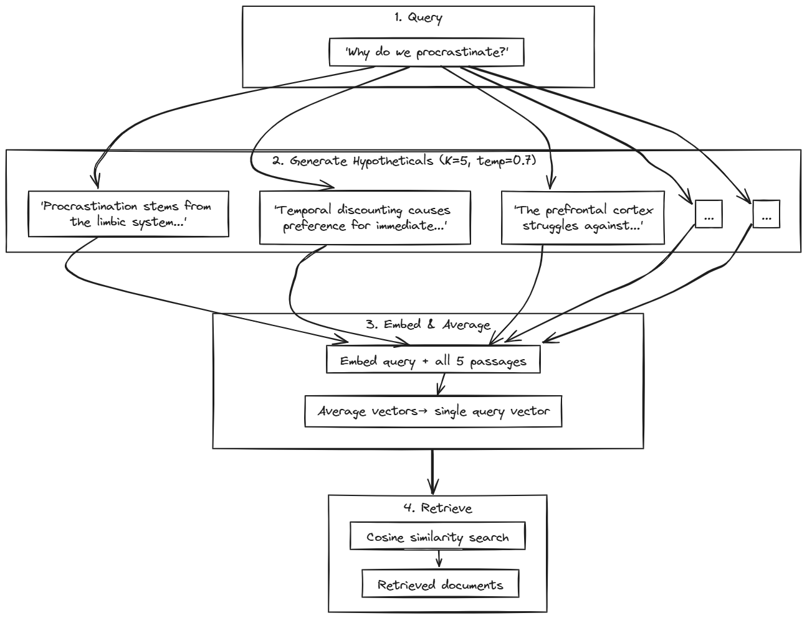

# HyDE: Hypothetical Document Embeddings

[← Preprocessing Overview](README.md) | [Home](../../README.md)

When you ask "What causes stress to affect memory?", your question uses conversational language. But the documents that could answer it use academic prose: "Chronic cortisol elevation impairs hippocampal neurogenesis..." Even when the topic matches perfectly, these stylistic differences push the vectors apart in embedding space, hurting retrieval.

[HyDE](https://arxiv.org/abs/2212.10496) fixes this by generating a *hypothetical answer* before searching. Instead of embedding the question directly, an LLM writes a short passage that *would* answer the query. This fake answer shares the same declarative style and vocabulary as real documents, so its embedding lands closer to relevant content.

The key insight: the hypothetical doesn't need to be factually correct—it just needs to *sound like* the documents you're searching for.

**When HyDE helps:** Zero-shot scenarios without training data, vague queries that need context, vocabulary gaps between how users ask and how documents are written, and complex semantic queries.

**When it struggles:** Topics the LLM doesn't know well (it can't write a useful hypothetical), simple keyword searches where BM25 works fine, and time-sensitive applications (adds ~1-2s latency per query).


## The HyDE Paper and Official Implementation

**Paper:** "Precise Zero-Shot Dense Retrieval without Relevance Labels"
**Authors:** Gao, Ma, Lin, Callan (CMU / Waterloo)
**Published:** ACL 2023 ([arXiv:2212.10496](https://arxiv.org/abs/2212.10496))
**Code:** [texttron/hyde](https://github.com/texttron/hyde)

The authors wanted dense retrieval without needing labeled training data. Their solution: instead of teaching the system what's relevant, transform the query into something that *looks like* a relevant document.

The algorithm works in three steps:

1. **Generate hypothetical documents.** Given a query, prompt an LLM (they used InstructGPT) to write a passage that would answer it. Generate multiple versions (K=5 by default) using temperature 0.7 for diversity.

2. **Embed and average.** Convert each hypothetical to a vector using a standard embedding model. Average all K vectors element-wise—this smooths out quirks from any single generation.

3. **Search.** Use the averaged vector to find similar real documents via cosine similarity.


<div align="center">
    
</div>


**Why does this work if the hypothetical contains wrong facts?** The embedding model compresses text into a fixed-size vector. This compression preserves *what the text is about* (topics, concepts, themes) but loses specific details. So a hypothetical that says "cortisol impairs memory via the hippocampus" will have an embedding similar to real documents about stress and memory—even if the specific mechanism described is slightly off. The embedding captures the semantic neighborhood, not the factual claims.

This is why HyDE works with any embedding model, including the ones used in RAGLab. The embedding doesn't need special training—it just needs to map similar topics to nearby vectors, which all modern embedding models do.

**Benchmark results:** HyDE significantly outperformed unsupervised baselines—+29% on MS MARCO, +23% on TREC-DL19, +38% on Natural Questions—bringing zero-shot retrieval close to fine-tuned systems.

### Prompts

The paper found that **minimal prompts work best**. Over-specifying vocabulary or structure causes "template bias"—the LLM produces similar outputs that don't explore the embedding space effectively.

**Official prompts from [texttron/hyde](https://github.com/texttron/hyde):**

| Task | Domain | Prompt |
|------|--------|--------|
| **Web Search** | General Q&A | `Please write a passage to answer the question. Question: {}` |
| **SciFact** | Scientific claims | `Please write a scientific paper passage to support/refute the claim. Claim: {}` |
| **TREC-COVID** | Medical/COVID research | `Please write a scientific paper passage to answer the question. Question: {}` |
| **FiQA** | Finance Q&A | `Please write a financial article passage to answer the question. Question: {}` |
| **Arguana** | Debate/arguments | `Please write a counter argument for the passage. Passage: {}` |
| **TREC-News** | News articles | `Please write a news passage about the topic. Topic: {}` |
| **Mr-TyDi** | Multilingual | `Please write a passage in {} to answer the question in detail. Question: {}` |

The pattern: mention the document type (passage, scientific paper, financial article) but avoid listing specific terms or examples. Let the LLM's general knowledge fill in domain-appropriate language.

**Community implementations follow this approach:**

[Haystack](https://docs.haystack.deepset.ai/docs/hypothetical-document-embeddings-hyde) generates 5 hypothetical documents at temperature 0.75, max 400 tokens each:
```
Given a question, generate a paragraph of text that answers the question.
Question: {{question}}
Paragraph:
```

[LangChain](https://docs.langchain.com/oss/javascript/integrations/retrievers/hyde) provides built-in prompts matching the paper's templates (`web_search`, `sci_fact`, `fiqa`, etc.) and handles embedding averaging automatically.

### Key Findings

**Minimal prompts beat elaborate ones.** Specifying vocabulary or structure limits the diversity of hypotheticals.

**Trust the embedding.** It naturally filters out wrong details while preserving topical relevance. Don't over-engineer the prompt to ensure accuracy.

**Multiple hypotheticals improve robustness.** K=5 captures different phrasings; averaging creates a more stable query vector.

**Temperature 0.7 balances diversity and relevance.** Lower temperatures produce repetitive outputs; higher temperatures may drift off-topic.


## RAGLab Implementation

RAGLab follows the paper's parameters but includes the **original query** in the embedding average (K+1 vectors instead of K). This means the final search vector is the average of the original query embedding + K hypothetical embeddings, anchoring the search closer to the user's intent while still benefiting from document-style language. Configuration in `src/config.py`:

```python
HYDE_K = 4              # Total hypotheticals: 2 neuroscience + 2 philosophy
HYDE_MAX_TOKENS = 150   # Short passages, 2-3 sentences (paper uses ~100-150)

# Split prompts for dual-domain corpus (explicit length for modern models)
HYDE_PROMPT_NEUROSCIENCE = """Write a brief 2-3 sentence passage from a neuroscience textbook to answer the question.

Question: {query}

Passage:"""

HYDE_PROMPT_PHILOSOPHY = """Write a brief 2-3 sentence passage from a classical wisdom/philosophy essay to answer the question.

Question: {query}

Passage:"""
```

**Split-domain approach:** For dual-domain corpora, using "or" in a single prompt causes all hypotheticals to cluster in one embedding region. Instead, we use two minimal prompts and split K evenly—2 neuroscience hypotheticals + 2 philosophy hypotheticals—ensuring embedding coverage across both document types. The explicit "brief 2-3 sentence" instruction adapts the paper's approach for modern models, which are more verbose than the InstructGPT used in the original research. Search uses pure semantic retrieval (alpha=1.0) since HyDE already transforms queries into document-like embeddings.


## Navigation

**Next:** [Query Decomposition](query-decomposition.md) — Breaking complex questions into sub-queries

**Related:**
- [GraphRAG](graphrag.md) — Entity-based retrieval with knowledge graph communities
- [Preprocessing Overview](README.md) — Strategy comparison
- [Paper (arXiv)](https://arxiv.org/abs/2212.10496) — Original HyDE research
- [Official Implementation](https://github.com/texttron/hyde) — CMU reference code
