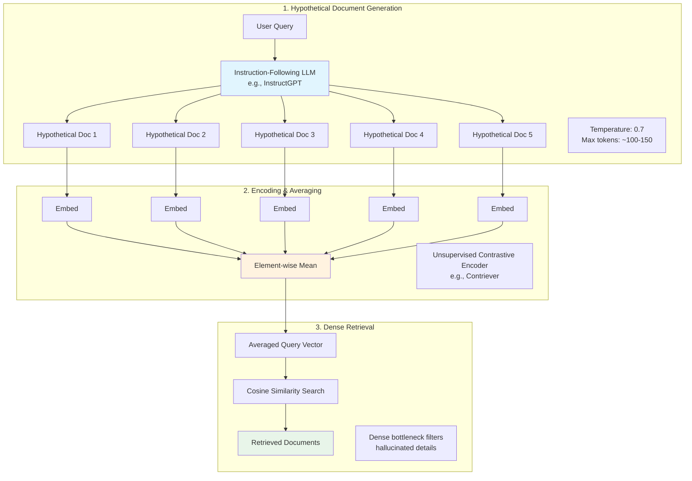

# HyDE: Hypothetical Document Embeddings

[← Preprocessing Overview](README.md) | [Home](../../README.md)

## Introduction

Dense retrieval systems face a fundamental semantic mismatch: user queries and document content occupy different regions in embedding space. A question like "What causes stress to affect memory?" uses interrogative, conversational language, while relevant documents use declarative, scientific prose ("Chronic cortisol elevation impairs hippocampal neurogenesis..."). Even when the topics align perfectly, these stylistic differences push vectors apart, degrading retrieval quality.

[HyDE](https://arxiv.org/abs/2212.10496) (Hypothetical Document Embeddings) solves this by generating a *hypothetical answer* before searching. Rather than embedding the question directly, the system prompts an instruction-following LLM to write a passage that *would* answer the query. This hypothetical document shares declarative structure and domain vocabulary with real corpus documents, bridging the semantic gap. The key insight is that the hypothetical doesn't need to be factually correct—it only needs to be *semantically similar* to relevant documents.

HyDE excels in **zero-shot scenarios** where no task-specific training data exists, handling vague or ambiguous queries that need context enrichment, and bridging vocabulary gaps when users phrase questions differently than documents describe answers. It works well for complex semantic queries and multilingual retrieval across diverse domains. However, HyDE struggles when the LLM lacks knowledge about the topic (a "knowledge bottleneck"), adds latency due to LLM generation before search, and may underperform on simple keyword queries where traditional BM25 works just as well.

---

## The HyDE Paper and Official Implementation

**Paper:** "Precise Zero-Shot Dense Retrieval without Relevance Labels"
**Authors:** Luyu Gao, Xueguang Ma, Jimmy Lin, Jamie Callan (CMU / Waterloo)
**Published:** ACL 2023 ([arXiv:2212.10496](https://arxiv.org/abs/2212.10496))
**Official Implementation:** [texttron/hyde](https://github.com/texttron/hyde)

The authors recognized that creating fully zero-shot dense retrieval systems without relevance labels remained difficult. Rather than trying to learn query and document encoders simultaneously, HyDE sidesteps this challenge by transforming queries into document-like text before encoding. The approach uses an instruction-following language model (InstructGPT in the original experiments) to generate hypothetical documents, then encodes them with an unsupervised contrastive encoder (Contriever) to find similar real documents in the corpus.

The paper's algorithm generates multiple hypothetical documents (K=5 by default) using temperature 0.7 to ensure diversity, embeds each one, and averages the resulting vectors element-wise before searching. This averaging creates a more robust query representation that captures different phrasings and perspectives while smoothing out individual hallucinations. The generated passages are typically short (100-150 tokens, roughly 2-3 sentences).


```mermaid
flowchart TB
    subgraph Generation ["1. Hypothetical Document Generation"]
        Q[User Query] --> LLM[Instruction-Following LLM<br/>e.g., InstructGPT]
        LLM --> H1[Hypothetical Doc 1]
        LLM --> H2[Hypothetical Doc 2]
        LLM --> H3[Hypothetical Doc 3]
        LLM --> H4[Hypothetical Doc 4]
        LLM --> H5[Hypothetical Doc 5]

        style LLM fill:#e1f5fe
        note1[Temperature: 0.7<br/>Max tokens: ~100-150]
    end

    subgraph Encoding ["2. Encoding & Averaging"]
        H1 --> E1[Embed]
        H2 --> E2[Embed]
        H3 --> E3[Embed]
        H4 --> E4[Embed]
        H5 --> E5[Embed]

        E1 --> AVG[Element-wise Mean]
        E2 --> AVG
        E3 --> AVG
        E4 --> AVG
        E5 --> AVG

        style AVG fill:#fff3e0
        note2[Unsupervised Contrastive Encoder<br/>e.g., Contriever]
    end

    subgraph Retrieval ["3. Dense Retrieval"]
        AVG --> VEC[Averaged Query Vector]
        VEC --> SIM[Cosine Similarity Search]
        SIM --> DOCS[Retrieved Documents]

        style DOCS fill:#e8f5e9
        note3[Dense bottleneck filters<br/>hallucinated details]
    end
```

The **dense bottleneck principle** is central to why HyDE works despite generating potentially incorrect content. The contrastive encoder was trained on real documents and compresses text into fixed-dimension vectors. This compression acts as a filter: it preserves topics, concepts, and semantic relationships while discarding specific wrong facts and hallucinated details. The hypothetical document captures *relevance patterns*—what a good answer should look like structurally and thematically—even when its specific claims are fabricated.

On benchmarks, HyDE significantly outperformed the unsupervised Contriever baseline: +29% on MS MARCO (20.6 → 26.6 NDCG@10), +23% on TREC-DL19 (45.2 → 55.4), and +38% on Natural Questions (25.4 → 35.0). These gains brought zero-shot performance close to fine-tuned retrievers, demonstrating that generation can substitute for supervised training.

### Prompts

The prompts from the official implementation are deliberately minimal—typically a single sentence specifying the document type without vocabulary lists or examples. This brevity is intentional: the paper found that over-specification causes template bias, limiting embedding diversity and reducing retrieval recall.

**Official prompts from [texttron/hyde](https://github.com/texttron/hyde):**

| Task | Prompt |
|------|--------|
| **Web Search** | `Please write a passage to answer the question. Question: {}` |
| **SciFact** | `Please write a scientific paper passage to support/refute the claim. Claim: {}` |
| **TREC-COVID** | `Please write a scientific paper passage to answer the question. Question: {}` |
| **FiQA** | `Please write a financial article passage to answer the question. Question: {}` |
| **Arguana** | `Please write a counter argument for the passage. Passage: {}` |
| **TREC-News** | `Please write a news passage about the topic. Topic: {}` |
| **Mr-TyDi** | `Please write a passage in {} to answer the question in detail. Question: {}` |

The pattern is consistent: mention the document type (passage, scientific paper, financial article, news) but avoid specifying vocabulary, structure, or examples. The LLM's general knowledge fills in domain-appropriate language, and the encoder filters out inaccuracies.

**Community implementations follow this pattern:**

[Haystack](https://docs.haystack.deepset.ai/docs/hypothetical-document-embeddings-hyde) uses temperature 0.75, generates 5 hypothetical documents with max 400 tokens each, and averages their embeddings:
```
Given a question, generate a paragraph of text that answers the question.
Question: {{question}}
Paragraph:
```

[LangChain](https://docs.langchain.com/oss/javascript/integrations/retrievers/hyde) provides built-in prompt keys (`web_search`, `sci_fact`, `fiqa`, etc.) matching the paper's templates. Their `HypotheticalDocumentEmbedder` class handles generation and embedding averaging:
```python
from langchain.chains import HypotheticalDocumentEmbedder

embeddings = HypotheticalDocumentEmbedder.from_llm(llm, base_embeddings, "web_search")
result = embeddings.embed_query("What is the capital of France?")
```

LlamaIndex similarly provides a `HyDEQueryTransform` that follows the paper's approach, generating hypothetical answers before retrieval.

### Key Findings

The paper established several principles that inform effective HyDE implementation:

**Minimal prompts work best.** Under-specification hurts retrieval, but over-specification causes template bias. The sweet spot is mentioning document type without constraining vocabulary or structure.

**Trust the encoder.** The contrastive encoder's dense bottleneck naturally filters hallucinations while preserving semantic relevance. Extensive prompt engineering to ensure factual accuracy is unnecessary and potentially counterproductive.

**Multiple hypotheticals improve robustness.** Generating K=5 documents and averaging their embeddings captures different phrasings and perspectives, creating a more centered representation in embedding space. Single hypotheticals work but are more sensitive to generation variance.

**Temperature 0.7 balances diversity and relevance.** Higher temperatures produce more varied hypotheticals; lower temperatures risk repetitive outputs that don't explore the semantic space effectively.

---

## RAGLab Implementation

RAGLab adapts HyDE for a domain-specific corpus combining brain science and classical philosophy texts. The implementation generates K=2 hypothetical passages (reduced from the paper's K=5 for latency) and includes the original query in the embedding average, following the paper's recommendation to anchor the representation.

The prompt specifies the dual domain without constraining vocabulary:
```python
HYDE_PROMPT = """Please write a short passage drawing on insights from brain science and classical philosophy (Stoicism, Taoism, Confucianism, Schopenhauer, Gracian) to answer the question.

Question: {query}

Passage:"""
```

The parenthetical tradition hints provide corpus-relevant cues while remaining general enough to avoid template bias. Search uses pure semantic retrieval (alpha=1.0) since HyDE already transforms the query into document-like embeddings optimized for vector similarity.

---

## Navigation

**Next:** [Query Decomposition](query-decomposition.md) — Breaking complex questions into sub-queries

**Related:**
- [GraphRAG](graphrag.md) — Entity-based retrieval with knowledge graph communities
- [Preprocessing Overview](README.md) — Strategy comparison
- [Paper (arXiv)](https://arxiv.org/abs/2212.10496) — Original HyDE research
- [Official Implementation](https://github.com/texttron/hyde) — CMU reference code
