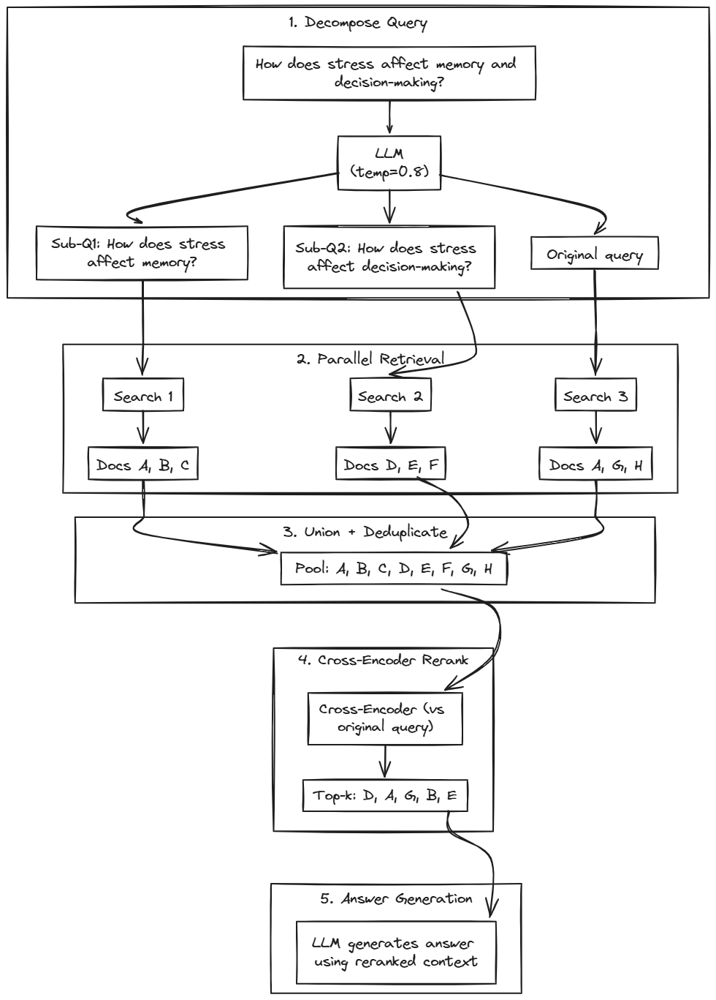

# Query Decomposition

[← HyDE](hyde.md) | [Home](../../README.md)

When you ask "How does stress affect memory and decision-making?", a single embedding averages both concepts into a middle ground that matches neither well. Query Decomposition breaks the question into focused sub-questions, searches each independently, pools results, and reranks against the original query. The cross-encoder judges each document's relevance to the *complete* question, not just individual sub-questions.

**When it helps:** Multi-hop questions, comparisons ("How does X differ from Y?"), "what, how, why" chains.

**When it struggles:** Simple lookups (unnecessary overhead), latency-critical apps (<500ms).


## The Decomposition Paper and Algorithm

**Paper:** "Question Decomposition for Retrieval-Augmented Generation"
**Authors:** Paul J. L. Ammann, Jonas Golde, Alan Akbik
**Published:** ACL SRW 2025 ([arXiv:2507.00355](https://arxiv.org/abs/2507.00355))

The authors studied how to improve retrieval for complex, multi-hop questions. Their solution: instead of forcing one search to handle multiple information needs, decompose the question and search for each need independently.

The algorithm works in five steps:

1. **Decompose the query.** An LLM breaks the original question into up to 5 sub-questions. Each sub-question should be answerable independently and together cover all aspects of the original. Temperature 0.8 and top-p 0.8 encourage diverse decompositions.

2. **Retrieve for each sub-question.** Execute separate retrieval for the original query plus each sub-question. This generates multiple result sets, each focused on one aspect.

3. **Pool all results.** Combine results using simple union—concatenate all result lists and deduplicate by document ID, keeping the first occurrence. No ranking manipulation at this stage.

4. **Rerank against original query.** A cross-encoder (paper uses `bge-reranker-large`) scores each pooled document against the *original* question. This is mandatory—the cross-encoder sees both the full question and each document together, enabling it to judge relevance to the complete multi-faceted query.

5. **Generate answer.** Use the reranked top-k documents as context for LLM generation.

<div align="center">
    
</div>

**Why simple union instead of rank fusion?** The paper found that complex merging strategies (like RRF) don't improve results when cross-encoder reranking follows. The reranker is powerful enough to sort through the pooled candidates—sophisticated merging is redundant.

**Why is reranking mandatory?** Without reranking, the pooled results would be ordered by their original scores from different searches. These scores aren't comparable across queries. The cross-encoder provides a unified relevance judgment against the complete original question.

**Benchmark results:** +36.7% MRR@10 on MultiHop-RAG, +11.6% F1 on HotpotQA—substantial improvements on multi-hop question answering benchmarks.


### Key Findings

**Decomposition temperature matters.** The paper uses temperature 0.8 with top-p 0.8 to generate diverse sub-questions. Lower temperatures produce repetitive decompositions that don't cover the full query.

**Simple queries don't benefit.** For straightforward factual questions, decomposition adds latency without improving results. The LLM should recognize these and keep the query as-is.

**Cross-encoder reranking is essential.** The pooled results need unified scoring. Without reranking, decomposition can hurt performance by mixing incomparable scores.

**Sub-question count is bounded.** The paper caps at 5 sub-questions. More leads to irrelevant tangents; fewer may miss aspects of complex queries.


## RAGLab Implementation

RAGLab implements the paper's algorithm faithfully, with one practical addition from community practice:

```python
# src/prompts.py
DECOMPOSITION_PROMPT = """Break down this question for a knowledge base spanning neuroscience research and classical wisdom/philosophy.

If the question is simple enough to answer directly, keep it as a single question.
Otherwise, create 3-5 sub-questions that can be answered independently and together cover all aspects of the original.

Question: {query}

Respond with JSON:
{{
  "sub_questions": ["...", "...", "..."],
  "reasoning": "Brief explanation"
}}"""
```

RAGLab matches the paper: simple union merge, temperature 0.8, mandatory cross-encoder reranking (`requires_reranking=True`), and dense retrieval only (`alpha=1.0`)—the UI and evaluation enforce this constraint automatically. Additions include a "keep as single question" clause for simple queries ([Haystack practice](https://haystack.deepset.ai/blog/query-decomposition)), JSON response with `reasoning` field for debugging, and domain-specific phrasing for our dual-domain corpus. Since RAGLab is designed to test different techniques and combinations, the constraint system ensures paper-aligned configurations while allowing experimentation with other strategies. 


## Navigation

**Next:** [GraphRAG](graphrag.md) — Entity-based retrieval with knowledge graph communities

**Related:**
- [HyDE](hyde.md) — Hypothetical document embeddings for vocabulary bridging
- [Preprocessing Overview](README.md) — Strategy comparison
- [Paper (arXiv)](https://arxiv.org/abs/2507.00355) — Original decomposition research
