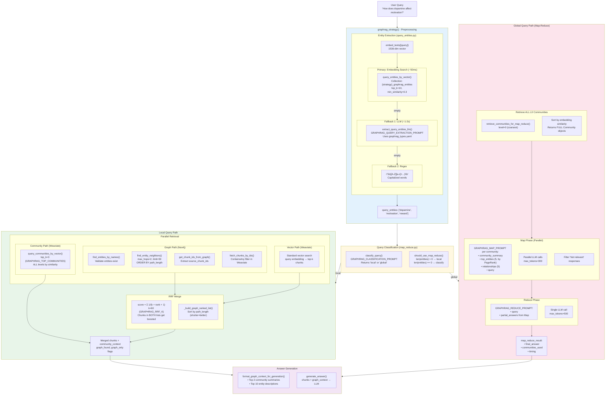

# GraphRAG Architecture Analysis: RAGLab vs Reference Implementations

## Executive Summary

This document provides a detailed comparison of GraphRAG implementations:
- **RAGLab** (this project)
- **Microsoft GraphRAG** (reference implementation)
- **LightRAG** (lightweight alternative)
- **LangChain LLMGraphTransformer**
- **LlamaIndex PropertyGraphIndex**

---

## 1. Indexing Pipeline: RAGLab Workflow

### Mermaid Diagram



```mermaid
flowchart TB
    subgraph Stage4_5["Stage 4.5: Entity Extraction"]
        direction TB
        Chunks["Final Chunks<br/>(JSON files)"]

        subgraph Extraction["extract_chunk() per chunk"]
            direction TB
            Prompt1["GRAPHRAG_CHUNK_EXTRACTION_PROMPT<br/>entity_types from graphrag_types.yaml<br/>max_entities=10, max_relationships=7"]
            LLM1["LLM Call<br/>claude-3-haiku<br/>structured output"]

            subgraph Gleaning["Gleaning Loop (max_gleanings=1)"]
                direction TB
                LoopCheck["GRAPHRAG_LOOP_PROMPT<br/>Did you miss any? Y/N"]
                ContinuePrompt["GRAPHRAG_CONTINUE_PROMPT<br/>MANY entities were missed..."]
                Dedupe["_deduplicate_entities()<br/>_deduplicate_relationships()"]
            end

            Prompt1 --> LLM1
            LLM1 --> LoopCheck
            LoopCheck -->|Y| ContinuePrompt
            ContinuePrompt --> LoopCheck
            LoopCheck -->|N| Dedupe
        end

        StrictMode["Strict Mode Filter<br/>GRAPHRAG_STRICT_MODE=True<br/>Discard non-matching types"]

        subgraph Consolidation["Consolidation (Microsoft approach)"]
            direction TB
            EntityMerge["consolidate_entities()<br/>Key: (normalized_name, entity_type)<br/>LLM summarize if >1 description"]
            RelMerge["consolidate_relationships()<br/>Key: (source, target, type)<br/>Average weights"]
        end

        Output1["extraction_results.json<br/>entities + relationships + stats"]

        Chunks --> Extraction
        Extraction --> StrictMode
        StrictMode --> Consolidation
        Consolidation --> Output1
    end

    subgraph Stage6b_1["Stage 6b Phase 1: Neo4j Upload"]
        direction TB
        Upload["upload_entities()<br/>MERGE on (normalized_name, entity_type)"]
        UploadRels["upload_relationships()<br/>MATCH source/target<br/>MERGE RELATED_TO edge"]
        Indexes["Create indexes:<br/>entity_name, entity_name_type, entity_type"]

        Upload --> UploadRels
        UploadRels --> Indexes
    end

    subgraph Stage6b_2["Stage 6b Phase 2: Leiden + PageRank"]
        direction TB
        Project["project_graph()<br/>GDS in-memory projection<br/>UNDIRECTED orientation"]
        Leiden["run_leiden()<br/>gamma=1.0, seed=42<br/>concurrency=1 (deterministic)<br/>includeIntermediateCommunities=True"]
        PageRank["compute_pagerank()<br/>damping=0.85, iterations=20"]
        WriteComm["write_communities_to_neo4j()<br/>Entity.community_id property"]
        Checkpoint["leiden_checkpoint.json<br/>seed + assignments (crash recovery)"]

        Project --> Leiden
        Leiden --> PageRank
        PageRank --> WriteComm
        Leiden --> Checkpoint
    end

    subgraph Stage6b_3["Stage 6b Phase 3: Community Summarization"]
        direction TB
        Levels["Process 3 hierarchy levels<br/>L0=coarsest, L2=finest"]

        subgraph PerCommunity["Per Community"]
            direction TB
            GetMembers["get_community_members()<br/>Sorted by PageRank DESC"]
            GetRels["get_community_relationships()"]
            BuildCtx["build_community_context()<br/>max_tokens=6000"]
            Summarize["summarize_community()<br/>GRAPHRAG_COMMUNITY_PROMPT<br/>max_tokens=300"]
            Embed["embed_texts([summary])<br/>1536-dim vector"]
        end

        WeaviateComm["Upload to Weaviate<br/>{strategy}_graphrag_communities<br/>community_id, summary, embedding"]
        JSONComm["communities.json<br/>Full data for offline access"]

        Levels --> PerCommunity
        PerCommunity --> WeaviateComm
        PerCommunity --> JSONComm
    end

    subgraph Stage6b_4["Stage 6b Phase 4: Entity Embeddings"]
        direction TB
        ReadEntities["Read entities from Neo4j"]
        EmbedDesc["embed_texts(descriptions)<br/>1536-dim vectors"]
        WeaviateEnt["Upload to Weaviate<br/>{strategy}_graphrag_entities<br/>entity_name, description, embedding"]

        ReadEntities --> EmbedDesc
        EmbedDesc --> WeaviateEnt
    end

    Output1 --> Stage6b_1
    Stage6b_1 --> Stage6b_2
    Stage6b_2 --> Stage6b_3
    Stage6b_3 --> Stage6b_4

    style Stage4_5 fill:#e1f5fe
    style Stage6b_1 fill:#fff3e0
    style Stage6b_2 fill:#f3e5f5
    style Stage6b_3 fill:#e8f5e9
    style Stage6b_4 fill:#fce4ec
```

### Indexing Configuration Reference

| Parameter | Value | Source File | Purpose |
|-----------|-------|-------------|---------|
| `GRAPHRAG_EXTRACTION_MODEL` | `anthropic/claude-3-haiku` | config.py:691 | Entity extraction LLM |
| `GRAPHRAG_MAX_ENTITIES` | 10 | config.py:698 | Max entities per chunk |
| `GRAPHRAG_MAX_RELATIONSHIPS` | 7 | config.py:699 | Max relationships per chunk |
| `GRAPHRAG_MAX_GLEANINGS` | 1 | config.py:704 | Additional extraction passes |
| `GRAPHRAG_STRICT_MODE` | True | config.py:749 | Discard non-matching types |
| `GRAPHRAG_LEIDEN_RESOLUTION` | 1.0 | config.py:710 | Leiden gamma parameter |
| `GRAPHRAG_LEIDEN_SEED` | 42 | config.py:713 | Deterministic seed |
| `GRAPHRAG_LEIDEN_CONCURRENCY` | 1 | config.py:714 | Single-threaded for reproducibility |
| `GRAPHRAG_MAX_HIERARCHY_LEVELS` | 3 | config.py:730 | L0, L1, L2 levels |
| `GRAPHRAG_MIN_COMMUNITY_SIZE` | 3 | config.py:712 | Min nodes per community |
| `GRAPHRAG_MAX_SUMMARY_TOKENS` | 300 | config.py:718 | Max tokens per community summary |
| `GRAPHRAG_MAX_CONTEXT_TOKENS` | 6000 | config.py:719 | Max input tokens for summarization |

---

## 2. Query Pipeline: RAGLab Workflow

### Mermaid Diagram



### Query Configuration Reference

| Parameter | Value | Source File | Purpose |
|-----------|-------|-------------|---------|
| `GRAPHRAG_ENTITY_EXTRACTION_TOP_K` | 10 | config.py:743 | Max entities from embedding search |
| `GRAPHRAG_ENTITY_MIN_SIMILARITY` | 0.3 | config.py:744 | Minimum cosine similarity |
| `GRAPHRAG_USE_EMBEDDING_EXTRACTION` | True | config.py:745 | Use embedding (vs LLM only) |
| `GRAPHRAG_TRAVERSE_DEPTH` | 2 | config.py:725 | Neo4j traversal hops |
| `GRAPHRAG_TOP_COMMUNITIES` | 3 | config.py:724 | Communities for local queries |
| `GRAPHRAG_RRF_K` | 60 | config.py:726 | RRF fusion constant |
| `GRAPHRAG_MAP_MAX_TOKENS` | 300 | config.py:738 | Max tokens per map response |
| `GRAPHRAG_REDUCE_MAX_TOKENS` | 500 | config.py:739 | Max tokens for reduce |

---

## 3. Implementation Comparison: RAGLab vs Microsoft GraphRAG

### Storage Architecture

| Component | RAGLab | Microsoft GraphRAG |
|-----------|--------|-------------------|
| **Entities** | Neo4j (graph) + Weaviate (embeddings) | Parquet files |
| **Relationships** | Neo4j only | Parquet files |
| **Communities** | Neo4j + Weaviate + JSON | Parquet files |
| **Community embeddings** | Yes (Weaviate HNSW) | No (not embedded) |
| **Entity embeddings** | Yes (Weaviate HNSW) | Yes (Parquet + Lance) |
| **Text chunks** | Weaviate | Parquet files |

**Key difference:** RAGLab embeds community summaries for vector search, enabling O(log n) retrieval. Microsoft uses map-reduce over all communities without embedding filtering.

### Entity Extraction at Query Time

| Aspect | RAGLab | Microsoft GraphRAG |
|--------|--------|-------------------|
| **Primary method** | Embedding similarity (50ms) | Embedding similarity |
| **Fallback** | LLM extraction (1-2s) → Regex | N/A |
| **Entity limit** | `top_k=10` | Configurable |
| **Similarity threshold** | `min_similarity=0.3` | N/A |
| **Collection** | `{strategy}_graphrag_entities` | entities.parquet |

### Local Search Implementation

| Aspect | RAGLab | Microsoft GraphRAG |
|--------|--------|-------------------|
| **Entity validation** | Neo4j lookup | N/A (assumes exists) |
| **Graph traversal** | Neo4j Cypher `max_hops=2`, `limit=50` | No traversal - uses stored text_unit_ids |
| **Chunk retrieval** | Weaviate batch fetch (ContainsAny) | Text unit lookup by stored IDs |
| **Community context** | By entity membership (aligned with Microsoft) | By entity membership |
| **Community level** | L0 only (finest level where entities have community_id) | Selected level |
| **Fusion method** | RRF (k=60) | RRF or weighted |
| **Graph ranking** | By path_length (shorter=better) | By relevance score |

**Key implementation difference:**
- RAGLab uses **Neo4j Cypher traversal** (Neo4j GraphRAG pattern) for multi-hop discovery
- Microsoft uses **direct text_unit_id lookup** (simpler, no traversal at query time)
- RAGLab's approach finds structurally related entities beyond initial matches

### Global Search Implementation

| Aspect | RAGLab | Microsoft GraphRAG |
|--------|--------|-------------------|
| **Classification** | LLM-based (local/global) | LLM-based |
| **Community selection** | ALL L0 communities | ALL at selected level |
| **Map input** | Summary + 5 entities + 5 rels | Full community report |
| **Entity ranking** | By PageRank | By importance score |
| **Map parallelism** | Async (asyncio.gather) | Async |
| **Chunks in map** | NO (community context only) | NO (reports only) |
| **Map max tokens** | 300 | Configurable |
| **Reduce max tokens** | 500 | Configurable |

### Community Hierarchy

| Aspect | RAGLab | Microsoft GraphRAG |
|--------|--------|-------------------|
| **Level convention** | L0=coarsest, L2=finest | L0=coarsest (same) |
| **Number of levels** | 3 (configurable) | Variable |
| **Global query level** | L0 (coarsest) | L0 (coarsest) |
| **Local query level** | All (by similarity) | Selected level |
| **Algorithm** | Neo4j GDS Leiden | graspologic Leiden |
| **Determinism** | seed=42, concurrency=1 | seed only |

---

## 4. Comparison: Entity Normalization & Merge Keys

| Aspect | RAGLab | Microsoft GraphRAG | LightRAG | LangChain | LlamaIndex |
|--------|--------|-------------------|----------|-----------|------------|
| **Merge Key** | `(normalized_name, entity_type)` | `(title, type)` | `entity_name` only | `node.id` | Not specified |
| **Name Normalization** | NFKC + lowercase + stopwords + punctuation | UPPERCASE via prompt | `sanitize_and_normalize_extracted_text()` | `id.title()` (title case) | None documented |
| **Type Normalization** | Preserve as-is | Lowercase | Not specified | `type.capitalize()` | From schema |
| **Description Merge** | LLM summarize if >1 | LLM summarize (resolve contradictions) | Map-reduce summarization | N/A | N/A |
| **Relationship Type** | Preserve as-is | N/A | N/A | `type.replace(" ", "_").upper()` | From extraction |

### RAGLab Normalization Function (src/graph/schemas.py:72-101)

```python
def normalized_name(self) -> str:
    name = self.name.strip()
    name = unicodedata.normalize('NFKC', name)  # café → cafe
    name = name.lower()

    # Remove edge stopwords
    words = name.split()
    while words and words[0] in EDGE_STOPWORDS:
        words.pop(0)
    while words and words[-1] in EDGE_STOPWORDS:
        words.pop()

    name = ' '.join(words)
    name = re.sub(r'[^\w\s]', '', name)  # Remove punctuation
    return ' '.join(name.split())

# EDGE_STOPWORDS: {'the', 'a', 'an', 'of', 'in', 'on', 'for', 'to', 'and'}
```

### Example Normalizations

| Original | RAGLab | Microsoft | LangChain |
|----------|--------|-----------|-----------|
| "The Dopamine" | `dopamine` | `THE DOPAMINE` | `The Dopamine` |
| "Prefrontal Cortex (PFC)" | `prefrontal cortex` | `PREFRONTAL CORTEX (PFC)` | `Prefrontal Cortex (Pfc)` |
| "café au lait" | `cafe au lait` | `CAFÉ AU LAIT` | `Café Au Lait` |

---

## 5. Comparison: Community Detection

| Aspect | RAGLab | Microsoft GraphRAG | LightRAG | LlamaIndex |
|--------|--------|-------------------|----------|------------|
| **Algorithm** | Neo4j GDS Leiden | graspologic hierarchical_leiden | None (no communities) | graspologic hierarchical_leiden |
| **Hierarchy** | L0 (coarsest) to L2 (finest) | L0 (coarsest) to leaf | N/A | Same as Microsoft |
| **Level Convention** | L0 = coarsest | L0 = coarsest | N/A | L0 = coarsest |
| **Storage** | Neo4j + Weaviate + JSON | Parquet files | N/A | Neo4j or in-memory |
| **Summarization** | LLM per community | LLM with structured JSON output | N/A | LLM per community |
| **Embeddings** | Yes (community summaries embedded) | No | N/A | No |

---

## 6. Comparison: Query Approaches

| Aspect | RAGLab | Microsoft GraphRAG | LightRAG |
|--------|--------|-------------------|----------|
| **Entity Matching** | Embedding similarity (primary) + LLM + Regex fallbacks | Embedding similarity on descriptions | LLM keyword extraction |
| **Local Query** | Graph traversal + RRF merge with vector + community context | Entity-centric traversal + text units | Low-level: entity nodes via local keywords |
| **Global Query** | Map-reduce over ALL L0 communities | Map-reduce over all community reports | High-level: relation edges via global keywords |
| **Hybrid** | RRF fusion (vector + graph) | DRIFT search (community + local) | Hybrid mode combining local + global |
| **Community Usage** | Augment context (parallel retrieval) | Map-reduce synthesis | N/A |

### RAGLab Query Types

1. **Local Search**: Entity embedding → Neo4j validation → graph traversal → RRF merge with vector + community context
2. **Global Search**: LLM classification → ALL L0 communities → Map phase (parallel) → Reduce phase → final answer

### Microsoft GraphRAG Query Types

1. **Local Search**: Entity embedding → graph traversal → text units
2. **Global Search**: Map-reduce over all community reports
3. **DRIFT Search**: 3-phase hybrid (primer → follow-up → output hierarchy)

### LightRAG Query Types

1. **Local (Low-Level)**: Extract local keywords → match entities → retrieve entity descriptions
2. **Global (High-Level)**: Extract global keywords → match relations → retrieve relationship descriptions
3. **Hybrid**: Combine both approaches

---

## 7. Storage Comparison

| Component | RAGLab | Microsoft GraphRAG | LightRAG | LlamaIndex |
|-----------|--------|-------------------|----------|------------|
| **Entities** | Neo4j | Parquet | NetworkX/GraphML (default) or Neo4j | Neo4j or in-memory |
| **Relationships** | Neo4j | Parquet | NetworkX/GraphML or Neo4j | Neo4j or in-memory |
| **Communities** | Neo4j + Weaviate + JSON | Parquet | N/A | In-memory dict |
| **Text Chunks** | Weaviate | Parquet | Key-value storage | Vector store |
| **Entity Embeddings** | Weaviate | Parquet + Lance | Vector storage | Optional (Neo4j or vector store) |
| **Community Embeddings** | Weaviate | Not stored | N/A | Not stored |

---

## 8. Key Insights: What RAGLab Does Right

### Following Standard Patterns
1. **Composite merge key** `(normalized_name, entity_type)` - matches Microsoft's design
2. **LLM description summarization** - standard approach
3. **Hierarchical Leiden** - industry standard for community detection
4. **RRF fusion** - proven technique for combining ranked lists
5. **Embedding-based entity matching** - faster than pure LLM extraction
6. **Gleaning** - multi-pass extraction for improved recall (now implemented)
7. **Map-reduce for global queries** - ALL L0 communities processed

### Novel/Different Choices
1. **Stronger normalization** - Unicode NFKC + stopwords (more aggressive than Microsoft's UPPERCASE)
2. **Multiple storage locations** - Neo4j + Weaviate + JSON (more flexible, potentially redundant)
3. **Community embedding storage** - Weaviate enables fast semantic search (Microsoft doesn't embed community summaries)
4. **3-tier entity extraction fallback** - Embedding → LLM → Regex (more robust)
5. **Community context for local queries** - Top 3 communities across ALL levels by similarity

### RAGLab-Specific Features
1. **Deterministic Leiden** - seed=42 + concurrency=1 guarantees reproducible community assignments
2. **Crash recovery** - leiden_checkpoint.json enables resumption without community ID mismatches
3. **Strict mode filtering** - Discards entities with types not in curated list (graph quality)

---

## 9. Quick Reference: Key Configuration

### RAGLab (src/config.py)
```python
# Chunking (recommended for GraphRAG)
GRAPHRAG_SEMANTIC_STD_COEFFICIENT = 2.0  # More granular chunks for entity extraction

# Extraction
GRAPHRAG_EXTRACTION_MODEL = "anthropic/claude-3-haiku"
GRAPHRAG_MAX_ENTITIES = 10           # Per chunk
GRAPHRAG_MAX_RELATIONSHIPS = 7       # Per chunk
GRAPHRAG_MAX_GLEANINGS = 1           # Additional extraction passes
GRAPHRAG_STRICT_MODE = True          # Discard non-matching types

# Leiden
GRAPHRAG_LEIDEN_RESOLUTION = 1.0     # Higher = more communities
GRAPHRAG_LEIDEN_MAX_LEVELS = 10      # Max hierarchy depth
GRAPHRAG_LEIDEN_SEED = 42            # Deterministic seed
GRAPHRAG_LEIDEN_CONCURRENCY = 1      # Single-threaded
GRAPHRAG_MIN_COMMUNITY_SIZE = 3      # Min nodes per community
GRAPHRAG_MAX_HIERARCHY_LEVELS = 3    # L0, L1, L2

# Query
GRAPHRAG_TRAVERSE_DEPTH = 2          # Hops for traversal
GRAPHRAG_TOP_COMMUNITIES = 3         # Communities for local queries
GRAPHRAG_RRF_K = 60                  # RRF constant
GRAPHRAG_ENTITY_EXTRACTION_TOP_K = 10
GRAPHRAG_ENTITY_MIN_SIMILARITY = 0.3

# Map-Reduce (global queries)
GRAPHRAG_MAP_MAX_TOKENS = 300        # Max tokens per map response
GRAPHRAG_REDUCE_MAX_TOKENS = 500     # Max tokens for reduce
```

### Microsoft GraphRAG (settings.yaml)
```yaml
extract_graph:
  entity_types: ["organization", "person", "geo", "event"]
  max_gleanings: 1

cluster_graph:
  max_cluster_size: 10
  use_lcc: true

local_search:
  text_unit_prop: 0.5
  community_prop: 0.1
  max_tokens: 12000

global_search:
  max_data_tokens: 8000
```

---

## 10. Key Differences Summary

1. **Graph traversal (Neo4j pattern):** RAGLab uses Cypher traversal (`MATCH path = (start)-[*1..2]-(neighbor)`) for multi-hop discovery. Microsoft uses direct text_unit_id lookup (no traversal). RAGLab's approach finds structurally related entities beyond initial matches, valuable for dual-domain corpus.

2. **Community context (now aligned):** RAGLab now uses entity membership for community retrieval, matching Microsoft's approach. Previously used embedding similarity.

3. **Community embeddings:** RAGLab embeds community summaries and stores in Weaviate; Microsoft does not. This enables faster community retrieval for global queries via HNSW.

4. **Dual storage:** RAGLab uses Neo4j for graph structure AND Weaviate for vector search. Microsoft uses Parquet files for everything.

5. **Entity extraction fallback:** RAGLab has a 3-tier fallback (embedding → LLM → regex). Microsoft relies on embedding only.

6. **Semantic chunking:** RAGLab recommends semantic chunking with std=2.0 for GraphRAG (more granular chunks). Microsoft uses fixed 300-token chunks.

7. **Map-reduce input:** RAGLab formats community context as summary + top 5 entities + top 5 relationships. Microsoft uses full community reports with more detail.

8. **Determinism:** RAGLab enforces determinism with both seed=42 AND concurrency=1. Microsoft only uses seed.

---

## Document Version
- Updated: 2026-01-24
- Based on: RAGLab codebase analysis + reference implementation research
- Changes: Added Mermaid diagrams, updated hierarchy convention (L0=coarsest), added gleaning/map-reduce details, comprehensive comparison tables
