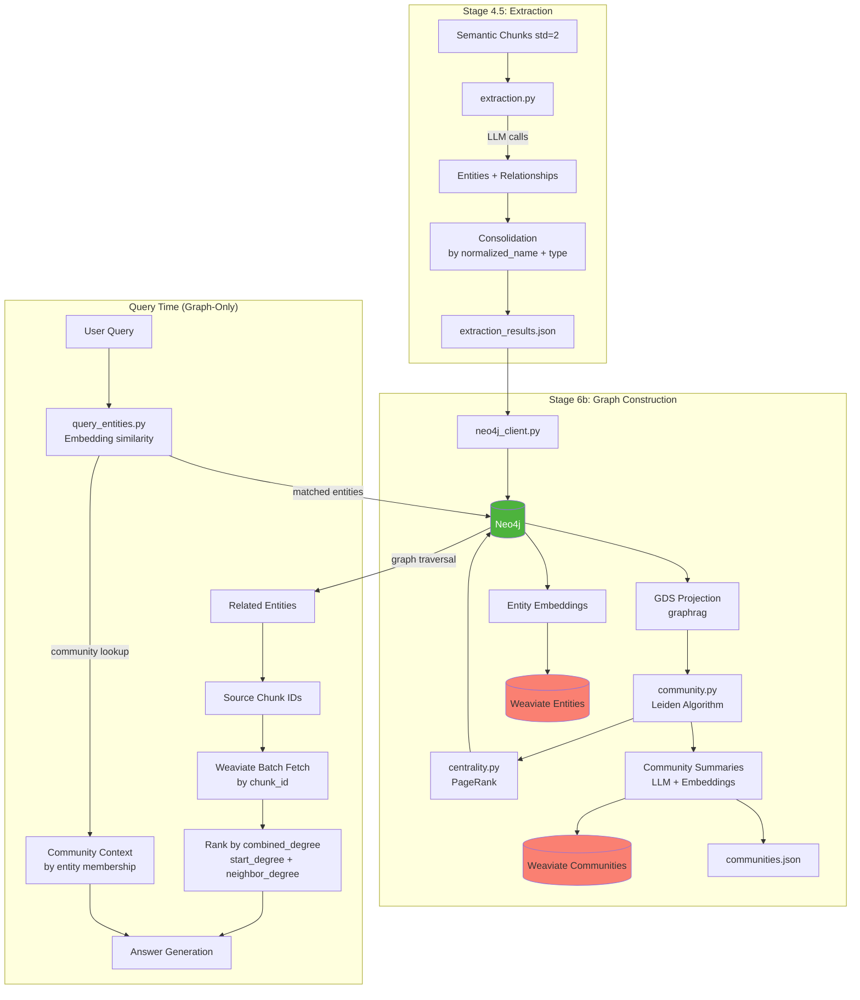
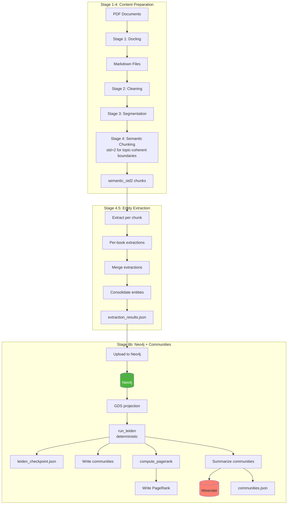
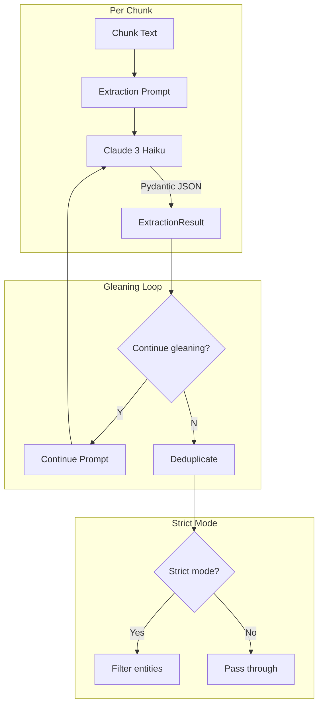
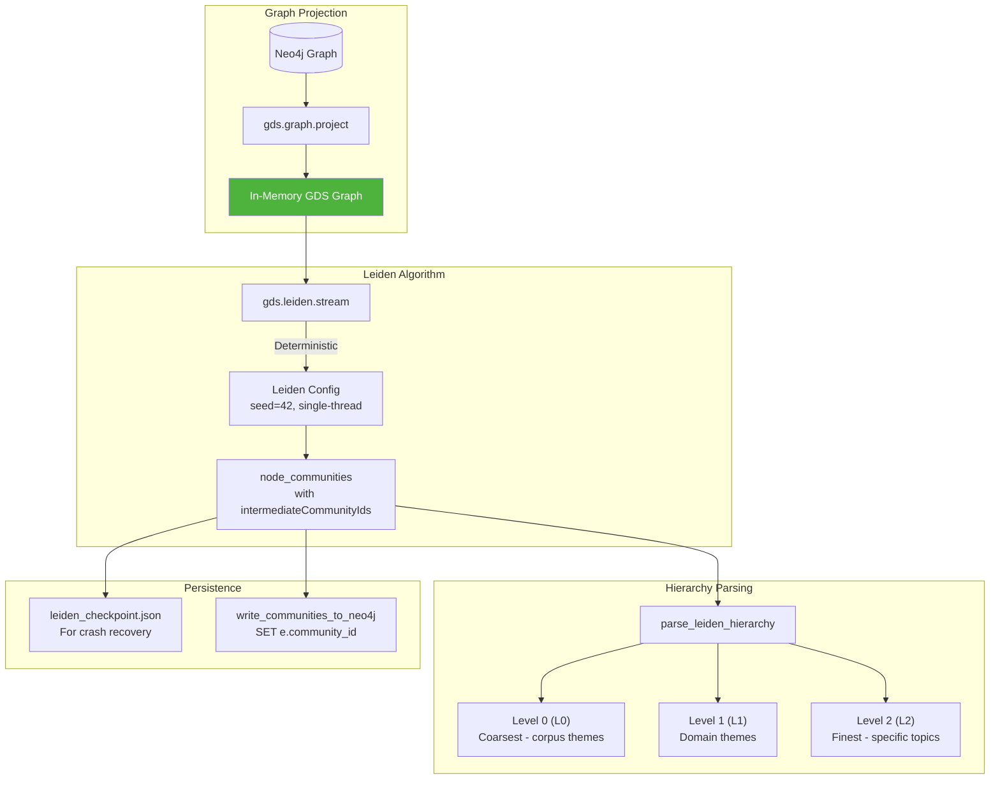
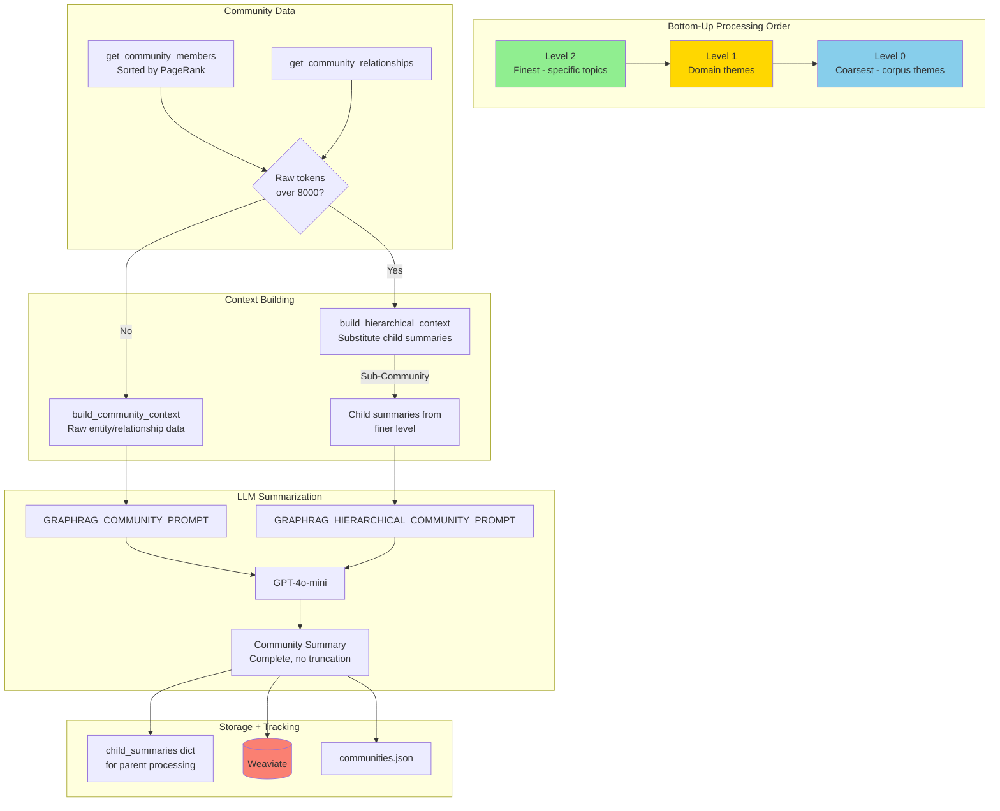
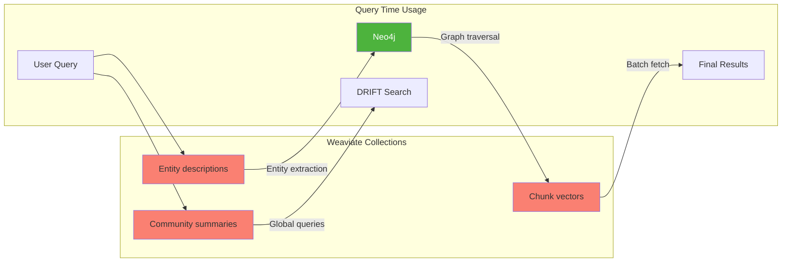
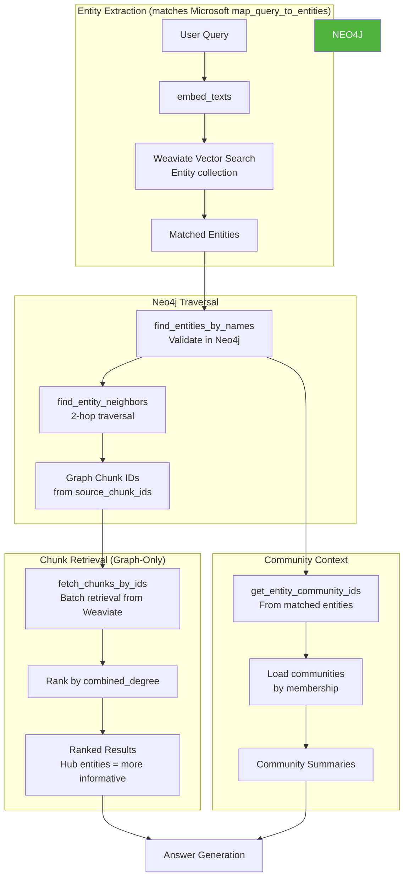
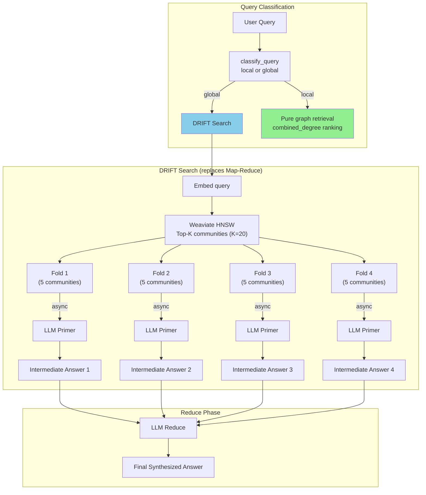

# GraphRAG RAGLab Implementation

> **Purpose**: This document provides a detailed analysis of the GraphRAG implementation in RAGLab, comparing it one-to-one against the Microsoft reference implementation documented in `graphrag_reference_implementation.md`.

## Document Structure

1. [Overview](#1-overview)
2. [Implementation Comparison Matrix](#2-implementation-comparison-matrix)
3. [Indexing Pipeline](#3-indexing-pipeline)
4. [Entity & Relationship Extraction](#4-entity--relationship-extraction)
5. [Community Detection (Leiden)](#5-community-detection-leiden)
6. [Community Summarization](#6-community-summarization)
7. [Embeddings & Storage](#7-embeddings--storage)
8. [Local Search Query Pipeline](#8-local-search-query-pipeline)
9. [Global Search (DRIFT)](#9-global-search-drift)
10. [Data Models](#10-data-models)
11. [Configuration Reference](#11-configuration-reference)
12. [Prompts Comparison](#12-prompts-comparison)
13. [Code Snippets](#13-code-snippets)
14. [What's Different](#14-whats-different)
15. [What's Not Implemented](#15-whats-not-implemented)

---

## 1. Overview

RAGLab implements GraphRAG based on Microsoft's paper (arXiv:2404.16130) and reference implementation. The implementation is split across two stages:

- **Stage 4.5**: Entity/relationship extraction from chunks
- **Stage 6b**: Neo4j upload, Leiden community detection, summarization

### Architecture Overview



---

## 2. Implementation Comparison Matrix

### Indexing Features

| Feature | Microsoft Reference | RAGLab Implementation | Status |
|---------|--------------------|-----------------------|--------|
| Chunking | 600 tokens (paper) | **Semantic (std=2)** for topic coherence | Different |
| Entity Extraction | LLM with delimited output | LLM with **Pydantic JSON Schema** | Different format |
| Gleaning | 1+ rounds | 1 round (configurable) | Matches |
| Entity Types | Configurable in settings.yaml | **graphrag_types.yaml** (8 types) | Matches |
| Entity Matching | Exact string match | Normalized name (NFKC + lowercase + stopwords) | Enhanced |
| Relationship Types | Open-ended | Open-ended | Matches |
| Description Summarization | LLM consolidation | LLM consolidation | Matches |
| Community Detection | Leiden (graspologic) | Leiden (Neo4j GDS) | Different library |
| Community Hierarchy | C0 (coarsest) to C3 | L0 (coarsest) to L2 (3 levels) | Matches convention |
| Community Summaries | Bottom-up LLM | **Bottom-up with child substitution** | Matches |
| Entity Embeddings | Description embeddings | Description embeddings | Matches |

### Query Features

| Feature | Microsoft Reference | RAGLab Implementation | Status |
|---------|--------------------|-----------------------|--------|
| Local Search | Entity matching → traversal | Entity matching → traversal | Matches |
| Entity Matching | Embedding similarity | Embedding similarity | Matches |
| Relationship Prioritization | combined_degree | **combined_degree** (start + neighbor degree) | Matches |
| Token Budget | 50% text, 10% community | combined_degree ranking (no explicit budget) | Different |
| Community Context | In token budget | By entity membership (separate) | Different |
| Global Search | Map-reduce over communities | **DRIFT** (top-K HNSW + primer folds + reduce) | Different |
| Query Classification | LLM-based | LLM-based | Matches |
| DRIFT Search | Dynamic iterative search | **Simplified DRIFT** (top-K HNSW + primer folds + reduce) | Implemented |

### Storage

| Feature | Microsoft Reference | RAGLab Implementation | Status |
|---------|--------------------|-----------------------|--------|
| Chunks | Parquet files | JSON files | Different |
| Entities | Parquet | Neo4j + Weaviate | Different |
| Relationships | Parquet | Neo4j | Matches (different store) |
| Communities | Parquet | JSON + Weaviate | Different |
| Vector Store | LanceDB (default) | Weaviate | Different |
| Graph Store | None (Parquet) | **Neo4j** (native graph DB) | Enhanced |

---

## 3. Indexing Pipeline

### RAGLab Pipeline



### Key Differences from Reference

1. **Chunking Strategy**: RAGLab uses **semantic chunking (std=2)** for topic-coherent boundaries that improve entity extraction quality, vs reference's 600-token fixed chunks
2. **Output Format**: JSON files vs Parquet columnar storage
3. **Graph Storage**: Native Neo4j graph database vs Parquet entity/relationship tables
4. **Deterministic Leiden**: Uses `seed=42` and `concurrency=1` for reproducibility

---

## 4. Entity & Relationship Extraction

### Extraction Process



### RAGLab vs Reference: Extraction Format

**Microsoft Reference** (delimited tuples):

    "entity"<|>CENTRAL INSTITUTION<|>ORGANIZATION<|>Description
    ##
    "relationship"<|>SOURCE<|>TARGET<|>Description<|>9
    <|COMPLETE|>

**RAGLab** (Pydantic JSON Schema):
```python
class ExtractionResult(BaseModel):
    entities: list[ExtractedEntity]
    relationships: list[ExtractedRelationship]

class ExtractedEntity(BaseModel):
    name: str
    entity_type: str
    description: str

class ExtractedRelationship(BaseModel):
    source_entity: str
    target_entity: str
    relationship_type: str
    description: str
    weight: float  # 0.0-1.0
```

### Entity Normalization

RAGLab uses a more sophisticated normalization than exact string matching:

```python
# src/graph/schemas.py:72-101
def normalized_name(self) -> str:
    name = self.name.strip()
    # Unicode normalization (café → cafe)
    name = unicodedata.normalize('NFKC', name)
    name = name.lower()

    # Remove leading/trailing stopwords
    words = name.split()
    while words and words[0] in EDGE_STOPWORDS:
        words.pop(0)
    while words and words[-1] in EDGE_STOPWORDS:
        words.pop()

    name = ' '.join(words)
    # Strip punctuation
    name = re.sub(r'[^\w\s]', '', name)
    return ' '.join(name.split())
```

**Stopwords removed**: `{'the', 'a', 'an', 'of', 'in', 'on', 'for', 'to', 'and'}`

### Entity Types Configuration

**File**: `src/graph/graphrag_types.yaml`

```yaml
entity_types:
  # Generic (2)
  - PERSON           # researchers, philosophers, historical figures
  - WORK             # books, papers, texts

  # Neuroscience (3)
  - BRAIN_STRUCTURE  # regions, systems
  - CHEMICAL         # neurotransmitters, hormones
  - DISORDER         # clinical conditions

  # Psychology bridge (2)
  - MENTAL_STATE     # internal experiences
  - BEHAVIOR         # observable patterns

  # Philosophy (1)
  - PRINCIPLE        # ideas, theories, virtues
```

**Comparison**: Microsoft suggests 4 types (PERSON, ORGANIZATION, LOCATION, EVENT). RAGLab uses **8 domain-specific types** tailored to the dual-domain corpus (neuroscience + philosophy).

---

## 5. Community Detection (Leiden)

### Implementation

**File**: `src/graph/community.py`



### Key Configuration

| Parameter | Microsoft Default | RAGLab Value | Notes |
|-----------|------------------|--------------|-------|
| `resolution` (gamma) | Configurable | **1.0** | Higher = more, smaller communities |
| `max_levels` | Configurable | **10** | Maximum hierarchy depth |
| `seed` | Optional | **42** | Fixed for determinism |
| `concurrency` | Multi-threaded | **1** | Single-threaded for reproducibility |

### Hierarchy Levels

RAGLab follows Microsoft's convention:
- **L0**: Coarsest (corpus-wide themes) - used for global queries
- **L1**: Medium (domain-level themes)
- **L2**: Finest (specific topics) - used for local queries

**Note**: Neo4j GDS returns `intermediateCommunityIds` where index 0 = coarsest, which matches Microsoft's L0 = coarsest convention.

### Crash Recovery

RAGLab implements deterministic Leiden for crash-proof design:

```python
# src/graph/community.py:156-163 (actual gds.leiden.stream call)
result = gds.leiden.stream(
    graph,
    gamma=resolution,  # 1.0
    maxLevels=max_levels,  # 10
    includeIntermediateCommunities=True,
    randomSeed=seed,  # 42
    concurrency=concurrency,  # 1
)
```

Resume from checkpoint:
```bash
python -m src.stages.run_stage_6b_neo4j --from summaries
```

---

## 6. Community Summarization

### Process (Microsoft Bottom-Up Approach)

RAGLab implements Microsoft's bottom-up community summarization algorithm (arXiv:2404.16130):

1. **Processing Order**: Finest level (L2) processed first, then L1, then L0 (coarsest)
2. **Child Summary Substitution**: When raw entity/relationship data exceeds token limit, child community summaries are substituted
3. **No Output Token Limit**: Summaries are allowed to be complete (no truncation)



### Context Building

Members are sorted by **PageRank** (not degree) for context building:

```python
# src/graph/community.py:476-519
def build_community_context(members, relationships, max_tokens=8000):
    lines = ["## Entities"]
    for member in members:  # Already sorted by PageRank
        desc = f" - {member.description}" if member.description else ""
        pr_note = f" [PR:{member.pagerank:.3f}]" if member.pagerank > 0 else ""
        lines.append(f"- {member.entity_name} ({member.entity_type}){pr_note}{desc}")

    if relationships:
        lines.append("\n## Relationships")
        for rel in relationships:
            lines.append(f"- {rel.source} --[{rel.relationship_type}]--> {rel.target}")

    context = "\n".join(lines)
    # Truncate to max_tokens * 4 characters
```

### Comparison to Reference

| Aspect | Microsoft Reference | RAGLab |
|--------|--------------------|----|
| Context building | Bottom-up (leaf summaries → parents) | **Bottom-up with child substitution** |
| Member ordering | By `combined_degree` | By **PageRank** |
| Token limit | 8,000 | **8,000** (matches Microsoft) |
| Output token limit | None (complete summaries) | **None** (matches Microsoft) |
| Output format | JSON with findings array | Plain text summary |

---

## 7. Embeddings & Storage

### What Gets Embedded

| Artifact | Microsoft | RAGLab | Collection Name |
|----------|-----------|--------|-----------------|
| Entity descriptions | Yes | Yes | `Entity_semantic_std2_v1` |
| Text units (chunks) | Yes | Yes | `RAG_semantic_std2_embed3large_v1` |
| Community summaries | Yes | Yes | `Community_semantic_std2_v1` |

> **Note**: GraphRAG uses semantic_std2 chunks exclusively (configured via `GRAPHRAG_CHUNKING_STRATEGY`). Community collection uses a different naming convention as it's derived from the summarization process, not the chunking strategy.

### Weaviate Collections



### Neo4j Graph Model

**Entity node:**

    :Entity {
        name: "dopamine",
        entity_type: "CHEMICAL",
        description: "...",
        source_chunk_ids: ["chunk_1", "chunk_5"],
        community_id: 42,
        pagerank: 0.0042
    }

**Relationship:**

    -[:RELATED_TO {type: "MODULATES", weight: 0.95}]->

**Pattern:** `(Entity)-[:RELATED_TO]->(Entity)`

---

## 8. Local Search Query Pipeline

### Query Flow



### Key Differences from Reference

| Aspect | Microsoft Reference | RAGLab |
|--------|--------------------|----|
| Entity matching | Embedding similarity | Embedding similarity |
| Relationship ranking | `combined_degree` | `combined_degree` (start + neighbor degree) |
| Context composition | Token budget allocation | combined_degree ranking (no explicit budget) |
| Community retrieval | In token budget | By entity membership (separate context) |

### Combined Degree Ranking

RAGLab ranks chunks by `combined_degree` (Microsoft's approach):

```python
# combined_degree = start_degree + neighbor_degree
# Higher combined_degree = hub entities = more informative chunks
# Chunks reached via multiple entities use MAX combined_degree
```

This aligns with Microsoft's relationship prioritization strategy.

---

## 9. Global Search (DRIFT)

### Pipeline

RAGLab uses simplified DRIFT search (Dynamic Reasoning with Inference-time Fine-Tuning) for global queries, replacing the original map-reduce approach.



### DRIFT Search Configuration (replaces Map-Reduce)

| Parameter | Microsoft Reference | RAGLab |
|-----------|--------------------|----|
| Community selection | ALL at selected level (map-reduce) | **Top-20 via HNSW** (DRIFT) |
| Community level | Configurable (C0-C3) | **L0 only** (coarsest) |
| Primer folds | N/A (1 call per community) | **4 folds** (5 communities per fold) |
| Primer max tokens | Configurable | 1000 |
| Reduce max tokens | Configurable | 800 |
| Total LLM calls | ~N (all communities) | **~5** (4 primer + 1 reduce) |
| Score filtering | Remove score=0 | Remove "Not relevant" + score=0 |

### Query Classification Prompt

```python
# src/prompts.py:242-256
GRAPHRAG_CLASSIFICATION_PROMPT = """Classify this query as 'local' or 'global'.

LOCAL queries ask about specific entities, concepts, or facts:
- "What is dopamine?"
- "How does the prefrontal cortex affect decision-making?"

GLOBAL queries ask about themes, patterns, or overviews:
- "What are the main themes in this corpus?"
- "How do neuroscience and philosophy approaches differ?"

Query: {query}

Respond with ONLY the word 'local' or 'global'."""
```

---

## 10. Data Models

### Pydantic Models

```python
# src/graph/schemas.py

class GraphEntity(BaseModel):
    name: str
    entity_type: str
    description: str = ""
    source_chunk_id: str = ""

    def normalized_name(self) -> str: ...
    def to_neo4j_properties(self) -> dict: ...

class GraphRelationship(BaseModel):
    source_entity: str
    target_entity: str
    relationship_type: str
    description: str = ""
    weight: float = 1.0  # 0.0-1.0 (not 1-10 like Microsoft)
    source_chunk_id: str = ""

class Community(BaseModel):
    community_id: str       # "community_L0_42"
    level: int              # 0 = coarsest
    parent_id: Optional[str]
    members: list[CommunityMember]
    member_count: int
    relationships: list[CommunityRelationship]
    relationship_count: int
    summary: str
    embedding: Optional[list[float]]

class CommunityMember(BaseModel):
    entity_name: str
    entity_type: str
    description: str = ""
    degree: int = 0
    pagerank: float = 0.0
```

### Comparison to Microsoft

| Field | Microsoft | RAGLab | Notes |
|-------|-----------|--------|-------|
| Entity `rank` | Degree-based | **PageRank** | Different metric |
| Relationship `weight` | 1-10 (LLM assigned) | **0.0-1.0** (confidence) | Different scale |
| Community `rating` | 0-10 impact score | **Not used** | Omitted |
| Community `findings` | Array of insights | **Plain summary** | Simpler format |

---

## 11. Configuration Reference

### GraphRAG Settings (`src/config.py`)

```python
# Chunking Strategy (single source of truth for GraphRAG)
GRAPHRAG_CHUNKING_STRATEGY = "semantic_std2"  # Uses semantic chunks for topic coherence
# Collection names derived via:
#   get_entity_collection_name() -> "Entity_semantic_std2_v1"
#   get_graphrag_chunk_collection_name() -> "RAG_semantic_std2_embed3large_v1"

# Extraction
GRAPHRAG_EXTRACTION_MODEL = "anthropic/claude-haiku-4.5"
GRAPHRAG_SUMMARY_MODEL = "deepseek/deepseek-v3.2"
GRAPHRAG_MAX_EXTRACTION_TOKENS = 4000
GRAPHRAG_MAX_ENTITIES = 10        # Per chunk (paper: no limit)
GRAPHRAG_MAX_RELATIONSHIPS = 7    # Per chunk (paper: no limit)
GRAPHRAG_MAX_GLEANINGS = 1        # Additional extraction passes
GRAPHRAG_STRICT_MODE = True       # Filter non-matching entity types

# Leiden Community Detection
GRAPHRAG_LEIDEN_RESOLUTION = 1.0  # gamma parameter
GRAPHRAG_LEIDEN_MAX_LEVELS = 10   # Maximum hierarchy depth
GRAPHRAG_MIN_COMMUNITY_SIZE = 3   # Minimum members to summarize
GRAPHRAG_LEIDEN_SEED = 42         # For determinism
GRAPHRAG_LEIDEN_CONCURRENCY = 1   # Single-threaded for reproducibility

# Community Summarization (Microsoft bottom-up approach)
# GRAPHRAG_MAX_SUMMARY_TOKENS removed - allow complete summaries
GRAPHRAG_MAX_CONTEXT_TOKENS = 8000  # Matches Microsoft
GRAPHRAG_MAX_HIERARCHY_LEVELS = 3  # L0, L1, L2

# PageRank
GRAPHRAG_PAGERANK_DAMPING = 0.85
GRAPHRAG_PAGERANK_ITERATIONS = 20

# Query-Time Entity Extraction (embedding similarity - matches Microsoft)
GRAPHRAG_ENTITY_EXTRACTION_TOP_K = 10
GRAPHRAG_ENTITY_MIN_SIMILARITY = 0.3

# Local Search
GRAPHRAG_TOP_COMMUNITIES = 3
GRAPHRAG_TRAVERSE_DEPTH = 2       # Max hops for entity traversal
# Note: GRAPHRAG_RRF_K (60) exists but is NOT used for GraphRAG (pure graph retrieval)

# Map-Reduce (deprecated — DRIFT search is now active for global queries)
GRAPHRAG_MAP_MAX_TOKENS = 300
GRAPHRAG_REDUCE_MAX_TOKENS = 500
```

### Comparison Table

| Parameter | Microsoft Default | RAGLab Value |
|-----------|------------------|--------------|
| Chunk size | 300 (default), 600 (paper) | **Semantic (std=2)** - topic-coherent |
| Gleanings | 0-1 | 1 |
| Max entities/chunk | Unlimited | 10 |
| Max relationships/chunk | Unlimited | 7 |
| Leiden resolution | Configurable | 1.0 |
| PageRank damping | Not specified | 0.85 |
| Max context tokens (summary) | 8,000 | **8,000** (matches) |
| Text unit prop | 0.5 (50%) | N/A (combined_degree ranking) |
| Community prop | 0.15 (15%) | N/A (by entity membership) |
| Retrieval method | Token budget allocation | Pure graph traversal |

---

## 12. Prompts Comparison

### Entity Extraction Prompt

**Microsoft** (delimited output):
```
Format each entity as ("entity"<|>NAME<|>TYPE<|>DESCRIPTION)
Format each relationship as ("relationship"<|>SOURCE<|>TARGET<|>DESCRIPTION<|>WEIGHT)
```

**RAGLab** (JSON output):
```python
# src/prompts.py:146-168
GRAPHRAG_CHUNK_EXTRACTION_PROMPT = """Extract entities and relationships from this text.

ENTITY TYPES (use ONLY these): {entity_types}

For each entity:
- name: The entity name as it appears in text
- entity_type: One of the types above
- description: Brief description (under 15 words)

For each relationship:
- source_entity / target_entity: Entity names from above
- relationship_type: Free-form type (e.g., CAUSES, MODULATES)
- description: Brief description
- weight: 0.0-1.0 (strength/importance)

LIMITS: Up to {max_entities} entities and {max_relationships} relationships.

IMPORTANT: Respond ONLY with valid JSON:
{{"entities": [...], "relationships": [...]}}"""
```

### Gleaning Prompts

RAGLab implements gleaning similarly to Microsoft:

```python
# Loop check (expects Y/N)
GRAPHRAG_LOOP_PROMPT = """Based on the text and your previous extraction,
are there any important entities or relationships you may have missed?
Answer with ONLY 'Y' if there are missed entities, or 'N' if complete."""

# Continue extraction
GRAPHRAG_CONTINUE_PROMPT = """MANY entities and relationships were missed.
...
Extract ADDITIONAL entities and relationships that were missed."""
```

### Community Summary Prompt

**Microsoft** (structured JSON with findings):
```json
{
    "title": "...",
    "summary": "...",
    "rating": 5.0,
    "rating_explanation": "...",
    "findings": [{"summary": "...", "explanation": "..."}]
}
```

**RAGLab** (plain text):
```python
GRAPHRAG_COMMUNITY_PROMPT = """You are analyzing a community...

Community entities and their relationships:
{community_context}

Write a summary (2-3 short paragraphs, ~150-200 words) that:
1. Identifies the main theme
2. Explains key relationships
3. Highlights important details

Summary:"""
```

---

## 13. Code Snippets

### Entity Extraction with Gleaning

```python
# src/graph/extraction.py:120-203
def extract_chunk(chunk, model=GRAPHRAG_EXTRACTION_MODEL, max_gleanings=1):
    entity_types = get_entity_types_string()
    text = chunk["text"]

    # Initial extraction
    prompt = GRAPHRAG_CHUNK_EXTRACTION_PROMPT.format(
        entity_types=entity_types,
        text=text,
        max_entities=GRAPHRAG_MAX_ENTITIES,
        max_relationships=GRAPHRAG_MAX_RELATIONSHIPS,
    )
    result = call_structured_completion(
        messages=[{"role": "user", "content": prompt}],
        model=model,
        response_model=ExtractionResult,
        temperature=0.0,
        max_tokens=GRAPHRAG_MAX_EXTRACTION_TOKENS,
    )

    all_entities = list(result.entities)
    all_relationships = list(result.relationships)

    # Gleaning loop
    for i in range(max_gleanings):
        if not _should_continue_gleaning(text, all_entities, all_relationships, model):
            break
        additional = _glean_additional_entities(...)
        all_entities.extend(additional.entities)
        all_relationships.extend(additional.relationships)

    # Deduplicate within chunk
    final_entities = _deduplicate_entities(all_entities)
    final_relationships = _deduplicate_relationships(all_relationships)

    # Apply strict mode filtering
    if GRAPHRAG_STRICT_MODE:
        filtered, discarded = filter_entities_strict(result.entities, allowed_types)
```

### Pure Graph Retrieval (Microsoft Design)

```python
# src/graph/query.py:912-...
def graph_retrieval(query, driver, top_k=10, collection_name=None):
    """Pure graph retrieval without vector search (Microsoft GraphRAG design)."""
    # Get graph chunk IDs and metadata
    graph_chunk_ids, graph_meta = get_graph_chunk_ids(query, driver)

    # Community context by entity membership (Microsoft approach)
    query_entities = graph_meta.get("query_entities", [])
    community_context = retrieve_community_context_by_membership(
        entity_names=query_entities,
        driver=driver,
    )

    # Fetch ALL graph-discovered chunks from Weaviate (batch filter, not vector search)
    all_graph_chunks = fetch_chunks_by_ids(graph_chunk_ids, collection_name)

    # Rank by combined_degree (Microsoft approach: hub entities = more informative)
    graph_context = graph_meta.get("graph_context", [])
    ranked_results = _build_graph_ranked_list(graph_context, all_graph_chunks)

    # Return top-k ranked by combined_degree (no vector search, no RRF merge)
    return ranked_results[:top_k], metadata
```

> **Note**: Previous versions used hybrid graph+vector retrieval with RRF merge.
> This was refactored to match Microsoft's pure graph approach in January 2026.

### Deterministic Leiden

```python
# src/graph/community.py:116-187
def run_leiden(gds, graph, resolution=1.0, max_levels=10, seed=42, concurrency=1):
    """Deterministic Leiden with fixed seed and single-threaded execution."""
    result = gds.leiden.stream(
        graph,
        gamma=resolution,
        maxLevels=max_levels,
        includeIntermediateCommunities=True,  # For hierarchy
        randomSeed=seed,           # Fixed seed
        concurrency=concurrency,   # Single-threaded
    )

    node_communities = []
    for record in result.itertuples():
        node_communities.append({
            "node_id": record.nodeId,
            "community_id": record.communityId,
            "intermediate_ids": list(record.intermediateCommunityIds),
        })

    return {
        "community_count": len(unique_communities),
        "node_communities": node_communities,
        "seed": seed,
    }
```

---

## 14. What's Different

### 1. Output Format

| Component | Microsoft | RAGLab | Rationale |
|-----------|-----------|--------|-----------|
| Extraction output | Delimited tuples | **Pydantic JSON** | Structured validation |
| Storage format | Parquet | **JSON + Neo4j** | Graph-native queries |
| Vector store | LanceDB | **Weaviate** | Production-ready |

### 2. Entity Matching

**Microsoft**: Exact string matching
**RAGLab**: Normalized matching (NFKC + lowercase + stopword removal)

```python
# "The Dopamine" → "dopamine"
# "café" → "cafe"
```

### 3. Relationship Weight Scale

**Microsoft**: 1-10 (LLM assigns strength)
**RAGLab**: 0.0-1.0 (confidence score)

### 4. Token Budget vs Combined Degree Ranking

**Microsoft**: Explicit token budget allocation (50% text, 15% community, 35% entities/relationships)
**RAGLab**: Pure graph retrieval with combined_degree ranking (no token budget, no RRF)

### 5. Community Context Retrieval

**Microsoft**: Part of token budget
**RAGLab**: By entity membership (separate from chunk context)

### 6. Relationship Prioritization

**Microsoft**: `combined_degree = degree(source) + degree(target)`
**RAGLab**: `combined_degree = start_degree + neighbor_degree` (Matches Microsoft)

Higher combined_degree indicates relationships involving "hub" entities that are
well-connected in the knowledge graph, providing more informative context.

### 7. Community Summary Format

**Microsoft**: Structured JSON with `title`, `rating`, `findings[]`
**RAGLab**: Plain text summary (150-200 words)

### 8. Graph Storage

**Microsoft**: No native graph DB (Parquet tables)
**RAGLab**: **Neo4j** with native graph queries and GDS algorithms

### 9. StrategyConfig Integration

GraphRAG uses the `StrategyConfig` system (`src/rag_pipeline/retrieval/preprocessing/strategy_config.py`) to enforce constraints:

```python
# GraphRAG strategy configuration
"graphrag": StrategyConfig(
    strategy_id="graphrag",
    display_name="GraphRAG",
    description="Knowledge graph + community retrieval (arXiv:2404.16130)",
    collection_constraint=CollectionConstraint(
        mode="dedicated",
        dedicated_collection=get_graphrag_chunk_collection_name(),  # "RAG_semantic_std2_embed3large_v1"
    ),
    search_type_constraint=SearchTypeConstraint(mode="internal"),  # No external search type
    alpha_constraint=AlphaConstraint(mode="fixed", fixed_value=1.0),  # Fixed alpha
),
```

**UI Behavior**: When GraphRAG is selected:
- Collection selector shows dedicated collection (disabled)
- Alpha slider shows fixed value (disabled)
- Search type is internal (bypasses Weaviate vector search)

**Evaluation Behavior**: GraphRAG runs as a single configuration, not in the standard grid search.

---

## 15. What's Not Implemented

### 1. Dynamic Community Selection

Microsoft's post-paper `DynamicCommunitySelection` is **not implemented**:
- RAGLab previously used static mode (ALL L0 communities). Now uses **DRIFT** with top-K HNSW selection
- Dynamic mode: LLM scores relevance per community, traverses hierarchy
- Parameters: `threshold` (0.5), `max_level`, `keep_parent`
- Benefit: Filters irrelevant communities, finds optimal granularity
- Cost: Requires LLM call per community for relevance scoring

### 2. DRIFT Search (Simplified — Implemented)

Simplified DRIFT replaces brute-force map-reduce for global queries:
- Top-K community selection via Weaviate HNSW (O(log n) vs O(n))
- Primer phase: parallel LLM calls over community folds
- Reduce phase: single LLM call for final synthesis
- ~5 LLM calls vs ~1000 (99.5% reduction)
- **Not implemented**: Follow-up queries, confidence-based stopping (full Microsoft DRIFT)

### 3. Covariates/Claims

The optional claims extraction system is **not implemented**:
- Subject, object, type, status
- Claim verification

### 4. Token Budget Allocation

RAGLab uses combined_degree ranking instead of explicit token budgets:
- No `text_unit_prop` (50%)
- No `community_prop` (15%)
- No relationship/entity budget
- Chunks ranked by graph centrality, not token allocation

### 5. Community Impact Rating

The 0-10 impact severity rating is **not used**:
- No `rating` field
- No `rating_explanation`
- No `findings[]` array

### 6. Graph Embeddings (Node2Vec)

Optional graph structure embeddings:
- `embed_graph` block
- Node2Vec walks

### 7. Graph Pruning

Pre-processing to remove noise:
- `min_node_freq`
- `min_node_degree`
- `min_edge_weight_pct`

### 8. Oversample Scaler

Entity retrieval oversampling:
- `oversample_scaler` (default 2)
- Retrieve more candidates, then filter

---

## Summary

RAGLab implements the core GraphRAG pipeline with several enhancements:

**Strengths**:
- Native Neo4j graph storage (vs Parquet tables)
- Deterministic Leiden with crash recovery
- Pydantic validation for extraction
- Enhanced entity normalization
- Pure graph retrieval with combined_degree ranking (matches Microsoft design)
- **Semantic chunking (std=2)** for topic-coherent chunks that improve entity extraction
- **StrategyConfig integration** for constraint-aware UI and evaluation

**Simplifications**:
- Simpler community summary format
- No token budget allocation
- Simplified DRIFT (no follow-up loop, no confidence-based stopping)
- No claims/covariates

**Design Philosophy**:
- Learning-focused with extensive documentation
- Production-ready storage (Weaviate, Neo4j)
- Modular stage-based pipeline
- Crash-proof with checkpoints
- Single source of truth for GraphRAG chunking strategy (`GRAPHRAG_CHUNKING_STRATEGY`)
