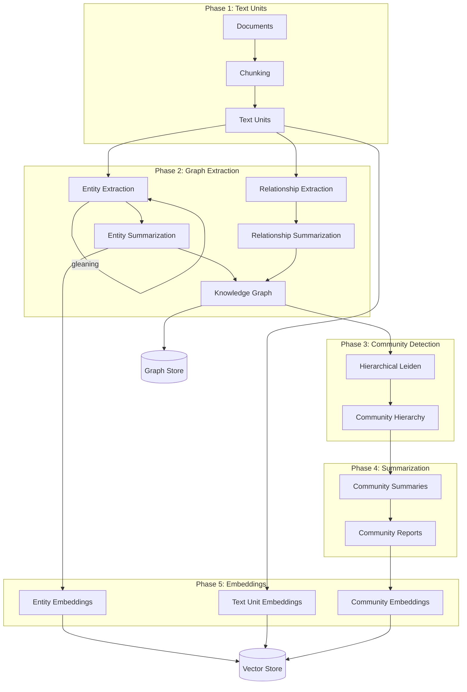
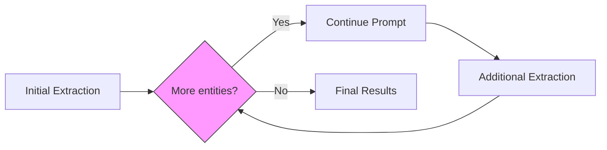
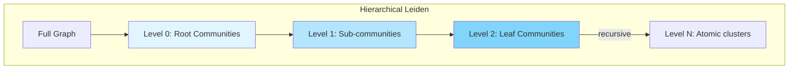
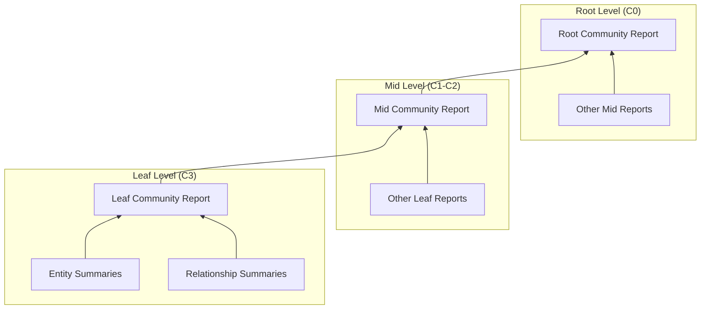
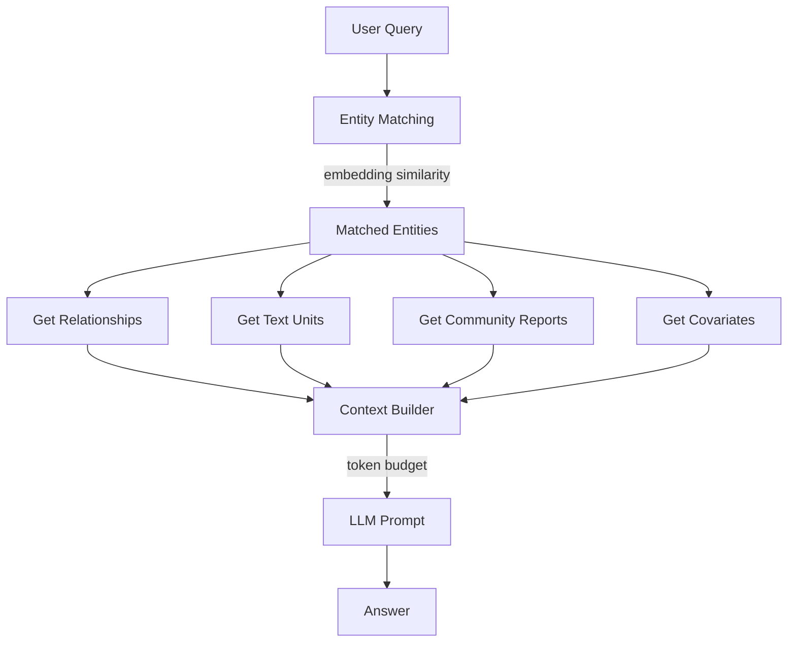
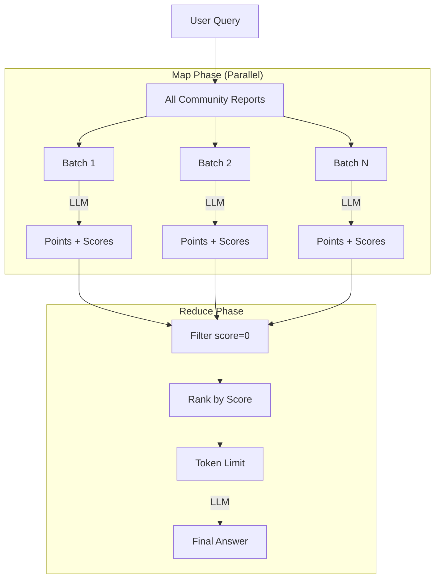
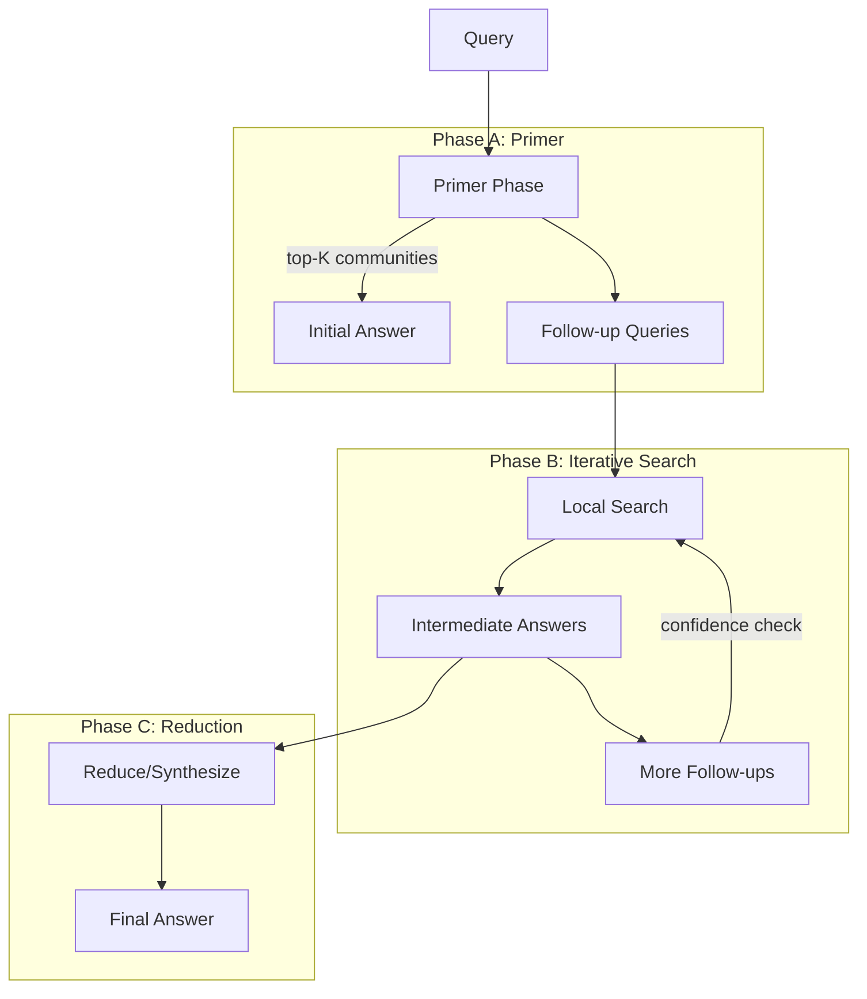

# GraphRAG Reference Implementation

> **Purpose**: This document captures implementation details from the original GraphRAG paper (arXiv:2404.16130) and Microsoft's reference implementation. It serves as an isolated reference for comparing against project-specific implementations.

## Sources

- **Paper**: [From Local to Global: A Graph RAG Approach to Query-Focused Summarization](https://arxiv.org/abs/2404.16130) (April 2024)
- **Repository**: [microsoft/graphrag](https://github.com/microsoft/graphrag)
- **Documentation**: [microsoft.github.io/graphrag](https://microsoft.github.io/graphrag/)

---

## 1. Overview

GraphRAG addresses a fundamental limitation of standard RAG: the inability to answer **global sensemaking questions** that require understanding themes and patterns across an entire corpus rather than specific facts.

### Core Innovation

Instead of relying solely on vector similarity search, GraphRAG:
1. Builds a **knowledge graph** of entities and relationships from the corpus
2. Applies **hierarchical community detection** to identify thematic clusters
3. Generates **community summaries** that capture corpus-wide themes
4. Uses **map-reduce** over community summaries for global queries

### Two Query Modes

| Mode | Use Case | Mechanism |
|------|----------|-----------|
| **Local Search** | Entity-specific questions | Graph traversal + vector search |
| **Global Search** | Thematic/corpus-wide questions | Map-reduce over community summaries |

---

## 2. Indexing Pipeline Overview



---

## 3. Phase 1: Text Unit Creation

### Chunking Strategy

Text Units are the atomic units of analysis. Documents are chunked with configurable parameters:

| Parameter | Paper Value | Default | Description |
|-----------|-------------|---------|-------------|
| `chunk_size` | 600 tokens | 300 tokens | Maximum tokens per chunk |
| `overlap` | 100 tokens | Configurable | Shared tokens between consecutive chunks |
| `strategy` | tokens | tokens | Chunking method ("tokens" or "sentences") |

### Key Insight from Paper

> "Using a chunk size of 600 extracted twice as many entities as using a chunk size of 2400."

Smaller chunks yield more precise entity extraction but require more LLM calls. The paper recommends **600 tokens with 1 gleaning round** as a balanced approach.

### Chunk-Document Relationship

- **Default**: 1-to-many (chunks aligned to document boundaries)
- **Alternative**: many-to-many (for very short documents)
- Each Text Unit maintains `document_ids` for provenance tracking

---

## 4. Phase 2: Entity & Relationship Extraction

### 4.1 Extraction Prompt Structure

The extraction prompt instructs the LLM to identify:

1. **Entities**: Name, Type, Description
2. **Relationships**: Source, Target, Description, Weight (strength score)

```
Output Format (using delimiters):
- Tuple delimiter: <|>
- Record delimiter: ##
- Completion marker: <|COMPLETE|>

Entity: ("entity"<|>NAME<|>TYPE<|>DESCRIPTION)
Relationship: ("relationship"<|>SOURCE<|>TARGET<|>DESCRIPTION<|>WEIGHT)
```

### 4.2 Entity Types

The paper uses **domain-tailored entity types**:
- Generic: PERSON, ORGANIZATION, LOCATION, EVENT
- Domain-specific types added based on corpus (e.g., for tech corpus: TECHNOLOGY, PRODUCT)

### 4.3 Gleaning (Multi-Pass Extraction)

Gleaning improves recall by prompting the LLM for missed entities:



**Three Prompts Used:**

| Prompt | Purpose |
|--------|---------|
| `GRAPH_EXTRACTION_PROMPT` | Initial entity/relationship extraction |
| `CONTINUE_PROMPT` | "MANY entities were missed. Add them below using the same format." |
| `LOOP_PROMPT` | "Answer Y if there are still entities to add, or N if none." |

**Paper Findings:**
- Podcast dataset: 600 tokens, **1 gleaning** round
- News dataset: 600 tokens, **0 gleanings**
- Gleaning improves recall by ~15-20%

### 4.4 Entity Matching

The paper uses **exact string matching** for entity reconciliation:

> "The analysis uses exact string matching for entity matching—the task of reconciling different extracted names for the same entity. However, softer matching approaches can be used."

**Deduplication Strategy:**
- Entities with same name are merged
- Descriptions are concatenated or summarized via LLM
- Relationship weights are accumulated for duplicates

### 4.5 Relationship Extraction Details

| Field | Description |
|-------|-------------|
| `source` | Source entity name |
| `target` | Target entity name |
| `description` | Relationship description |
| `weight` | Strength score (numeric, defaults to 1.0) |

Relationships are **directional** but the graph can be projected as **undirected** for community detection.

---

## 5. Phase 3: Community Detection

### 5.1 Leiden Algorithm

GraphRAG uses the **Leiden algorithm** (improvement over Louvain) via the `graspologic` library:



### 5.2 Hierarchy Levels (Paper Convention)

| Level | Name | Description | Use Case |
|-------|------|-------------|----------|
| C0 | Root | Coarsest communities | Global queries (map-reduce) |
| C1 | Mid | Domain-level themes | Alternative aggregation |
| C2 | Sub | Topic-level clusters | More granular analysis |
| C3 | Leaf | Finest granularity | Maximum detail |

**Paper Tested**: Levels C0-C3 (4 levels)

### 5.3 Configuration Parameters

| Parameter | Default | Description |
|-----------|---------|-------------|
| `max_cluster_size` | Configurable | Maximum nodes per community (controls granularity) |
| `use_lcc` | true | Use largest connected component only |
| `seed` | Configurable | Random seed for reproducibility |

**Note**: Microsoft's implementation uses `max_cluster_size` rather than traditional resolution parameter to control community granularity.

### 5.4 Graph Projection

For Leiden, the graph is treated as **undirected weighted**:
- Edge weights from relationship strength scores
- Duplicate edges have accumulated weights

---

## 6. Phase 4: Community Summarization

### 6.1 Summarization Hierarchy

Community reports are generated **bottom-up**:



### 6.2 Context Building for Summarization

**For Leaf Communities:**
1. Collect entity summaries (prioritized by combined source/target degree)
2. Collect relationship summaries
3. Iteratively add until token limit reached

**For Higher Levels:**
- If all element summaries fit: summarize all
- Otherwise: substitute sub-community summaries for element summaries
- Rank sub-communities by token count

### 6.3 Community Report Prompt

The prompt instructs generation of:

| Field | Description |
|-------|-------------|
| `title` | Community name from key entities |
| `summary` | Executive overview (2-3 sentences) |
| `rating` | Impact severity score (0-10) |
| `rating_explanation` | Single sentence justification |
| `findings` | 5-10 key insights with explanations |

**Grounding Rules:**
- Data references format: `[Data: <dataset> (record ids)]`
- Maximum 5 record IDs per reference (use "+more" for additional)
- No fabrication—only evidence-supported claims

---

## 7. Phase 5: Embedding Generation

### 7.1 What Gets Embedded

| Artifact | Field Embedded | Purpose |
|----------|----------------|---------|
| Entity | `description` | Local search entity matching |
| Text Unit | `text` | Source text retrieval |
| Community Report | `summary` / `full_content` | Community retrieval |

### 7.2 Entity Description Embeddings

**Critical for Local Search:**
> "By default, GraphRAG embeds only the entity description field, because this is used during local search to find starting entry points to the graph for traversal."

**Configuration:**
- `GRAPHRAG_EMBEDDING_TARGET`: What to embed
- `GRAPHRAG_EMBEDDING_SKIP`: What to skip
- For global-only usage, entity embeddings can be skipped

---

## 8. Local Search Query Pipeline

### 8.1 Overview



### 8.2 Entity Matching via Embeddings

**Algorithm:**
```
1. Embed user query
2. Vector similarity search against entity descriptions
3. Retrieve top-k * oversample_scaler candidates
4. Filter by exclusion list
5. Append inclusion list entities
6. Return top-k entities
```

**Parameters:**
| Parameter | Default | Description |
|-----------|---------|-------------|
| `top_k_mapped_entities` | 10 | Number of entities to retrieve |
| `oversample_scaler` | 2 | Multiplier for initial retrieval |
| `embedding_vectorstore_key` | ID or title | Lookup method |

### 8.3 Relationship Prioritization

Two-tier ranking strategy:

**In-Network Relationships** (between matched entities):
- Highest priority
- Sorted by `combined_degree` (sum of source and target node degrees)

**Out-of-Network Relationships** (to external entities):
- Secondary priority
- Sorted by:
  1. `links` count (how many matched entities connect to external entity)
  2. `combined_degree`

**Budget:** `relationship_budget = top_k_relationships * len(matched_entities)`

### 8.4 Token Budget Allocation

Context is built within a token budget:

| Component | Default Proportion | Description |
|-----------|-------------------|-------------|
| Text Units | 50% (`text_unit_prop=0.5`) | Source text chunks |
| Community Reports | 10% (`community_prop=0.1`) | Thematic context |
| Entities + Relationships | 40% (remainder) | Graph structure |

**Total:** `max_tokens` defaults to **12,000 tokens**

### 8.5 Local Search System Prompt

Key directives:
- Summarize information from provided data tables
- Use citations: `[Data: <dataset> (record ids)]`
- Maximum 5 record IDs per reference
- Acknowledge uncertainty rather than fabricate
- Use markdown formatting

---

## 9. Global Search Query Pipeline

### 9.1 Map-Reduce Overview



### 9.2 Map Phase Details

**Input:** Community reports shuffled and divided into batches

**Processing:**
```
For each batch:
    1. Format batch as context
    2. LLM generates points with importance scores (0-100)
    3. Parse JSON response for (description, score) pairs
```

**Concurrency:** `asyncio.Semaphore(concurrent_coroutines)` (default: 32)

**Map Prompt Output Format:**
```json
{
  "points": [
    {"description": "Key insight with data references", "score": 85},
    {"description": "Another insight", "score": 72}
  ]
}
```

### 9.3 Reduce Phase Details

**Filtering:**
1. Remove points with `score = 0` (not helpful)
2. Sort remaining by score (descending)
3. Accumulate until `max_data_tokens` (default: 8000)

**Synthesis:**
- Remaining points become context for final LLM call
- Reduce prompt instructs synthesis from multiple "analyst reports"
- Preserves modal verbs (shall, may, will)
- Maintains data references

**Fallback:** If all scores = 0 and `allow_general_knowledge=false`:
> "I am sorry but I am unable to answer this question given the provided data."

### 9.4 Community Level Selection

> "Lower hierarchy levels, with their detailed reports, tend to yield more thorough responses, but may also increase the time and LLM resources needed."

**Paper Finding:**
- C0 (root) required 9-43x fewer tokens than full source text
- C3 (leaf) required 26-33% fewer tokens than source

---

## 10. DRIFT Search (Dynamic Reasoning)

### 10.1 Overview

DRIFT (Dynamic Reasoning and Inference with Flexible Traversal) combines local and global search:



### 10.2 Key Parameters

| Parameter | Description |
|-----------|-------------|
| `n_depth` | Maximum iteration depth |
| `drift_k_followups` | Number of follow-up queries per iteration |
| `top_k_reports` | Community reports for primer |

### 10.3 Algorithm

1. **Primer**: Query against top-K community reports, generate initial answer and follow-ups
2. **Iteration**: For each follow-up, run local search, generate intermediate answers
3. **Ranking**: Score and rank incomplete actions
4. **Reduction**: Synthesize all responses into final answer

---

## 11. Data Model & Storage

### 11.1 Core Tables (Parquet Format)

| Table | Key Fields | Description |
|-------|------------|-------------|
| `documents` | id, text, title, creation_date | Source documents |
| `text_units` | id, text, document_ids, entity_ids | Chunked text with links |
| `entities` | id, title, type, description, rank | Extracted entities |
| `relationships` | id, source, target, description, weight | Entity connections |
| `communities` | id, level, parent_id, entity_ids | Leiden clusters |
| `community_reports` | id, community_id, title, summary, findings | Generated summaries |
| `covariates` | id, subject_id, type, description, status | Claims (optional) |

### 11.2 Entity Attributes

| Field | Type | Description |
|-------|------|-------------|
| `title` | string | Entity name (canonical) |
| `type` | string | Entity type (PERSON, ORG, etc.) |
| `description` | string | Summarized description |
| `rank` | float | Importance score (degree-based default) |
| `community_id` | string | Assigned community |
| `x`, `y` | float | UMAP coordinates (optional) |

### 11.3 Relationship Attributes

| Field | Type | Description |
|-------|------|-------------|
| `source` | string | Source entity title |
| `target` | string | Target entity title |
| `description` | string | Relationship description |
| `weight` | float | Strength/frequency score |
| `combined_degree` | int | Sum of source and target degrees |

### 11.4 Vector Store Integration

Embeddings stored in configurable vector store (default: LanceDB):
- Entity description embeddings
- Text unit embeddings
- Community report embeddings

---

## 12. Configuration Reference

### 12.1 Chunking (`chunks` block)

```yaml
chunks:
  size: 300              # Tokens per chunk (paper: 600)
  overlap: 100           # Token overlap
  strategy: tokens       # "tokens" or "sentences"
  prepend_metadata: false
  chunk_size_includes_metadata: false
```

### 12.2 Entity Extraction (`extract_graph` block)

```yaml
extract_graph:
  model_id: <model>
  entity_types: [PERSON, ORGANIZATION, LOCATION, EVENT]
  max_gleanings: 1       # 0 = disabled, 1+ = gleaning rounds
  prompt: <prompt_file>
```

### 12.3 Community Detection (`cluster_graph` block)

```yaml
cluster_graph:
  max_cluster_size: 10   # Controls granularity
  use_lcc: true          # Largest connected component
  seed: 42               # Random seed
```

### 12.4 Summarization (`summarize_descriptions` block)

```yaml
summarize_descriptions:
  max_length: 500        # Output tokens
  max_input_length: 4000 # Input collection limit
  model_id: <model>
```

### 12.5 Local Search (`local_search` block)

```yaml
local_search:
  chat_model_id: <model>
  embedding_model_id: <model>
  top_k_entities: 10
  top_k_relationships: 10
  max_context_tokens: 12000
  text_unit_prop: 0.5
  community_prop: 0.1
```

### 12.6 Global Search (`global_search` block)

```yaml
global_search:
  map_model_id: <model>
  reduce_model_id: <model>
  max_data_tokens: 8000
  concurrent_coroutines: 32
  allow_general_knowledge: false
```

---

## 13. Paper Evaluation Results

### 13.1 Datasets

| Dataset | Size | Chunks | Entities | Relationships |
|---------|------|--------|----------|---------------|
| Podcast | ~1M tokens | 1,669 | 8,564 | 20,691 |
| News | ~1.7M tokens | 3,197 | 15,754 | 19,520 |

### 13.2 Evaluation Metrics

**LLM-as-Judge Criteria:**
| Criterion | Description |
|-----------|-------------|
| Comprehensiveness | Coverage of question aspects |
| Diversity | Variety of perspectives/insights |
| Empowerment | Supports reader understanding |
| Directness | Specificity and conciseness |

### 13.3 Results vs Vector RAG

| Metric | GraphRAG Win Rate |
|--------|-------------------|
| Comprehensiveness | 72-83% |
| Diversity | 62-82% |

All improvements statistically significant (p < 0.001)

### 13.4 Token Efficiency

| Level | vs Source Text |
|-------|----------------|
| C0 (root) | 9-43x fewer tokens |
| C3 (leaf) | 26-33% fewer tokens |

---

## 14. Key Implementation Decisions Summary

### Indexing Decisions

| Decision | Choice | Rationale |
|----------|--------|-----------|
| Chunking | 600 tokens | Balance extraction quality vs API cost |
| Gleaning | 1 round | 15-20% recall improvement |
| Entity matching | Exact string | Simple, duplicates cluster together |
| Community algorithm | Leiden | Hierarchical, well-connected guarantees |
| Summarization | Bottom-up | Higher levels incorporate lower summaries |

### Query Decisions

| Decision | Choice | Rationale |
|----------|--------|-----------|
| Entity retrieval | Embedding similarity | Fast semantic matching |
| Relationship priority | In-network first | Most relevant connections |
| Token allocation | 50% text, 10% community | Balance specificity and context |
| Global search | Map-reduce | Scalable to large community sets |
| Score filtering | Remove score=0 | Focus on helpful points |

### Storage Decisions

| Decision | Choice | Rationale |
|----------|--------|-----------|
| Output format | Parquet | Efficient columnar storage |
| Vector store | LanceDB (default) | Embedded, no server required |
| Graph projection | Undirected weighted | For Leiden clustering |

---

## 15. Appendix: Prompt Templates

### A. Entity Extraction Prompt (Summarized)

```
-Goal-
Given a text document, identify all entities and relationships.

-Steps-
1. Identify entities: name, type, description
2. Identify relationships: source, target, description, strength
3. Return as delimited tuples

-Entity Types-
{entity_types}

-Text-
{input_text}
```

### B. Community Report Prompt (Summarized)

```
You are an AI assistant analyzing a community of entities.

Create a report with:
- TITLE: Community name from key entities
- SUMMARY: Executive overview
- IMPACT SEVERITY RATING: 0-10 scale
- RATING EXPLANATION: Single sentence
- DETAILED FINDINGS: 5-10 key insights

Output as JSON. Only use provided data.
Maximum {max_report_length} words.
```

### C. Map Phase Prompt (Summarized)

```
Generate key points answering the user question.
Rate each point 0-100 for importance.

Output JSON:
{"points": [{"description": "...", "score": N}, ...]}

Only include evidence-supported claims.
```

### D. Reduce Phase Prompt (Summarized)

```
Synthesize analyst reports into a single response.
Reports ranked by importance (descending).

- Preserve modal verbs
- Maintain data references
- Remove irrelevant information
- Use markdown formatting
```

---

## 16. References

1. Edge, D., et al. (2024). "From Local to Global: A Graph RAG Approach to Query-Focused Summarization." arXiv:2404.16130
2. Microsoft GraphRAG Documentation: https://microsoft.github.io/graphrag/
3. Microsoft GraphRAG GitHub: https://github.com/microsoft/graphrag
4. Graspologic (Leiden implementation): https://graspologic.readthedocs.io/
