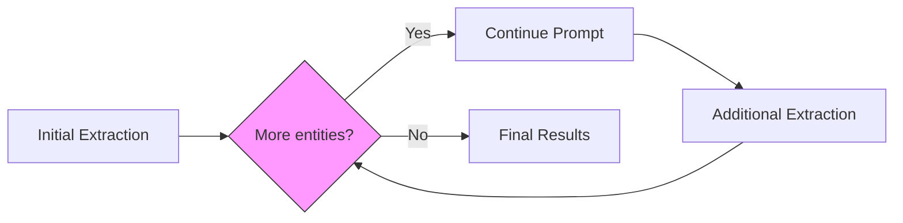
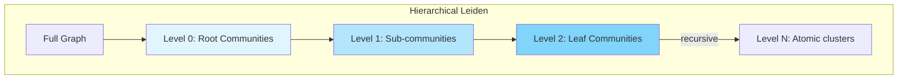
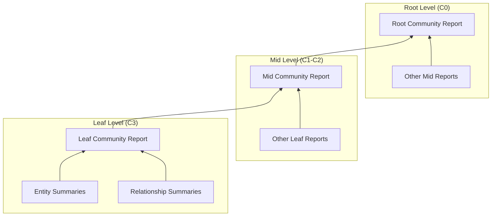
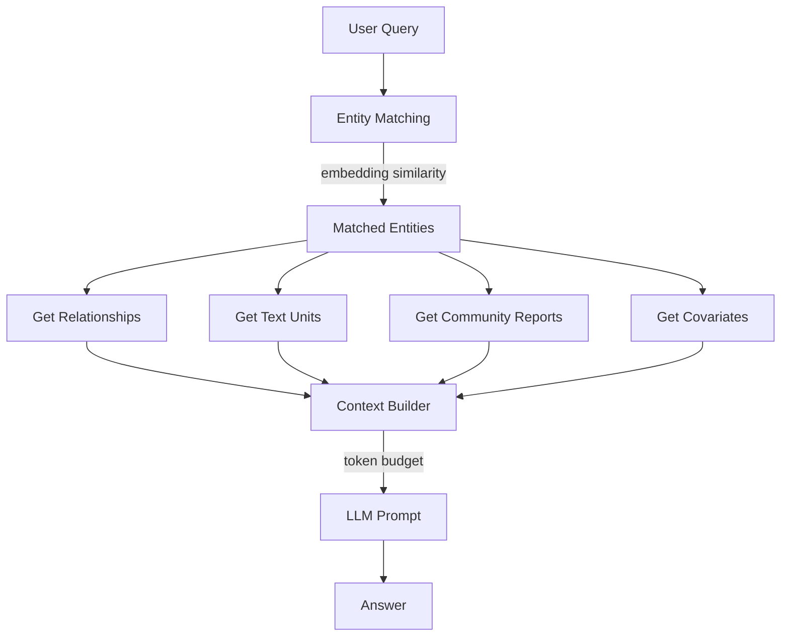
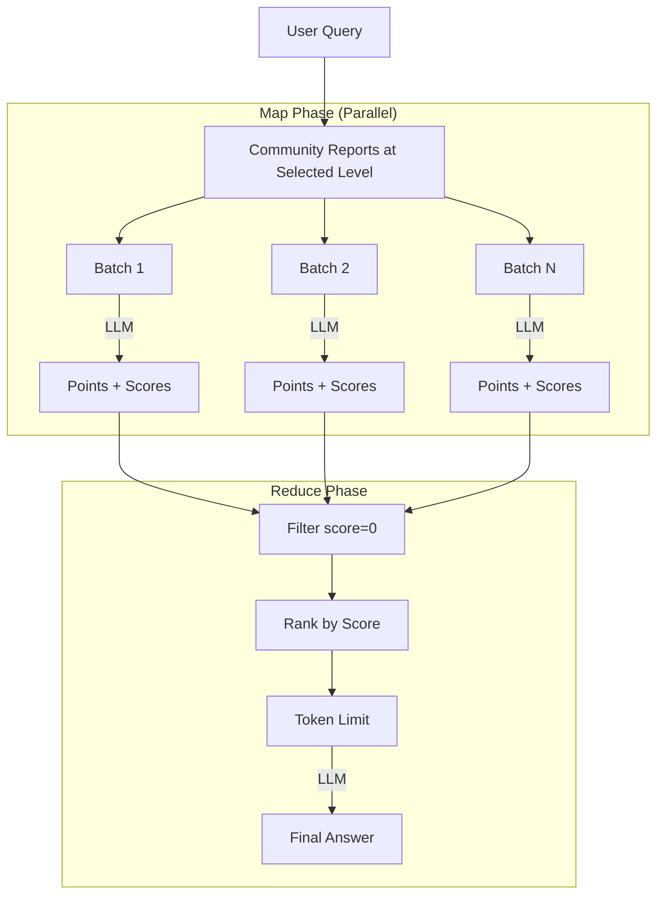
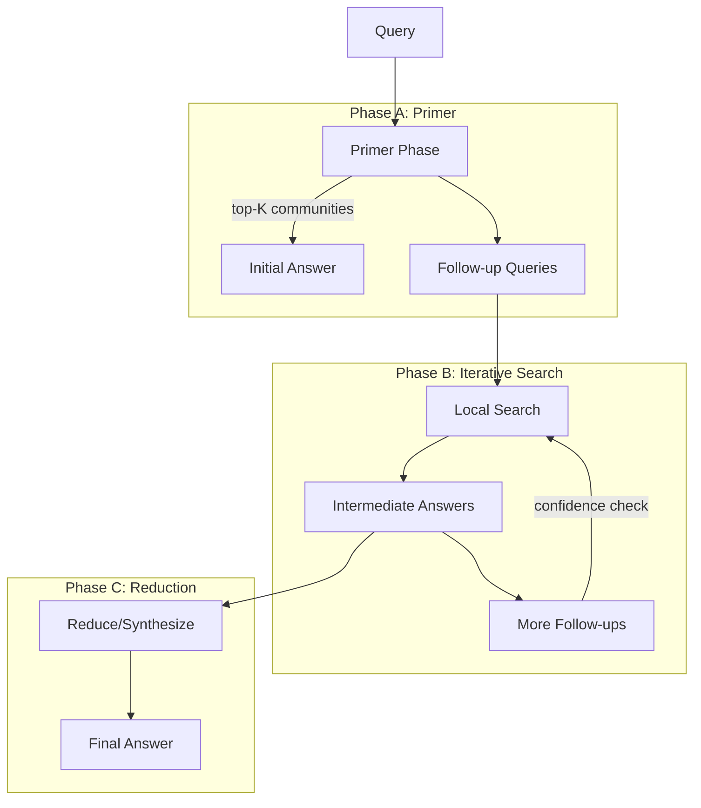

# GraphRAG Reference Implementation

> **Purpose**: This document captures implementation details from the original GraphRAG paper (arXiv:2404.16130) and Microsoft's reference implementation. It serves as an isolated reference for comparing against project-specific implementations.

## Sources

- **Paper**: [From Local to Global: A Graph RAG Approach to Query-Focused Summarization](https://arxiv.org/abs/2404.16130) (April 2024)
- **Repository**: [microsoft/graphrag](https://github.com/microsoft/graphrag)
- **Documentation**: [microsoft.github.io/graphrag](https://microsoft.github.io/graphrag/)

---

## 1. Overview

GraphRAG addresses a fundamental limitation of standard RAG: the inability to answer **global sensemaking questions** that require understanding themes and patterns across an entire corpus rather than specific facts.

### Core Innovation

Instead of relying solely on vector similarity search, GraphRAG:
1. Builds a **knowledge graph** of entities and relationships from the corpus
2. Applies **hierarchical community detection** to identify thematic clusters
3. Generates **community summaries** that capture corpus-wide themes
4. Uses **map-reduce** over community summaries for global queries

### Two Query Modes

| Mode | Use Case | Mechanism |
|------|----------|-----------|
| **Local Search** | Entity-specific questions | Graph traversal + vector search |
| **Global Search** | Thematic/corpus-wide questions | Map-reduce over community summaries |

---

## 2. Indexing Pipeline Overview

```mermaid
flowchart TB
    subgraph Phase1["Phase 1: Text Units"]
        DOC[Documents] --> CHUNK[Chunking]
        CHUNK --> TU[Text Units]
    end

    subgraph Phase2["Phase 2: Graph Extraction"]
        TU --> EE[Entity Extraction]
        TU --> RE[Relationship Extraction]
        EE --> |gleaning| EE
        EE --> ES[Entity Summarization]
        RE --> RS[Relationship Summarization]
        ES --> GRAPH[Knowledge Graph]
        RS --> GRAPH
    end

    subgraph Phase3["Phase 3: Community Detection"]
        GRAPH --> LEIDEN[Hierarchical Leiden]
        LEIDEN --> HIER[Community Hierarchy]
    end

    subgraph Phase4["Phase 4: Summarization"]
        HIER --> CS[Community Summaries]
        CS --> CR[Community Reports]
    end

    subgraph Phase5["Phase 5: Embeddings"]
        ES --> EMB_ENT[Entity Embeddings]
        TU --> EMB_TU[Text Unit Embeddings]
        CR --> EMB_CR[Community Embeddings]
    end

    EMB_ENT --> VS[(Vector Store)]
    EMB_TU --> VS
    EMB_CR --> VS
    GRAPH --> GDB[(Graph Store)]
```



---

## 3. Phase 1: Text Unit Creation

### Chunking Strategy

Text Units are the atomic units of analysis. Documents are chunked with configurable parameters:

| Parameter | Paper Value | Default | Description |
|-----------|-------------|---------|-------------|
| `chunk_size` | 600 tokens | 300 tokens | Maximum tokens per chunk |
| `overlap` | 100 tokens | Configurable | Shared tokens between consecutive chunks |
| `strategy` | tokens | tokens | Chunking method ("tokens" or "sentences") |

### Key Insight from Paper

> "Using a chunk size of 600 extracted twice as many entities as using a chunk size of 2400."

Smaller chunks yield more precise entity extraction but require more LLM calls. The paper recommends **600 tokens with 1 gleaning round** as a balanced approach.

### Chunk-Document Relationship

- **Default**: 1-to-many (chunks aligned to document boundaries)
- **Alternative**: many-to-many (for very short documents)
- Each Text Unit maintains `document_ids` for provenance tracking

---

## 4. Phase 2: Entity & Relationship Extraction

### 4.1 Extraction Prompt Structure

The extraction prompt instructs the LLM to identify:

1. **Entities**: Name, Type, Description
2. **Relationships**: Source, Target, Description, Weight (strength score)

```
Output Format (using delimiters):
- Tuple delimiter: <|>
- Record delimiter: ##
- Completion marker: <|COMPLETE|>

Entity: ("entity"<|>NAME<|>TYPE<|>DESCRIPTION)
Relationship: ("relationship"<|>SOURCE<|>TARGET<|>DESCRIPTION<|>WEIGHT)
```

### 4.2 Entity Types

The paper uses **domain-tailored entity types**:
- Generic: PERSON, ORGANIZATION, LOCATION, EVENT
- Domain-specific types added based on corpus (e.g., for tech corpus: TECHNOLOGY, PRODUCT)

### 4.3 Gleaning (Multi-Pass Extraction)

Gleaning improves recall by prompting the LLM for missed entities:



**Three Prompts Used:**

| Prompt | Purpose |
|--------|---------|
| `GRAPH_EXTRACTION_PROMPT` | Initial entity/relationship extraction |
| `CONTINUE_PROMPT` | "MANY entities were missed. Add them below using the same format." |
| `LOOP_PROMPT` | "Answer Y if there are still entities to add, or N if none." |

**Paper Findings:**
- Podcast dataset: 600 tokens, **1 gleaning** round
- News dataset: 600 tokens, **0 gleanings**
- Gleaning improves recall by ~15-20%

### 4.4 Entity Matching

The paper uses **exact string matching** for entity reconciliation:

> "The analysis uses exact string matching for entity matching—the task of reconciling different extracted names for the same entity. However, softer matching approaches can be used."

**Deduplication Strategy:**
- Entities with same name are merged
- Descriptions are concatenated or summarized via LLM
- Relationship weights are accumulated for duplicates

### 4.5 Relationship Extraction Details

| Field | Description |
|-------|-------------|
| `source` | Source entity name |
| `target` | Target entity name |
| `description` | Relationship description |
| `weight` | Strength score (numeric, defaults to 1.0) |

Relationships are **directional** but the graph can be projected as **undirected** for community detection.

---

## 5. Phase 3: Community Detection

### 5.1 Leiden Algorithm

GraphRAG uses the **Leiden algorithm** (improvement over Louvain) via the `graspologic` library:



### 5.2 Hierarchy Levels (Paper Convention)

| Level | Name | Description | Use Case |
|-------|------|-------------|----------|
| C0 | Root | Coarsest communities | Global queries (map-reduce) |
| C1 | Mid | Domain-level themes | Alternative aggregation |
| C2 | Sub | Topic-level clusters | More granular analysis |
| C3 | Leaf | Finest granularity | Maximum detail |

**Paper Tested**: Levels C0-C3 (4 levels)

### 5.3 Configuration Parameters

| Parameter | Default | Description |
|-----------|---------|-------------|
| `max_cluster_size` | Configurable | Maximum nodes per community (controls granularity) |
| `use_lcc` | true | Use largest connected component only |
| `seed` | Configurable | Random seed for reproducibility |

**Note**: Microsoft's implementation uses `max_cluster_size` rather than traditional resolution parameter to control community granularity.

### 5.4 Graph Projection

For Leiden, the graph is treated as **undirected weighted**:
- Edge weights from relationship strength scores
- Duplicate edges have accumulated weights

---

## 6. Phase 4: Community Summarization

### 6.1 Summarization Hierarchy

Community reports are generated **bottom-up**:



### 6.2 Context Building for Summarization

**For Leaf Communities:**
1. Collect entity summaries (prioritized by combined source/target degree)
2. Collect relationship summaries
3. Iteratively add until token limit reached

**For Higher Levels:**
- If all element summaries fit: summarize all
- Otherwise: substitute sub-community summaries for element summaries
- Rank sub-communities by token count

### 6.3 Community Report Prompt

The prompt instructs generation of:

| Field | Description |
|-------|-------------|
| `title` | Community name from key entities |
| `summary` | Executive overview (2-3 sentences) |
| `rating` | Impact severity score (0-10) |
| `rating_explanation` | Single sentence justification |
| `findings` | 5-10 key insights with explanations |

**Grounding Rules:**
- Data references format: `[Data: <dataset> (record ids)]`
- Maximum 5 record IDs per reference (use "+more" for additional)
- No fabrication—only evidence-supported claims

---

## 7. Phase 5: Embedding Generation

### 7.1 What Gets Embedded

| Artifact | Field Embedded | Purpose |
|----------|----------------|---------|
| Entity | `title:description` | Local search entity matching |
| Text Unit | `text` | Source text retrieval |
| Community Report | `summary` / `full_content` | Community retrieval |

### 7.2 Entity Description Embeddings

**Critical for Local Search:**

The reference implementation embeds **`title:description`** (concatenated with a colon separator):

```python
# From generate_text_embeddings.py
"data": entities.loc[:, ["id", "title", "description"]].assign(
    title_description=lambda df: df["title"] + ":" + df["description"]
),
"embed_column": "title_description"
```

The title provides disambiguation context (e.g., distinguishing "John Smith the CEO" from "John Smith the researcher").

**Storage:**

Entity embeddings are stored in a **vector store** (LanceDB by default, also supports Azure AI Search, CosmosDB):

```python
# Entity embeddings loaded into vectorstore with entity ID as key
vectorstore.add_documents(
    documents=[{"id": entity.id, "embedding": entity.description_embedding, ...}]
)
```

**Query-Time Usage:**

The `map_query_to_entities()` function performs vector similarity search at query time:

```python
# From entity_extraction.py
def map_query_to_entities(query, text_embedding_vectorstore, text_embedder, ...):
    # 1. Embed the user query
    # 2. Search vectorstore for similar entity embeddings
    search_results = text_embedding_vectorstore.similarity_search_by_text(
        text=query,
        text_embedder=lambda t: text_embedder.embed(t),
        k=k * oversample_scaler,
    )
    # 3. Return matched entities as graph entry points
```

This enables fast semantic matching (~50ms) without LLM calls—the query embedding is compared against pre-computed entity embeddings to find relevant graph entry points.

**Configuration:**
- `GRAPHRAG_EMBEDDING_TARGET`: What to embed
- `GRAPHRAG_EMBEDDING_SKIP`: What to skip
- For global-only usage, entity embeddings can be skipped

---

## 8. Local Search Query Pipeline

### 8.1 Overview



### 8.2 Entity Matching via Embeddings

**Algorithm:**
```
1. Embed user query
2. Vector similarity search against entity descriptions
3. Retrieve top-k * oversample_scaler candidates
4. Filter by exclusion list
5. Append inclusion list entities
6. Return top-k entities
```

**Parameters:**
| Parameter | Default | Description |
|-----------|---------|-------------|
| `top_k_mapped_entities` | 10 | Number of entities to retrieve |
| `oversample_scaler` | 2 | Multiplier for initial retrieval |
| `embedding_vectorstore_key` | ID or title | Lookup method |

### 8.3 Relationship Prioritization

Two-tier ranking strategy:

**In-Network Relationships** (between matched entities):
- Highest priority
- Sorted by `combined_degree` (sum of source and target node degrees)

**Out-of-Network Relationships** (to external entities):
- Secondary priority
- Sorted by:
  1. `links` count (how many matched entities connect to external entity)
  2. `combined_degree`

**Budget:** `relationship_budget = top_k_relationships * len(matched_entities)`

### 8.4 Token Budget Allocation

Context is built within a token budget:

| Component | Default Proportion | Description |
|-----------|-------------------|-------------|
| Text Units | 50% (`text_unit_prop=0.5`) | Source text chunks |
| Community Reports | 10% (`community_prop=0.1`) | Thematic context |
| Entities + Relationships | 40% (remainder) | Graph structure |

**Total:** `max_tokens` defaults to **12,000 tokens**

### 8.5 Local Search System Prompt

Key directives:
- Summarize information from provided data tables
- Use citations: `[Data: <dataset> (record ids)]`
- Maximum 5 record IDs per reference
- Acknowledge uncertainty rather than fabricate
- Use markdown formatting

---

## 9. Global Search Query Pipeline

### 9.1 Map-Reduce Overview

The diagram below shows **static mode** (original paper) where all communities at a selected level are processed. See Section 9.5 for dynamic mode which traverses hierarchy.



### 9.2 Map Phase Details

**Input:** Community reports shuffled and divided into batches

**Processing:**
```
For each batch:
    1. Format batch as context
    2. LLM generates points with importance scores (0-100)
    3. Parse JSON response for (description, score) pairs
```

**Concurrency:** `asyncio.Semaphore(concurrent_coroutines)` (default: 32)

**Map Prompt Output Format:**
```json
{
  "points": [
    {"description": "Key insight with data references", "score": 85},
    {"description": "Another insight", "score": 72}
  ]
}
```

### 9.3 Reduce Phase Details

**Filtering:**
1. Remove points with `score = 0` (not helpful)
2. Sort remaining by score (descending)
3. Accumulate until `max_data_tokens` (default: 8000)

**Synthesis:**
- Remaining points become context for final LLM call
- Reduce prompt instructs synthesis from multiple "analyst reports"
- Preserves modal verbs (shall, may, will)
- Maintains data references

**Fallback:** If all scores = 0 and `allow_general_knowledge=false`:
> "I am sorry but I am unable to answer this question given the provided data."

### 9.4 Community Level Selection

> "Lower hierarchy levels, with their detailed reports, tend to yield more thorough responses, but may also increase the time and LLM resources needed."

**Paper Finding:**
- C0 (root) required 9-43x fewer tokens than full source text
- C3 (leaf) required 26-33% fewer tokens than source

### 9.5 Static vs Dynamic Community Selection

The reference implementation supports **two modes** for community selection:

| Mode | Hierarchy Used? | How it works |
|------|-----------------|--------------|
| **Static (original paper)** | No | Select a level (C0-C3), process ALL communities at that level |
| **Dynamic (post-paper)** | Yes | Starts at root, LLM scores relevance, traverses children of relevant communities |

**Static Mode (Original Paper Approach):**
- User selects a hierarchy level (e.g., C0 for coarse, C3 for fine-grained)
- ALL community reports at that level are processed via map-reduce
- Simple but may include irrelevant communities

**Dynamic Mode (`DynamicCommunitySelection`):**
```python
# Starts at level 0 (root communities)
self.starting_communities = self.levels["0"]

# Traverses hierarchy based on LLM relevance scoring
for child in self.communities[community].children:
    if child in self.reports:
        communities_to_rate.append(child)  # Explore relevant children

# Prunes parents when children are more relevant
if not self.keep_parent:
    relevant_communities.discard(self.communities[community].parent)
```

**Dynamic mode parameters:**
- `threshold`: Relevance score cutoff (default: 0.5)
- `max_level`: Maximum hierarchy depth to explore
- `keep_parent`: Whether to retain parent when child is relevant (default: False)

**Note:** The original paper (arXiv:2404.16130) describes static level selection. Dynamic community selection is a post-paper enhancement in the reference implementation that uses LLM-based relevance scoring to navigate the hierarchy intelligently.

---

## 10. DRIFT Search (Dynamic Reasoning)

### 10.1 Overview

DRIFT (Dynamic Reasoning and Inference with Flexible Traversal) combines local and global search:



### 10.2 Key Parameters

| Parameter | Description |
|-----------|-------------|
| `n_depth` | Maximum iteration depth |
| `drift_k_followups` | Number of follow-up queries per iteration |
| `top_k_reports` | Community reports for primer |

### 10.3 Algorithm

1. **Primer**: Query against top-K community reports, generate initial answer and follow-ups
2. **Iteration**: For each follow-up, run local search, generate intermediate answers
3. **Ranking**: Score and rank incomplete actions
4. **Reduction**: Synthesize all responses into final answer

---

## 11. Data Model & Storage

### 11.1 Core Tables (Parquet Format)

| Table | Key Fields | Description |
|-------|------------|-------------|
| `documents` | id, text, title, creation_date | Source documents |
| `text_units` | id, text, document_ids, entity_ids | Chunked text with links |
| `entities` | id, title, type, description, rank | Extracted entities |
| `relationships` | id, source, target, description, weight | Entity connections |
| `communities` | id, level, parent_id, entity_ids | Leiden clusters |
| `community_reports` | id, community_id, title, summary, findings | Generated summaries |
| `covariates` | id, subject_id, type, description, status | Claims (optional) |

### 11.2 Entity Attributes

| Field | Type | Description |
|-------|------|-------------|
| `title` | string | Entity name (canonical) |
| `type` | string | Entity type (PERSON, ORG, etc.) |
| `description` | string | Summarized description |
| `rank` | float | Importance score (degree-based default) |
| `community_id` | string | Assigned community |
| `x`, `y` | float | UMAP coordinates (optional) |

### 11.3 Relationship Attributes

| Field | Type | Description |
|-------|------|-------------|
| `source` | string | Source entity title |
| `target` | string | Target entity title |
| `description` | string | Relationship description |
| `weight` | float | Strength/frequency score |
| `combined_degree` | int | Sum of source and target degrees |

### 11.4 Vector Store Integration

Embeddings stored in configurable vector store (default: LanceDB):
- Entity description embeddings
- Text unit embeddings
- Community report embeddings

---

## 12. Configuration Reference

### 12.1 Chunking (`chunks` block)

```yaml
chunks:
  size: 300              # Tokens per chunk (paper: 600)
  overlap: 100           # Token overlap
  strategy: tokens       # "tokens" or "sentences"
  prepend_metadata: false
  chunk_size_includes_metadata: false
```

### 12.2 Entity Extraction (`extract_graph` block)

```yaml
extract_graph:
  model_id: <model>
  entity_types: [PERSON, ORGANIZATION, LOCATION, EVENT]
  max_gleanings: 1       # 0 = disabled, 1+ = gleaning rounds
  prompt: <prompt_file>
```

### 12.3 Community Detection (`cluster_graph` block)

```yaml
cluster_graph:
  max_cluster_size: 10   # Controls granularity
  use_lcc: true          # Largest connected component
  seed: 42               # Random seed
```

### 12.4 Summarization (`summarize_descriptions` block)

```yaml
summarize_descriptions:
  max_length: 500        # Output tokens
  max_input_length: 4000 # Input collection limit
  model_id: <model>
```

### 12.5 Local Search (`local_search` block)

```yaml
local_search:
  chat_model_id: <model>
  embedding_model_id: <model>
  top_k_entities: 10
  top_k_relationships: 10
  max_context_tokens: 12000
  text_unit_prop: 0.5
  community_prop: 0.1
```

### 12.6 Global Search (`global_search` block)

```yaml
global_search:
  map_model_id: <model>
  reduce_model_id: <model>
  max_data_tokens: 8000
  concurrent_coroutines: 32
  allow_general_knowledge: false
```

---

## 13. Paper Evaluation Results

### 13.1 Datasets

| Dataset | Size | Chunks | Entities | Relationships |
|---------|------|--------|----------|---------------|
| Podcast | ~1M tokens | 1,669 | 8,564 | 20,691 |
| News | ~1.7M tokens | 3,197 | 15,754 | 19,520 |

### 13.2 Evaluation Metrics

**LLM-as-Judge Criteria:**
| Criterion | Description |
|-----------|-------------|
| Comprehensiveness | Coverage of question aspects |
| Diversity | Variety of perspectives/insights |
| Empowerment | Supports reader understanding |
| Directness | Specificity and conciseness |

### 13.3 Results vs Vector RAG

| Metric | GraphRAG Win Rate |
|--------|-------------------|
| Comprehensiveness | 72-83% |
| Diversity | 62-82% |

All improvements statistically significant (p < 0.001)

### 13.4 Token Efficiency

| Level | vs Source Text |
|-------|----------------|
| C0 (root) | 9-43x fewer tokens |
| C3 (leaf) | 26-33% fewer tokens |

---

## 14. Key Implementation Decisions Summary

### Indexing Decisions

| Decision | Choice | Rationale |
|----------|--------|-----------|
| Chunking | 600 tokens | Balance extraction quality vs API cost |
| Gleaning | 1 round | 15-20% recall improvement |
| Entity matching | Exact string | Simple, duplicates cluster together |
| Community algorithm | Leiden | Hierarchical, well-connected guarantees |
| Summarization | Bottom-up | Higher levels incorporate lower summaries |

### Query Decisions

| Decision | Choice | Rationale |
|----------|--------|-----------|
| Entity retrieval | Embedding similarity | Fast semantic matching |
| Relationship priority | In-network first | Most relevant connections |
| Token allocation | 50% text, 10% community | Balance specificity and context |
| Global search | Map-reduce | Scalable to large community sets |
| Score filtering | Remove score=0 | Focus on helpful points |

### Storage Decisions

| Decision | Choice | Rationale |
|----------|--------|-----------|
| Output format | Parquet | Efficient columnar storage |
| Vector store | LanceDB (default) | Embedded, no server required |
| Graph projection | Undirected weighted | For Leiden clustering |

---

## 15. Scoring & Weight Calculations

### 15.1 Relationship Weight (Strength Score)

**LLM-Assigned Strength:**
The extraction prompt asks the LLM to provide a `relationship_strength` score:
> "a numeric score indicating strength of the relationship between the source entity and target entity"

**Typical Values (from prompt examples):**
- Strong direct relationship (e.g., "Chair of organization"): **9**
- Ownership/control: **5**
- Indirect involvement (e.g., "negotiated exchange"): **2**
- Co-occurrence (e.g., "exchanged in same event"): **2**

**Weight Accumulation:**
When the same relationship (same source, target, type) is extracted from multiple text units:
```
final_weight = sum(all_extracted_weights)
```

> "The weight column shows the sum of the LLM-assigned relationship strength (weight is not the number of connections between source and target nodes!)"

### 15.2 Combined Degree

**Definition:**
```
combined_degree = degree(source_entity) + degree(target_entity)
```

Where `degree(entity)` = number of relationships connected to that entity.

**Purpose:** Prioritize relationships between highly-connected (important) entities.

**Usage in Local Search:**
- In-network relationships sorted by `combined_degree` (descending)
- Higher combined_degree = more important connection

### 15.3 Entity Rank

**Default Calculation:**
```
entity_rank = degree(entity)  # Number of relationships
```

**Usage:**
- Fallback ranking when query embedding is empty
- Community context prioritization

### 15.4 Map Phase Importance Score

**Scale:** 0-100 (integer)

**Scoring Guidelines (from prompt):**
- **0**: "I don't know" type response / not helpful
- **1-30**: Marginally relevant information
- **31-70**: Moderately helpful, partial answer
- **71-100**: Highly relevant, directly answers question

**Filtering:**
- Points with `score = 0` are **removed** before reduce phase
- Remaining points sorted by score descending

### 15.5 Community Impact Severity Rating

**Scale:** 0.0-10.0 (float)

**From Community Report Prompt:**
> "IMPACT SEVERITY RATING: a float score between 0-10 that represents the severity of IMPACT posed by entities within the community. IMPACT is the scored importance of a community."

**Example from Prompt:**
- Unity March at public plaza: **5.0** ("moderate due to potential for unrest")

---

## 16. Complete Token Limits Reference

### 16.1 Indexing Token Limits

| Parameter | Default Value | Location |
|-----------|---------------|----------|
| `chunk_size` | 1,200 tokens | `chunks.size` |
| `chunk_overlap` | 100 tokens | `chunks.overlap` |
| `max_input_length` (summarize) | 4,000 tokens | `summarize_descriptions.max_input_length` |
| `max_length` (summarize output) | 500 tokens | `summarize_descriptions.max_length` |
| `max_input_length` (community) | 8,000 tokens | `community_reports.max_input_length` |
| `max_report_length` | 2,000 words | `community_reports.max_length` |
| `batch_max_tokens` (embedding) | 8,191 tokens | `embed_text.batch_max_tokens` |

### 16.2 Query Token Limits

| Parameter | Default Value | Location |
|-----------|---------------|----------|
| `max_context_tokens` (local) | 12,000 tokens | `local_search.max_context_tokens` |
| `max_context_tokens` (global) | 12,000 tokens | `global_search.max_context_tokens` |
| `max_data_tokens` (global reduce) | 12,000 tokens | `global_search.data_max_tokens` |
| `map_max_length` | (words, configurable) | `global_search.map_max_length` |
| `reduce_max_length` | (words, configurable) | `global_search.reduce_max_length` |
| `data_max_tokens` (DRIFT) | 12,000 tokens | `drift_search.data_max_tokens` |
| `primer_llm_max_tokens` | 12,000 tokens | `drift_search.primer_llm_max_tokens` |

### 16.3 Token Budget Allocation (Local Search)

| Component | Proportion | With 12K max |
|-----------|------------|--------------|
| Text Units | 50% (`text_unit_prop=0.5`) | 6,000 tokens |
| Community Reports | 15% (`community_prop=0.15`) | 1,800 tokens |
| Entities + Relationships | 35% (remainder) | 4,200 tokens |

**Note:** Earlier documentation showed `community_prop=0.1` (10%), but current defaults use `0.15` (15%).

---

## 17. Entity Types Configuration

### 17.1 Storage Location

Entity types are configured in `settings.yaml` under the `extract_graph` section:

```yaml
extract_graph:
  model_id: extraction_chat_model
  prompt: "prompts/extract_graph.txt"
  entity_types: [organization, person, geo, event]
  max_gleanings: 1
```

### 17.2 Default Entity Types

| Type | Description |
|------|-------------|
| `ORGANIZATION` | Companies, agencies, institutions |
| `PERSON` | Named individuals |
| `GEO` | Geographic locations, places |
| `EVENT` | Named events, occurrences |

### 17.3 Format Rules

- **Case**: Types are converted to UPPERCASE in extraction output
- **Format**: Simple string array in YAML
- **Injection**: Passed to prompt via `{entity_types}` placeholder
- **Example prompt injection**: `Entity_types: ORGANIZATION,PERSON,GEO,EVENT`

### 17.4 Domain Customization

Add domain-specific types by extending the array:

```yaml
# For a medical corpus
entity_types: [organization, person, geo, event, disease, treatment, drug, symptom]

# For a technical corpus
entity_types: [organization, person, geo, event, technology, product, concept]
```

**No validation**: The LLM may extract entities with types not in the list. These are included but may reduce consistency.

---

## 18. Relationship Weights Deep Dive

### 18.1 Extraction

The LLM assigns a `relationship_strength` during extraction:

```
("relationship"<|>SOURCE<|>TARGET<|>DESCRIPTION<|>WEIGHT)
```

**Example from prompt:**
```
("relationship"{tuple_delimiter}MARTIN SMITH{tuple_delimiter}CENTRAL INSTITUTION{tuple_delimiter}Martin Smith is the Chair of the Central Institution and will answer questions at a press conference{tuple_delimiter}9)
```

### 18.2 Weight Interpretation

| Score Range | Interpretation | Example |
|-------------|----------------|---------|
| 8-10 | Direct, strong relationship | "Chair of", "owns", "created" |
| 5-7 | Significant but indirect | "formerly owned", "invested in" |
| 2-4 | Weak/circumstantial | "mentioned together", "co-occurred" |
| 1 | Minimal connection | Default when unparseable |

### 18.3 Accumulation on Merge

When same relationship extracted multiple times:

```python
# Pseudocode for relationship merging
if (source, target, type) already exists:
    existing.weight += new.weight
    existing.descriptions.append(new.description)
else:
    create new relationship
```

**Result:** Frequently mentioned relationships have higher weights.

### 18.4 Usage in Graph

| Context | How Weight Used |
|---------|-----------------|
| Leiden clustering | Edge weight for modularity calculation |
| Visualization | Edge thickness |
| Context building | Not currently used for ranking |

**Note from docs:** "Weight is not used by default" for relationship ranking in local search—`combined_degree` is used instead.

---

## 19. Complete Prompts (Full Text)

### 19.1 GRAPH_EXTRACTION_PROMPT

```
-Goal-
Given a text document that is potentially relevant to this activity and a list of entity types, identify all entities of those types from the text and all relationships among the identified entities.

-Steps-
1. Identify all entities. For each identified entity, extract the following information:
- entity_name: Name of the entity, capitalized
- entity_type: One of the following types: [{entity_types}]
- entity_description: Comprehensive description of the entity's attributes and activities
Format each entity as ("entity"{tuple_delimiter}<entity_name>{tuple_delimiter}<entity_type>{tuple_delimiter}<entity_description>)

2. From the entities identified in step 1, identify all pairs of (source_entity, target_entity) that are *clearly related* to each other.
For each pair of related entities, extract the following information:
- source_entity: name of the source entity, as identified in step 1
- target_entity: name of the target entity, as identified in step 1
- relationship_description: explanation as to why you think the source entity and the target entity are related to each other
- relationship_strength: a numeric score indicating strength of the relationship between the source entity and target entity
Format each relationship as ("relationship"{tuple_delimiter}<source_entity>{tuple_delimiter}<target_entity>{tuple_delimiter}<relationship_description>{tuple_delimiter}<relationship_strength>)

3. Return output in English as a single list of all the entities and relationships identified in steps 1 and 2. Use **{record_delimiter}** as the list delimiter.

4. When finished, output {completion_delimiter}

######################
-Examples-
######################
Example 1:
Entity_types: ORGANIZATION,PERSON
Text:
The Verdantis's Central Institution is scheduled to meet on Monday and Thursday, with the institution planning to release its latest policy decision on Thursday at 1:30 p.m. PDT, followed by a press conference where Central Institution Chair Martin Smith will take questions. Investors expect the Market Strategy Committee to hold its benchmark interest rate steady in a range of 3.5%-3.75%.
######################
Output:
("entity"{tuple_delimiter}CENTRAL INSTITUTION{tuple_delimiter}ORGANIZATION{tuple_delimiter}The Central Institution is the Federal Reserve of Verdantis, which is setting interest rates on Monday and Thursday)
{record_delimiter}
("entity"{tuple_delimiter}MARTIN SMITH{tuple_delimiter}PERSON{tuple_delimiter}Martin Smith is the chair of the Central Institution)
{record_delimiter}
("entity"{tuple_delimiter}MARKET STRATEGY COMMITTEE{tuple_delimiter}ORGANIZATION{tuple_delimiter}The Central Institution committee makes key decisions about interest rates and the growth of Verdantis's money supply)
{record_delimiter}
("relationship"{tuple_delimiter}MARTIN SMITH{tuple_delimiter}CENTRAL INSTITUTION{tuple_delimiter}Martin Smith is the Chair of the Central Institution and will answer questions at a press conference{tuple_delimiter}9)
{completion_delimiter}

######################
Example 2:
Entity_types: ORGANIZATION
Text:
TechGlobal's (TG) stock skyrocketed in its opening day on the Global Exchange Thursday. But IPO experts warn that the semiconductor corporation's debut on the public markets isn't indicative of how other newly listed companies may perform.

TechGlobal, a formerly public company, was taken private by Vision Holdings in 2014. The well-established chip designer says it powers 85% of premium smartphones.
######################
Output:
("entity"{tuple_delimiter}TECHGLOBAL{tuple_delimiter}ORGANIZATION{tuple_delimiter}TechGlobal is a stock now listed on the Global Exchange which powers 85% of premium smartphones)
{record_delimiter}
("entity"{tuple_delimiter}VISION HOLDINGS{tuple_delimiter}ORGANIZATION{tuple_delimiter}Vision Holdings is a firm that previously owned TechGlobal)
{record_delimiter}
("relationship"{tuple_delimiter}TECHGLOBAL{tuple_delimiter}VISION HOLDINGS{tuple_delimiter}Vision Holdings formerly owned TechGlobal from 2014 until present{tuple_delimiter}5)
{completion_delimiter}

######################
Example 3:
Entity_types: ORGANIZATION,GEO,PERSON
Text:
Five Aurelians jailed for 8 years in Firuzabad and widely regarded as hostages are on their way home to Aurelia.

The swap orchestrated by Quintara was finalized when $8bn of Firuzi funds were transferred to financial institutions in Krohaara, the capital of Quintara.

The exchange initiated in Firuzabad's capital, Tiruzia, led to the four men and one woman, who are also Firuzi nationals, boarding a chartered flight to Krohaara.

They were welcomed by senior Aurelian officials and are now on their way to Aurelia's capital, Cashion.

The Aurelians include 39-year-old businessman Samuel Namara, who has been held in Tiruzia's Alhamia Prison, as well as journalist Durke Bataglani, 59, and environmentalist Meggie Tazbah, 53, who also holds Bratinas nationality.
######################
Output:
("entity"{tuple_delimiter}FIRUZABAD{tuple_delimiter}GEO{tuple_delimiter}Firuzabad held Aurelians as hostages)
{record_delimiter}
("entity"{tuple_delimiter}AURELIA{tuple_delimiter}GEO{tuple_delimiter}Country seeking to release hostages)
{record_delimiter}
("entity"{tuple_delimiter}QUINTARA{tuple_delimiter}GEO{tuple_delimiter}Country that negotiated a swap of money in exchange for hostages)
{record_delimiter}
("entity"{tuple_delimiter}TIRUZIA{tuple_delimiter}GEO{tuple_delimiter}Capital of Firuzabad where the Aurelians were being held)
{record_delimiter}
("entity"{tuple_delimiter}KROHAARA{tuple_delimiter}GEO{tuple_delimiter}Capital city in Quintara)
{record_delimiter}
("entity"{tuple_delimiter}CASHION{tuple_delimiter}GEO{tuple_delimiter}Capital city in Aurelia)
{record_delimiter}
("entity"{tuple_delimiter}SAMUEL NAMARA{tuple_delimiter}PERSON{tuple_delimiter}Aurelian who spent time in Tiruzia's Alhamia Prison)
{record_delimiter}
("entity"{tuple_delimiter}ALHAMIA PRISON{tuple_delimiter}GEO{tuple_delimiter}Prison in Tiruzia)
{record_delimiter}
("entity"{tuple_delimiter}DURKE BATAGLANI{tuple_delimiter}PERSON{tuple_delimiter}Aurelian journalist who was held hostage)
{record_delimiter}
("entity"{tuple_delimiter}MEGGIE TAZBAH{tuple_delimiter}PERSON{tuple_delimiter}Bratinas national and environmentalist who was held hostage)
{record_delimiter}
("relationship"{tuple_delimiter}FIRUZABAD{tuple_delimiter}AURELIA{tuple_delimiter}Firuzabad negotiated a hostage exchange with Aurelia{tuple_delimiter}2)
{record_delimiter}
("relationship"{tuple_delimiter}QUINTARA{tuple_delimiter}AURELIA{tuple_delimiter}Quintara brokered the hostage exchange between Firuzabad and Aurelia{tuple_delimiter}2)
{record_delimiter}
("relationship"{tuple_delimiter}QUINTARA{tuple_delimiter}FIRUZABAD{tuple_delimiter}Quintara brokered the hostage exchange between Firuzabad and Aurelia{tuple_delimiter}2)
{record_delimiter}
("relationship"{tuple_delimiter}SAMUEL NAMARA{tuple_delimiter}ALHAMIA PRISON{tuple_delimiter}Samuel Namara was a prisoner at Alhamia prison{tuple_delimiter}8)
{record_delimiter}
("relationship"{tuple_delimiter}SAMUEL NAMARA{tuple_delimiter}MEGGIE TAZBAH{tuple_delimiter}Samuel Namara and Meggie Tazbah were exchanged in the same hostage release{tuple_delimiter}2)
{record_delimiter}
("relationship"{tuple_delimiter}SAMUEL NAMARA{tuple_delimiter}DURKE BATAGLANI{tuple_delimiter}Samuel Namara and Durke Bataglani were exchanged in the same hostage release{tuple_delimiter}2)
{record_delimiter}
("relationship"{tuple_delimiter}MEGGIE TAZBAH{tuple_delimiter}DURKE BATAGLANI{tuple_delimiter}Meggie Tazbah and Durke Bataglani were exchanged in the same hostage release{tuple_delimiter}2)
{record_delimiter}
("relationship"{tuple_delimiter}SAMUEL NAMARA{tuple_delimiter}FIRUZABAD{tuple_delimiter}Samuel Namara was a hostage in Firuzabad{tuple_delimiter}2)
{record_delimiter}
("relationship"{tuple_delimiter}MEGGIE TAZBAH{tuple_delimiter}FIRUZABAD{tuple_delimiter}Meggie Tazbah was a hostage in Firuzabad{tuple_delimiter}2)
{record_delimiter}
("relationship"{tuple_delimiter}DURKE BATAGLANI{tuple_delimiter}FIRUZABAD{tuple_delimiter}Durke Bataglani was a hostage in Firuzabad{tuple_delimiter}2)
{completion_delimiter}

######################
-Real Data-
######################
Entity_types: {entity_types}
Text: {input_text}
######################
Output:
```

### 19.2 CONTINUE_PROMPT (Gleaning)

```
MANY entities and relationships were missed in the last extraction. Remember to ONLY emit entities that match any of the previously extracted types. Add them below using the same format:
```

### 19.3 LOOP_PROMPT (Gleaning Check)

```
It appears some entities and relationships may have still been missed. Answer Y if there are still entities or relationships that need to be added, or N if there are none. Please answer with a single letter Y or N.
```

### 19.4 COMMUNITY_REPORT_PROMPT

```
You are an AI assistant that helps a human analyst to perform general information discovery. Information discovery is the process of identifying and assessing relevant information associated with certain entities (e.g., organizations and individuals) within a network.

# Goal
Write a comprehensive report of a community, given a list of entities that belong to the community as well as their relationships and optional associated claims. The report will be used to inform decision-makers about information associated with the community and their potential impact. The content of this report includes an overview of the community's key entities, their legal compliance, technical capabilities, reputation, and noteworthy claims.

# Report Structure

The report should include the following sections:

- TITLE: community's name that represents its key entities - title should be short but specific. When possible, include representative named entities in the title.
- SUMMARY: An executive summary of the community's overall structure, how its entities are related to each other, and significant information associated with its entities.
- IMPACT SEVERITY RATING: a float score between 0-10 that represents the severity of IMPACT posed by entities within the community. IMPACT is the scored importance of a community.
- RATING EXPLANATION: Give a single sentence explanation of the IMPACT severity rating.
- DETAILED FINDINGS: A list of 5-10 key insights about the community. Each insight should have a short summary followed by multiple paragraphs of explanatory text grounded according to the grounding rules below. Be comprehensive.

Return output as a well-formed JSON-formatted string with the following format:
    {
        "title": <report_title>,
        "summary": <executive_summary>,
        "rating": <impact_severity_rating>,
        "rating_explanation": <rating_explanation>,
        "findings": [
            {
                "summary":<insight_1_summary>,
                "explanation": <insight_1_explanation>
            },
            {
                "summary":<insight_2_summary>,
                "explanation": <insight_2_explanation>
            }
        ]
    }

# Grounding Rules

Points supported by data should list their data references as follows:

"This is an example sentence supported by multiple data references [Data: <dataset name> (record ids); <dataset name> (record ids)]."

Do not list more than 5 record ids in a single reference. Instead, list the top 5 most relevant record ids and add "+more" to indicate that there are more.

For example:
"Person X is the owner of Company Y and subject to many allegations of wrongdoing [Data: Reports (1), Entities (5, 7); Relationships (23); Claims (7, 2, 34, 64, 46, +more)]."

where 1, 5, 7, 23, 2, 34, 46, and 64 represent the id (not the index) of the relevant data record.

Do not include information where the supporting evidence for it is not provided.

Limit the total report length to {max_report_length} words.

# Example Input
-----------
Text:

Entities

id,entity,description
5,VERDANT OASIS PLAZA,Verdant Oasis Plaza is the location of the Unity March
6,HARMONY ASSEMBLY,Harmony Assembly is an organization that is holding a march at Verdant Oasis Plaza

Relationships

id,source,target,description
37,VERDANT OASIS PLAZA,UNITY MARCH,Verdant Oasis Plaza is the location of the Unity March
38,VERDANT OASIS PLAZA,HARMONY ASSEMBLY,Harmony Assembly is holding a march at Verdant Oasis Plaza
39,VERDANT OASIS PLAZA,UNITY MARCH,The Unity March is taking place at Verdant Oasis Plaza
40,VERDANT OASIS PLAZA,TRIBUNE SPOTLIGHT,Tribune Spotlight is reporting on the Unity march taking place at Verdant Oasis Plaza
41,VERDANT OASIS PLAZA,BAILEY ASADI,Bailey Asadi is speaking at Verdant Oasis Plaza about the march
43,HARMONY ASSEMBLY,UNITY MARCH,Harmony Assembly is organizing the Unity March

Output:
{
    "title": "Verdant Oasis Plaza and Unity March",
    "summary": "The community revolves around the Verdant Oasis Plaza, which is the location of the Unity March. The plaza has relationships with the Harmony Assembly, Unity March, and Tribune Spotlight, all of which are associated with the march event.",
    "rating": 5.0,
    "rating_explanation": "The impact severity rating is moderate due to the potential for unrest or conflict during the Unity March.",
    "findings": [
        {
            "summary": "Verdant Oasis Plaza as the central location",
            "explanation": "Verdant Oasis Plaza is the central entity in this community, serving as the location for the Unity March. This plaza is the common link between all other entities, suggesting its significance in the community. The plaza's association with the march could potentially lead to issues such as public disorder or conflict, depending on the nature of the march and the reactions it provokes. [Data: Entities (5), Relationships (37, 38, 39, 40, 41,+more)]"
        },
        {
            "summary": "Harmony Assembly's role in the community",
            "explanation": "Harmony Assembly is another key entity in this community, being the organizer of the march at Verdant Oasis Plaza. The nature of Harmony Assembly and its march could be a potential source of threat, depending on their objectives and the reactions they provoke. The relationship between Harmony Assembly and the plaza is crucial in understanding the dynamics of this community. [Data: Entities(6), Relationships (38, 43)]"
        }
    ]
}


# Real Data

Use the following text for your answer. Do not make anything up in your answer.

Text:
{input_text}

Output:
```

### 19.5 LOCAL_SEARCH_SYSTEM_PROMPT

```
---Role---

You are a helpful assistant responding to questions about data in the tables provided.


---Goal---

Generate a response of the target length and format that responds to the user's question, summarizing all information in the input data tables appropriate for the response length and format, and incorporating any relevant general knowledge.

If you don't know the answer, just say so. Do not make anything up.

Points supported by data should list their data references as follows:

"This is an example sentence supported by multiple data references [Data: <dataset name> (record ids); <dataset name> (record ids)]."

Do not list more than 5 record ids in a single reference. Instead, list the top 5 most relevant record ids and add "+more" to indicate that there are more.

For example:

"Person X is the owner of Company Y and subject to many allegations of wrongdoing [Data: Sources (15, 16), Reports (1), Entities (5, 7); Relationships (23); Claims (2, 7, 34, 46, 64, +more)]."

where 15, 16, 1, 5, 7, 23, 2, 7, 34, 46, and 64 represent the id (not the index) of the relevant data record.

Do not include information where the supporting evidence for it is not provided.


---Target response length and format---

{response_type}


---Data tables---

{context_data}

Add sections and commentary to the response as appropriate for the length and format. Style the response in markdown.
```

### 19.6 MAP_SYSTEM_PROMPT (Global Search)

```
---Role---

You are a helpful assistant responding to questions about data in the tables provided.


---Goal---

Generate a response consisting of a list of key points that responds to the user's question, summarizing all relevant information in the input data tables.

You should use the data provided in the data tables below as the primary context for generating the response.
If you don't know the answer or if the input data tables do not contain sufficient information to provide an answer, just say so. Do not make anything up.

Each key point in the response should have the following element:
- Description: A comprehensive description of the point.
- Importance Score: An integer score between 0-100 that indicates how important the point is in answering the user's question. An 'I don't know' type of response should have a score of 0.

The response should be JSON formatted as follows:
{
    "points": [
        {"description": "Description of point 1 [Data: Reports (report ids)]", "score": score_value},
        {"description": "Description of point 2 [Data: Reports (report ids)]", "score": score_value}
    ]
}

The response shall preserve the original meaning and use of modal verbs such as "shall", "may" or "will".

Points supported by data should list the relevant reports as references as follows:
"This is an example sentence supported by data references [Data: Reports (report ids)]"

**Do not list more than 5 record ids in a single reference**. Instead, list the top 5 most relevant record ids and add "+more" to indicate that there are more.

For example:
"Person X is the owner of Company Y and subject to many allegations of wrongdoing [Data: Reports (2, 7, 64, 46, 34, +more)]. He is also CEO of company X [Data: Reports (1, 3)]"

where 1, 2, 3, 7, 34, 46, and 64 represent the id (not the index) of the relevant data report in the provided tables.

Do not include information where the supporting evidence for it is not provided.

Limit your response length to {max_length} words.

---Data tables---

{context_data}
```

### 19.7 REDUCE_SYSTEM_PROMPT (Global Search)

```
---Role---

You are a helpful assistant responding to questions about a dataset by synthesizing perspectives from multiple analysts.


---Goal---

Generate a response of the target length and format that responds to the user's question, summarize all the reports from multiple analysts who focused on different parts of the dataset.

Note that the analysts' reports provided below are ranked in the **descending order of importance**.

If you don't know the answer or if the provided reports do not contain sufficient information to provide an answer, just say so. Do not make anything up.

The final response should remove all irrelevant information from the analysts' reports and merge the cleaned information into a comprehensive answer that provides explanations of all the key points and implications appropriate for the response length and format.

Add sections and commentary to the response as appropriate for the length and format. Style the response in markdown.

The response shall preserve the original meaning and use of modal verbs such as "shall", "may" or "will".

The response should also preserve all the data references previously included in the analysts' reports, but do not mention the roles of multiple analysts in the analysis process.

**Do not list more than 5 record ids in a single reference**. Instead, list the top 5 most relevant record ids and add "+more" to indicate that there are more.

For example:

"Person X is the owner of Company Y and subject to many allegations of wrongdoing [Data: Reports (2, 7, 34, 46, 64, +more)]. He is also CEO of company X [Data: Reports (1, 3)]"

where 1, 2, 3, 7, 34, 46, and 64 represent the id (not the index) of the relevant data record.

Do not include information where the supporting evidence for it is not provided.

Limit your response length to {max_length} words.

---Target response length and format---

{response_type}


---Analyst Reports---

{report_data}
```

### 19.8 NO_DATA_ANSWER (Fallback)

```
I am sorry but I am unable to answer this question given the provided data.
```

---

## 20. Additional Configuration Parameters

### 20.1 Graph Pruning (`prune_graph` block)

```yaml
prune_graph:
  min_node_freq: 2           # Minimum times entity must appear
  min_node_degree: 1         # Minimum relationships per entity
  min_edge_weight_pct: 40.0  # Percentile threshold for edge weights
  max_node_freq_std: null    # Standard deviation limit for frequency
  max_node_degree_std: null  # Standard deviation limit for degree
  remove_ego_nodes: false    # Remove highly central nodes
  lcc_only: false            # Keep only largest connected component
```

### 20.2 Graph Embedding (`embed_graph` block)

```yaml
embed_graph:
  enabled: false             # Disabled by default
  dimensions: 1536           # Vector dimensions
  num_walks: 10              # Node2Vec walks per node
  walk_length: 40            # Steps per walk
  window_size: 2             # Context window
  iterations: 3              # Training iterations
  random_seed: 42            # Reproducibility seed
```

### 20.3 DRIFT Search (`drift_search` block)

```yaml
drift_search:
  data_max_tokens: 12000     # Maximum data tokens
  reduce_max_tokens: 2000    # Reduce phase limit
  concurrency: 32            # Parallel requests
  drift_k_followups: 20      # Follow-up queries per iteration
  primer_folds: 5            # Search priming folds
  primer_llm_max_tokens: 12000
  n_depth: 3                 # Maximum iteration depth
```

### 20.4 Rate Limiting & Retries

```yaml
# In model definition
max_retries: 10              # Maximum retry attempts
max_retry_wait: 10.0         # Max backoff seconds
request_timeout: 180.0       # Per-request timeout
concurrent_requests: 25      # Parallel requests allowed
tokens_per_minute: null      # Token rate limit (optional)
requests_per_minute: null    # Request rate limit (optional)
```

---

## 21. Expected LLM Response Structures

This section consolidates all expected response formats from LLM calls throughout the pipeline.

### 21.1 Entity & Relationship Extraction Response

**Format:** Delimited tuples (not JSON)

**Delimiters:**
| Delimiter | Default Value | Purpose |
|-----------|---------------|---------|
| `tuple_delimiter` | `<\|>` | Separates fields within a record |
| `record_delimiter` | `##` | Separates records in the list |
| `completion_delimiter` | `<\|COMPLETE\|>` | Marks end of extraction |

**Entity Record Structure:**
```
("entity"<|>ENTITY_NAME<|>ENTITY_TYPE<|>ENTITY_DESCRIPTION)
```

| Field | Type | Constraints |
|-------|------|-------------|
| `entity_name` | string | Capitalized, canonical name |
| `entity_type` | string | Must be from `{entity_types}` list |
| `entity_description` | string | Comprehensive description |

**Relationship Record Structure:**
```
("relationship"<|>SOURCE_ENTITY<|>TARGET_ENTITY<|>RELATIONSHIP_DESCRIPTION<|>RELATIONSHIP_STRENGTH)
```

| Field | Type | Constraints |
|-------|------|-------------|
| `source_entity` | string | Must match an extracted entity name |
| `target_entity` | string | Must match an extracted entity name |
| `relationship_description` | string | Why entities are related |
| `relationship_strength` | numeric | Integer/float, typically 1-10 |

**Complete Response Example:**
```
("entity"<|>CENTRAL INSTITUTION<|>ORGANIZATION<|>The Central Institution is the Federal Reserve of Verdantis)
##
("entity"<|>MARTIN SMITH<|>PERSON<|>Martin Smith is the chair of the Central Institution)
##
("relationship"<|>MARTIN SMITH<|>CENTRAL INSTITUTION<|>Martin Smith is the Chair of the Central Institution<|>9)
<|COMPLETE|>
```

### 21.2 Gleaning Loop Response

**Format:** Single character

**Expected Values:**
| Response | Meaning | Action |
|----------|---------|--------|
| `Y` | More entities exist | Continue extraction |
| `N` | Extraction complete | Stop gleaning loop |

### 21.3 Community Report Response

**Format:** JSON object

**Schema:**
```json
{
    "title": "<string: short community name with key entities>",
    "summary": "<string: executive summary, 2-3 sentences>",
    "rating": "<float: 0.0-10.0 impact severity>",
    "rating_explanation": "<string: single sentence justification>",
    "findings": [
        {
            "summary": "<string: insight title>",
            "explanation": "<string: detailed explanation with [Data: ...] citations>"
        }
    ]
}
```

| Field | Type | Constraints |
|-------|------|-------------|
| `title` | string | Short, specific, includes entity names |
| `summary` | string | Executive overview of community structure |
| `rating` | float | 0.0 (no impact) to 10.0 (critical impact) |
| `rating_explanation` | string | Single sentence explaining rating |
| `findings` | array | 5-10 insight objects |
| `findings[].summary` | string | Brief insight title |
| `findings[].explanation` | string | Multi-paragraph explanation with citations |

**Citation Format in Findings:**
```
[Data: Entities (5, 7); Relationships (23, 45); Claims (2, 7, 34, +more)]
```

### 21.4 Map Phase Response (Global Search)

**Format:** JSON object

**Schema:**
```json
{
    "points": [
        {
            "description": "<string: key point with [Data: Reports (...)] citations>",
            "score": "<integer: 0-100 importance score>"
        }
    ]
}
```

| Field | Type | Constraints |
|-------|------|-------------|
| `points` | array | List of key point objects |
| `points[].description` | string | Comprehensive point description with citations |
| `points[].score` | integer | 0 = "I don't know", 1-100 = importance level |

**Score Interpretation:**
| Range | Meaning |
|-------|---------|
| 0 | No relevant information / "I don't know" |
| 1-30 | Marginally relevant |
| 31-70 | Moderately helpful |
| 71-100 | Highly relevant, directly answers question |

**Example:**
```json
{
    "points": [
        {
            "description": "The Central Bank announced rate changes affecting multiple sectors [Data: Reports (2, 7, 15)]",
            "score": 85
        },
        {
            "description": "Market reactions were mixed across regions [Data: Reports (3, 8)]",
            "score": 62
        }
    ]
}
```

### 21.5 Local Search Response

**Format:** Freeform markdown text

**Required Elements:**
- Markdown formatting with headers/sections appropriate to length
- Data citations: `[Data: <dataset> (record ids)]`
- Maximum 5 record IDs per citation (use `+more` for additional)

**Citation Datasets Available:**
| Dataset | Contains |
|---------|----------|
| `Entities` | Entity records |
| `Relationships` | Relationship records |
| `Sources` | Text unit records |
| `Reports` | Community report records |
| `Claims` | Covariate records (if enabled) |

**Example Response:**
```markdown
## Overview

The Central Institution plays a key role in monetary policy [Data: Entities (5, 12); Reports (3)].

## Key Findings

Martin Smith, as Chair, influences rate decisions [Data: Entities (7); Relationships (23, 45, 67, 89, +more)].

The Market Strategy Committee meets regularly to assess conditions [Data: Sources (15, 16); Reports (1, 3)].
```

### 21.6 Reduce Phase Response (Global Search)

**Format:** Freeform markdown text

**Required Elements:**
- Synthesized response from analyst reports
- Markdown formatting with sections
- Preserved data citations from analyst reports
- No mention of "analysts" in final output

**Same citation rules as Local Search.**

### 21.7 Entity Description Summarization Response

**Format:** Plain text string

**Purpose:** Consolidate multiple descriptions of same entity into single coherent description.

**Input:** Multiple descriptions separated by delimiter
**Output:** Single summarized description (max `max_length` tokens)

### 21.8 Relationship Description Summarization Response

**Format:** Plain text string

**Purpose:** Consolidate multiple relationship descriptions into single coherent description.

**Input:** Multiple descriptions for same (source, target) pair
**Output:** Single summarized description (max `max_length` tokens)

### 21.9 Response Parsing Notes

**Extraction Parsing:**
```python
# Pseudocode for parsing extraction response
records = response.split(record_delimiter)  # Split by ##
for record in records:
    if completion_delimiter in record:
        break  # End of extraction
    fields = record.split(tuple_delimiter)  # Split by <|>
    record_type = fields[0].strip('(")')    # "entity" or "relationship"
    if record_type == "entity":
        name, type, description = fields[1], fields[2], fields[3]
    elif record_type == "relationship":
        source, target, description, weight = fields[1], fields[2], fields[3], fields[4]
```

**JSON Parsing:**
- Community reports and map responses are parsed as JSON
- Invalid JSON triggers error handling / retry
- Empty or malformed responses return default values

**Weight Parsing:**
```python
# Relationship weight with fallback
try:
    weight = float(weight_string)
except ValueError:
    weight = 1.0  # Default weight if unparseable
```

---

## 22. References

1. Edge, D., et al. (2024). "From Local to Global: A Graph RAG Approach to Query-Focused Summarization." arXiv:2404.16130
2. Microsoft GraphRAG Documentation: https://microsoft.github.io/graphrag/
3. Microsoft GraphRAG GitHub: https://github.com/microsoft/graphrag
4. Graspologic (Leiden implementation): https://graspologic.readthedocs.io/
